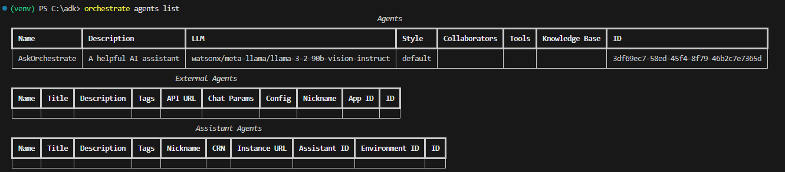
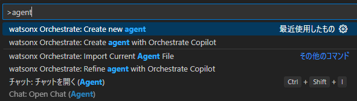
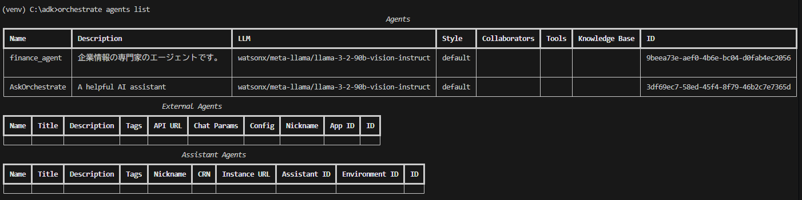
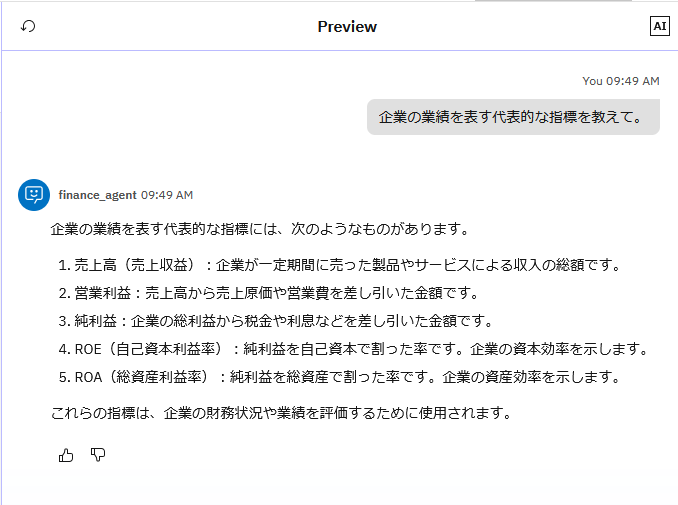
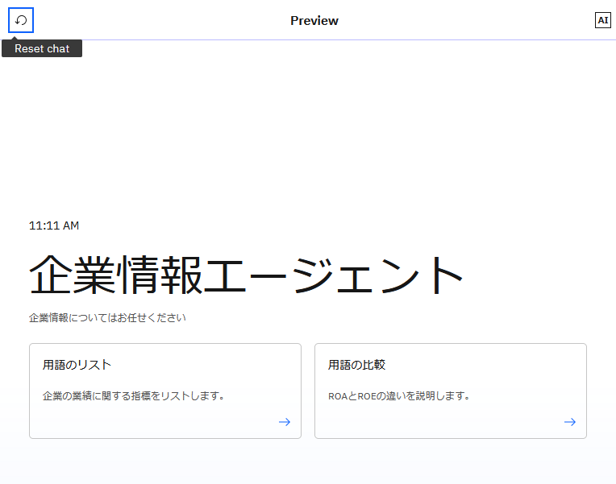
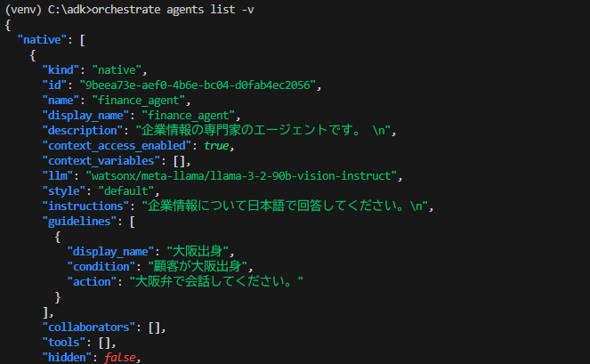

# エージェントを作ってみよう！
エージェントはGUIベースのエージェント・ビルダーを用いて開発することもできますが、ADKを用いることで、より多くの機能を利用することができます。また、yamlファイルなどを用いて作成するため、Gitとの連動や、CI/CDパイプラインを実装し、より効率的に開発することが可能です。このLabでは、基本的なエージェントの実装方法と、サーバーへのインポート方法について学びます。

!!! note
    手順はDeveloper Editionを用いた場合を想定してますが、SaaS版でもほぼ同様です。

## 環境のactivate

1. 必要に応じて、local環境をactivateします。
    ```
        orchestrate env activate local
    ```

## エージェントの確認
まず、現在の環境に存在するエージェントを確認してみましょう。  

1. エージェントの一覧をagents listコマンドで確認します。
    ```
        orchestrate agents list
    ```
      
    エージェントの一覧が表示されます。エージェントには通常のエージェントの他に、外部エージェントとアシスタントがありますが、それらも表示されます。  
    エージェントの説明や、使用されているLLMを確認することが可能です。


## エージェントの作成とインポート
シンプルなエージェントを作成してみましょう。ここでは、日本語で企業情報について会話可能なエージェントを作成してみることにします。

1. agentsフォルダを必要に応じて作成し、以下の内容でfinance_agent.yamlファイルをagentsフォルダ配下に作成します。
    ``` yaml title="finance_agent.yaml"
    spec_version: v1
    kind: native
    style: default
    name: finance_agent
    llm: watsonx/meta-llama/llama-3-2-90b-vision-instruct
    description: >
        企業情報の専門家のエージェントです。 
    instructions: >
        企業情報について日本語で回答してください。
    ```

    !!! note
        Visual Studio CodeにADK拡張が導入されている場合は、Ctrl+Shift+pでコマンド・パレットを表示し、Create Agentコマンドを用いることでテンプレートを適切なフォルダに自動生成することが可能です。  

          

2. agents importコマンドで作成したエージェントをインポートします。
    ```
        orchestrate agents import -f ./agents/finance_agent.yaml
    ```
    

3. agents list コマンドでインポートされたエージェントを確認してみましょう。
    ```
        orchestrate agents list
    ```
    

4. chat UI[(http://localhost:3000)](http://localhost:3000)にアクセスし、左下のManage Agentsをクリックすると、インポートしたfinance_agentが表示されているはずです。  
    

5. finance_agentをクリックします。先ほどyamlファイルで指定した情報が設定されていることを確認してください。
    

6. まだ利用可能なToolなどを指定していないため、外部の処理を呼び出すことはできませんが、LLMによる基本的な会話は可能です。右側のチャット欄に以下の様に記入して返答を確認してみましょう。
    ```
        企業の業績を表す代表的な指標を教えて。
    ```

    


## スターター・プロンプトの変更とエージェントの更新
よくある問い合わせ等、代表的なプロンプトをスターター・プロンプトとしてあらかじめ3つまで定義しておくことが可能です。スターター・プロンプトを定義し、エージェントを更新してみましょう。

1. finance_agent.yamlを以下の様に修正します。welcom_contentでエージェントを表示した際のメッセージを、starter_promptsで、スターター・プロンプトを定義することが可能です。

    ``` yaml title="finance_agent.yaml"
    spec_version: v1
    kind: native
    style: default
    name: finance_agent
    llm: watsonx/meta-llama/llama-3-2-90b-vision-instruct
    description: >
    企業情報の専門家のエージェントです。 
    instructions: >
    企業情報について日本語で回答してください。
    welcome_content:
        welcome_message: "企業情報エージェント"
        description: "企業情報についてはお任せください"
    starter_prompts:
        is_default_prompts: false
        prompts:
            - id: "prompt_id_1"
                title: "用語のリスト"
                subtitle: "企業の業績に関する指標をリストします。"
                prompt: "企業の業績を表す代表的な指標を5個リストして"
                state: "active"
            - id: "prompt_id_2"
                title: "用語の比較"
                subtitle: "ROAとROEの違いを説明します。"
                prompt: "ROAとROEの意味とその違いを表形式で整理して"
                state: "active"
    ```
2. エージェントを更新します。インポートと同じ手順で行うことで同じ名前のエージェントが存在する場合には自動的に更新されます。
    ```
        orchestrate agents import -f ./agents/finance_agent.yaml
    ```
    

3. ChatUI上で、Previewのリセットボタンをクリックし、チャットを更新してください。以下の様に表示されるはずです。

    

4. クリックして動作を確認してみましょう。

## Option#1 ガイドラインの設定
ガイドラインを定義することで、特定の条件にマッチした場合のアクションや、toolの呼び出しを指定することができます。ガイドラインを用いることで、通常のプロンプトより強い指示を与え、よりルール・ベースで動作させることが可能になります。今回は、顧客が大阪出身であると判断した場合、大阪弁で会話するようなガイドラインを設定してみましょう。

1. 以下のようにfinance_agent.yamlを修正し、ガイドラインに関する定義を追加してください。

    ``` yaml title="finance_agent.yaml"
    spec_version: v1
    kind: native
    style: default
    name: finance_agent
    llm: watsonx/meta-llama/llama-3-2-90b-vision-instruct
    description: >
    企業情報の専門家のエージェントです。 
    instructions: >
    企業情報について日本語で回答してください。
    welcome_content:
        welcome_message: "企業情報エージェント"
        description: "企業情報についてはお任せください"
    starter_prompts:
        is_default_prompts: false
        prompts:
            - id: "prompt_id_1"
                title: "用語のリスト"
                subtitle: "企業の業績に関する指標をリストします。"
                prompt: "企業の業績を表す代表的な指標を5個リストして"
                state: "active"
            - id: "prompt_id_2"
                title: "用語の比較"
                subtitle: "ROAとROEの違いを説明します。"
                prompt: "ROAとROEの意味とその違いを表形式で整理して"
                state: "active"
    guidelines:
        - display_name: "大阪出身"
            condition: "顧客が大阪出身"
            action: "大阪弁で会話してください。"
    ```
    !!!note
        tool呼び出しを実行させたい場合には以下の様に実行するtoolの名前を指定します。
         - display_name: "Check user"
            condition: "If the customer expresses the need to check a user in the system."
            action: "Use the 'get_user' tool to check the user in the system"
            tool: "get_user"

2. agents import　コマンドを用いてエージェントを更新します。
    ```
        orchestrate agents import -f ./tools/finance_agent.yaml
    ```
3. チャットをリセットしてから、**大阪から来ました**と入力し、ガイドラインが動作していることを確認してください。  
    

## Option#2 JSONによる出力
エージェントをリストするコマンドなどは、-v オプションを用いることで、json形式で出力することができます。jsonで出力することにより、スクリプトによる自動化などを実装することが容易になります。
以下のコマンドでjsonで出力されることを確認してみましょう。

```
    orchestrate agents list -v
```


## お疲れさまでした！
このLabでは、ADKを用いてAgentを定義、インポートする手順について学びました。