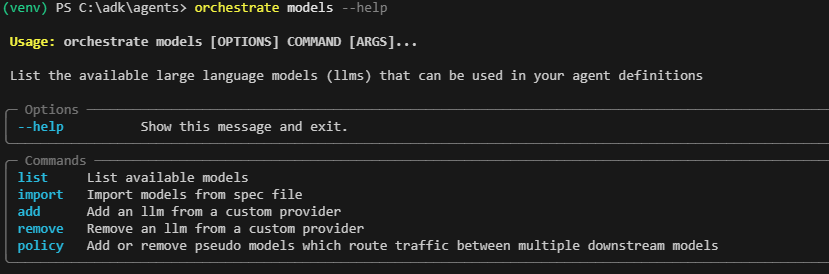
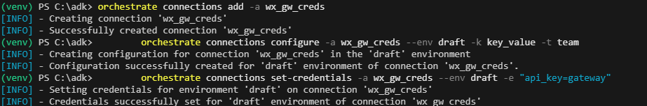
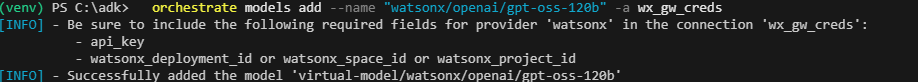
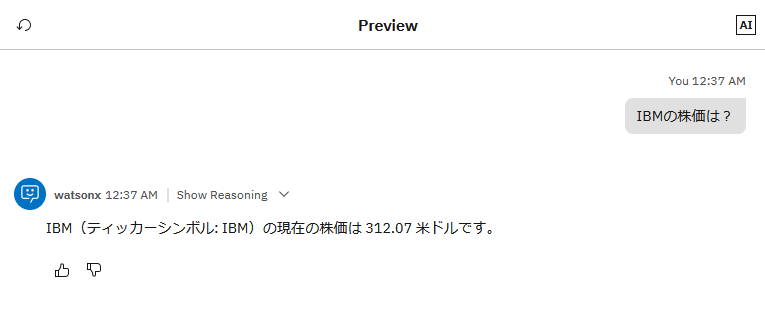

# AIGatewayを設定してみよう！
watsonx Orchestrateは、llama,granite,gpt-ossといったモデルをwatsonx Orchestrate自身が提供します。AIGatewayを使用することで外部でホスティングされるモデル(OpanAI,Google,Anthropic,OpenRouter)などを構成することで、利用することができます。  
AgentBuilder上では標準では2種類のモデルしかリストされず、他のモデルを利用するにはADKを用いる必要がありますが、AIGateway経由で構成したモデルはVirtualModelとしてリストされ、選択することが可能となります。  
このLabでは、watsonx Orchestrateが提供するモデルをAIGatewayから登録する手順について学びます。


## モデルの確認
現在の環境で利用可能なモデルについて確認してみましょう。

1. 必要に応じて、local環境をactivateします。
    ```
        orchestrate env activate local
    ```

2. --helpオプションを付けてmodelsコマンドの使い方を確認してみましょう。  
    ```
        orchestrate models --help
    ```
    モデルのリスト、追加などの他、例外時の挙動などを指定できるpolicyというコマンドがあります。  
    
2. モデルの一覧をmodelss listコマンドで確認します。
    ```
        orchestrate models list
    ```
    　　
    モデルの一覧を確認することができます。一覧に**gpt-oss-120b**があることを確認してください。

!!! note
gpt-oss-120bは、OpanAI社が公開した、Apache2.0ライセンスで利用可能なモデルです。比較的軽量ながら高い推論能力を提供します。また、日本語にも対応しており、日本語を用いたツール呼び出しの場合に活用可能なモデルです。


## モデルのインポート
gpt-oss-120bをインポートしてみましょう。

1. モデルを追加する際には、connectionsを用いて、api_keyを指定しますが、watsonx Orchestrateの提供するモデルを追加する際には、gatewayという文字列を渡す仕様になっています。以下のコマンドを実行し、connectionsを設定します。

    ``` 
        orchestrate connections add -a wx_gw_creds  
        orchestrate connections configure -a wx_gw_creds --env draft -k key_value -t team  
        orchestrate connections set-credentials -a wx_gw_creds --env draft -e "api_key=gateway"   
    ```

    
2. 次に先ほど作成したconnectionsを利用してモデルを追加します。
    ```
        orchestrate models add --name "watsonx/openai/gpt-oss-120b" -a wx_gw_creds
    ```
    

3. models listコマンドでモデルを確認してみましょう。
    ```
        orchestrate models list
    ```
    以下のように、追加したgpt-oss-120bがvirtual-modelとして表示されるはずです。  
    


## モデルの実行
インポートしたモデルをエージェントに割り当てて実行してみましょう。チャットUIにアクセスし、Manage Agentsからfinance_agentを表示します。既に開いている場合には、一度Manage Agentsをクリックしてから開きなおしてください。

1. モデル・リストにgpt-oss-120bが追加されているので選択してください。
    

2. チャット入力欄に、「IBMの株価は？」と入力してみましょう。ツールが呼びだされ、株価が表示されるはずです。  


!!! note
    gpt-oss-120bを用いた場合、変数を勝手に考えるなという指示がより強く効く傾向にあり、ティッカーシンボルを求めてくる場合があります。その場合はチャットからＩＢＭと入力してください。

6. スターター・プロンプトより、「ROAとROEの違いについて表形式で整理して」を選択してデフォルトのllamaとの違いを確認してみましょう。    


##　モデルの削除
追加したgpt-oss-120bを削除してみましょう。

1. 追加したモデルは以下のコマンドで削除することが可能です。


## お疲れさまでした！
このLabでは、AIGatewayの機能を用いて、モデルを追加する方法について学びました。同様の手順でOpenAI,Googleといった外部のプロバイダーのLLMを登録して利用することが可能です。  
また、AIGatewayには、ポリシー設定という機能があり、エラー時に別LLMに切り替えるといった振る舞いを定義することも可能です。