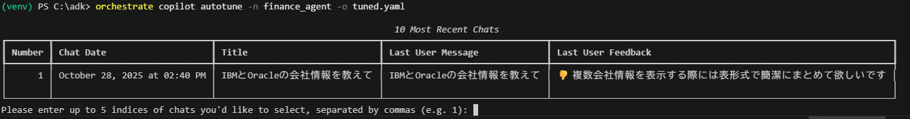
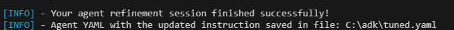
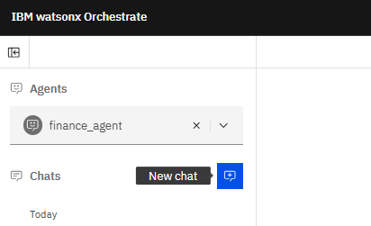
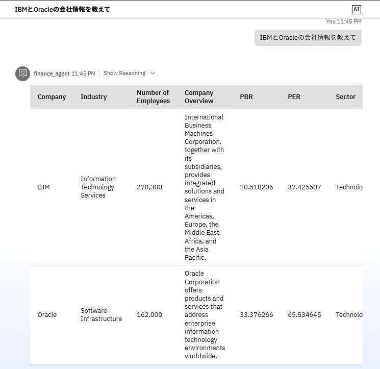

# AIエージェントの振る舞いを改善してみよう！
ADKには、AIエージェントへの指示をを対話的に設定したり、ユーザーからのフィードバックを元に改善するためのCopilotと呼ばれる機能が存在ます。このLabでは、copilot autotuneコマンドを用いて、どの様にAIエージェントの振る舞いを改善していけるかを学びます。

!!! note
    現時点では残念ながら出力されるyamlファイルは英語ベースのものとなります。

## Copilotサーバーの起動
Copilot機能は専用のサーバーを起動して使用します。


1. サーバーとチャットUIが起動していない場合には、orchestrate server startコマンドとorchestrate chat startコマンドで起動してください。既に起動済みの場合はスキップしてください。
    ```
        orchestrate server start -e .\env
        orchestrate chat start
    ```

2. copilot serverを起動します。
    ```
        orchestrate copilot start -e .\env
    ```
    サーバーの起動が成功すると、以下のようなメッセージが表示されます。  
    

## Agentの改善
1. ChatUIからfinance_agentを選択し、「IBMとOracleの会社情報を教えて？」と入力してみます。  

    !!! note
        AIGatewayのLabを行って、gpt-oss-120bを設定している場合にはデフォルトのモデルに戻してから実行してください。  
    
    以下のような返答があるはずです。  
    

2. ここで、複数の情報を表示する際には表形式にしてほしいとフィードバックしてみましょう。サムダウンのマークをクリックします。  
    

3. フィードバックの入力画面が表示されるので、Toolongをクリックし、「複数会社情報を表示する際には表形式で簡潔にまとめて欲しいです」と入力し、**Submit**をクリックします。
    

4. autotuneコマンドで、採用するフィードバックを選択します。以下のコマンドを実行すると、フィードバックのリストが表示されます。  
    ```
        orchestrate copilot autotune -n finance_agent -o tuned.yaml
    ```
    

5. 先程入力されたフィードバックの番号を入力します。複数のフィードバックをカンマ区切りで指定することも可能です。  

    

6. 調整が完了し、指定したファイル名にyamlが出力されます。  
    

7. Visual Studio Codeの左側のエクスプローラーから、**tuned.yaml**をダブルクリックして開きます。  
    以下のように、ツールの利用方法や出力例などが追加されていることが分かります。autotuneコマンドを使用すると、ベストプラクティスに従った形式に修正されるため、新規にエージェントを実装する際に参考にすることも有効です。    
    
    ``` tuned.yaml
       spec_version: v1
        name: finance_agent
        display_name: finance_agent
        description: "企業情報の専門家のエージェントです。 \n"
        context_access_enabled: true
        context_variables: []
        llm: watsonx/meta-llama/llama-3-2-90b-vision-instruct
        style: default
        instructions: |-
        **Role**
        You are an agent responsible for providing company information in Japanese.

        **Tool Usage Guidelines**
        1. Call each tool only once for each unique set of parameters.
        2. Do not assume any tool parameters.

        **How To Use Tools**

        - When the user asks for company information, first identify the company or companies the user is inquiring about.
            Then, call the get_company_info tool for each company, using the company's ticker symbol as the parameter.
            Format the output of the get_company_info tool in a clear and readable format, including the company name, industry, number of employees, a brief company overview, PBR, PER, and sector.
            Ensure that the company overview is summarized briefly and the response is provided in Japanese.
            If the user asks for multiple companies, display the information in a table format to facilitate comparison.

        - When the user asks for a stock quote, call the get_stock_quote tool using the company's ticker symbol as the parameter.
            Display the stock quote in a clear and readable format.

        **Examples**
        Example #1:
        user: What is the company information for IBM and Oracle?
        AI Agent:
        | Company | Industry | Number of Employees | Company Overview | PBR | PER | Sector |
        | --- | --- | --- | --- | --- | --- | --- |
        | IBM | Information Technology Services | 270,300 | IBMはアメリカの多国籍技術企業です。 | 10.467457 | 37.24493 | Technology |
        | Oracle | Software - Infrastructure | 162,000 | Oracleはアメリカの多国籍企業で、企業向けのソフトウェア製品を提供しています。 | 33.245117 | 65.27714 | Technology |

        Example #2:
        user: What is the stock quote for IBM?
        AI Agent:
        The current stock quote for IBM is ... (call get_stock_quote tool and display the result)
    ```
8. 更新されたyamlファイルを用いてエージェントを更新してみましょう。
    ```
        orchestrate agents import -f tuned.yaml
    ```
    

9. チャット画面を表示し**New Chat**をクリックして、先ほどと同様に「IBMとOracleの会社情報を教えて」と入力してみましょう。  
    
    
10. 先程と異なり、シンプルな表形式で表示されました。  
    

!!! note
    このケースでは、エージェントへの指示が英語になったことに引きずられ、回答全体が英語になってしまっています。  
    生成ＡＩの特性上、プロンプトの変更により意図しない挙動の変更が起きる可能性もあるため、リグレッション・テストは必須となります。watsonx Orchestratdでは、エージェントのテスト、評価のためのフレームワークも提供しています。
    

## お疲れさまでした！
このLabでは、Copilot autotuneコマンドを用いて、エージェントの動作の改善する方法について学びました。ユーザーのフィードバックを生成AIを用いて自動的に適用することで、効率的なエージェント改善を可能にします。