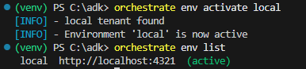
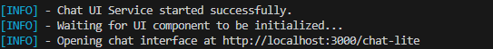
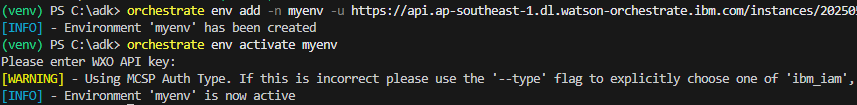
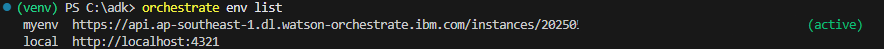
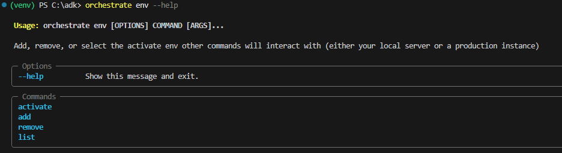
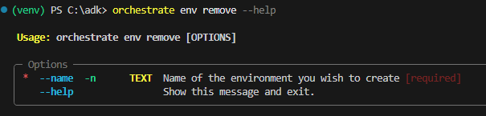

# サーバーへ接続しよう！
ADKのコマンドを用いることで、watsonx Orchestrateのサーバーに対して様々な処理を実行することが可能です。対象の環境は、  

- watsonx Orchestrate Developer Edition
- watsonx Orchestrate SaaS(IBMCloud/AWS)
- watsonx Orchestrate オンプレミス  

のいずれも対応しています。これらの環境を複数登録し、対象の環境を切り替えてコマンドを発行することが可能です。

## Developer Editionの導入・環境の追加
watsonx Orchestrate Devloper EditionはローカルPC上で動作するサーバーです。
ここでは、インストール手順の詳細については説明せず、wasonx OrchestrateのSaaS版を使用してサーバーを起動する場合の設定について説明します。  
詳細については、[ADKの公式サイト](https://developer.watson-orchestrate.ibm.com/developer_edition/wxOde_setup)の情報を参照してください。  
なお、ハンズオンでは、既にDeveloper Editionが導入、設定済みのwindows imageを使用するため、ステップ3のサーバーの起動から実施してください。

1. Visual Studioのエクスプローラー上で右クリックし、**新しいファイル**を選択し**env**という名前でファイルを作成します。  
    

2. envファイルにパラメータを記述します。Developer Edition自体はLLMを提供しないため、envファイルに指定したパラメータは、Developer Editionのダウンロード時だけでなく、LLMを利用するために使用されます。WO_API_KEYとWO_INSTANCEに設定する値については講師に確認してください。
    ```
        WO_DEVELOPER_EDITION_SOURCE=orchestrate
        WO_API_KEY=XXXXXXXXXX
        WO_INSTANCE=XXXXXXXXXXX
        USE_SAAS_ML_TOOLS_RUNTIME
    ```

    !!! note
        ハンズオン環境では、上記値の他に、**WO_DEVELOPER_EDITION_SKIP_LOGIN**という値が設定されています。これは、新しいイメージがリリースされた際に、再ダウンロードを防ぐための物です。
    

3. 以下のコマンドでサーバーを起動します。初回起動時には、イメージをダウンロードするため、時間がかかります。（数十分から数時間程度。ネットワーク環境に依存）  

    !!! note
        venvをactivateしていない場合には以下のコマンドを実行して下さい。  

            ## windowsの場合
            . ./venv/Scripts/activate
            ## mac/Linuxの場合
            source ./venv/bin/activate


    ```
        orchestrate server start -e ./env
    ```
    

    !!! note
        サーバー起動時に以下のようなエラーが発生する場合があります。Dockerレジストリへのログインがタイムアウトしていることが原因であることが多いため、このエラーが発生した場合は、再度コマンドを実行してみてください。
        

4. env activate コマンドで、Developer Edition(local)をactiveにします。コマンドを発行した場合、activeになっているenvに対して操作が実行されることになります。  
    ```
        orchestrate env activate local
    ```
5. env list コマンドで、利用可能な環境(env)を確認してみましょう。
    ```
        orchestrate env list
    ```
    localという名前のenvがactiveであることが分かります。  
    

6. 以下のコマンドでチャットUIを起動します。
    ```
        orchestrate chat start
    ```
    
       
    起動が成功した場合、自動的にUIが開くはずです。開かない場合は、ブラウザから**http://localhost:3000**にアクセスしてみてください。
    

## SaaS環境の追加
SaaSで動作しているwatsonx Orchestrateもenvとして追加することが可能です。利用可能なSaaS環境がある場合には追加してみましょう。

1. orchestrate env add コマンドでenvを追加します。使用するURLは講師に確認してください。
    ```
        orchestrate env add --name myenv -url XXXXXX
    ```

2. 追加されたenvをactivateします。API keyを求められるので入力してください。
    ```
        orchestrate env activate myenv
    ```
    

3. SaaS環境が追加され、activeになっていることを確認してみましょう。
    ```
        orchestrate env list
    ```
    


## Option その他のコマンドの確認
envコマンドのその他の利用法を確認してみましょう。

1. --helpオプションで、コマンドの使用法を確認することが可能です。
    ```
        orchestrate env --help
    ```
    

3. removeの使い方を確認してみましょう。
    ```
        orchestrate env remove --help
    ```
    

4. ハンズオンでは基本的にlocalを使用します。先ほど定義したmyenvを削除してみましょう。
    ```
        orchestrate env remove -n myenv
    ```


## お疲れさまでした！
このLabでは、orchestrate envコマンドを用いて、Developer EditionもしくはSaaSの環境を利用する方法について学びました。