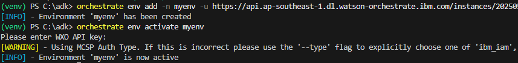
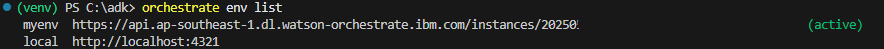

# サーバーへ接続しよう！
ADKのコマンドを用いることで、watsonx Orchestrateのサーバーに対して様々な処理を実行することが可能です。対象の環境は、  

- watsonx Orchestrate Developer Edition
- watsonx Orchestrate SaaS（IBMCloud/AWS)
- watsonx Orchestrate オンプレミス  

のいずれも対応しています。これらの環境を複数登録し、対象の環境を切り替えてコマンドを発行することが可能です。

## SaaS環境の追加
SaaSで動作しているwatsonx Orchestrateもenvとして追加することが可能です。利用可能なSaaS環境がある場合には追加してみましょう。

1. orchestrate env add コマンドでenvを追加します。使用するURLは講師に確認してください。
    ```
    orchestrate env add --name myenv_<イニシャル> --url XXXXXX
    ```

2. 追加されたenvをactivateします。API keyを求められるので入力してください。使用するAPI keyは講師に確認してください。
    ```
    orchestrate env activate myenv_<イニシャル>
    ```
    

!!! note
    API keyを入力してもターミナル画面には表示されません。これは他者から識別されないためのセキュリティ機能です。

3. SaaS環境が追加され、activeになっていることを確認してみましょう。
    ```
    orchestrate env list
    ```
    

## お疲れさまでした！
このLabでは、orchestrate envコマンドを用いて、SaaSの環境を利用する方法について学びました。
