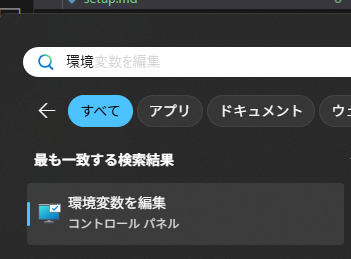
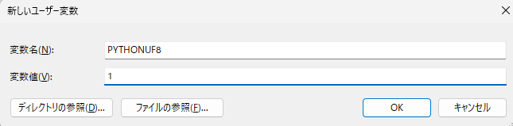
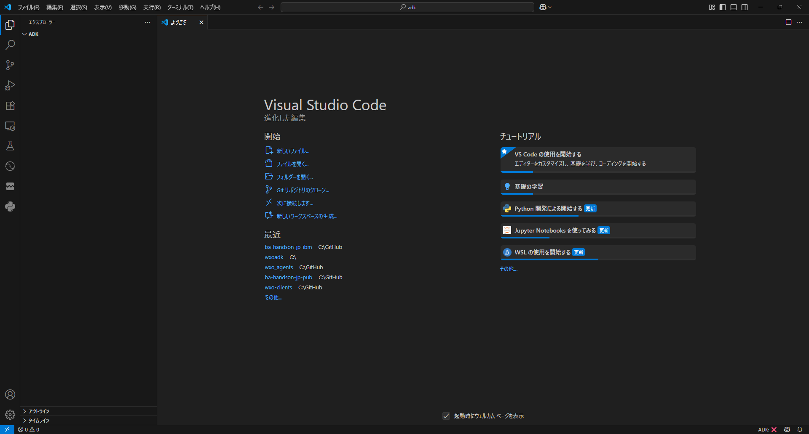
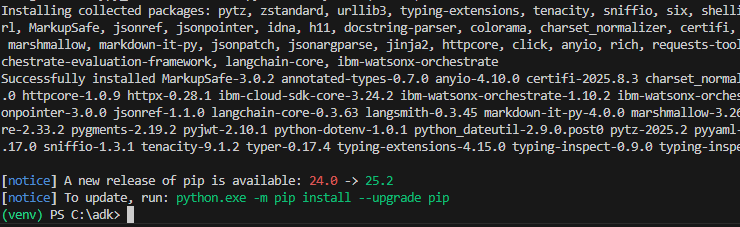
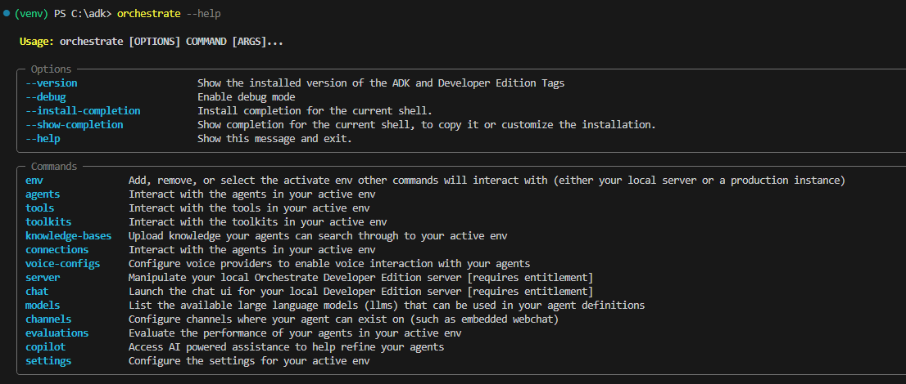

# ADKをインストールしよう！
ADKを用いることで、より細かなエージェントの設定を行ったり、外部のLLMとの連携を設定するなど、エージェント・ビルダーから設定する以上の様々な機能を利用することが可能です。
このLabではADKの導入方法について説明します。インストール手順の詳細については[ADKの公式サイト](https://developer.watson-orchestrate.ibm.com/getting_started/installing)を参照してください。

## 仮想環境の構築
ここでは、windows上のマシンに、Visual Studio Code上のターミナルからvenvを用いて仮想環境を構築する手順について説明します。
!!! note
    環境を構築するフォルダについては**C:\adk**を用い、pythonの3.11以上が導入済みの環境の前提とします。

1. Windowsメニューより、**環境変数**とタイプし、**環境変数を編集**を選択します。  
    

2. **新規**ボタンをクリックし、以下の変数を定義してください。この変数はPYTHONのデフォルト・エンコーディングを指定するものです。  
    - 変数名：PYTHONUTF8
    - 変数値：1

    

3. Visual Studio Codeを起動します。フォルダが開かれていない場合は、ファイル＞フォルダーを開くより、C:\adkフォルダを選択して開いてください。
    
    
4. **ターミナル > 新しいターミナル**を選択しターミナルを開きます。

5. 以下のコマンドで、venvを作成します。
    ```
    python -m venv venv
    ```

    
 
6. venvをactivateします。
    ```
    ## windowsの場合
    . ./venv/Scripts/activate
    ## mac/Linuxの場合
    source ./venv/bin/activate
    ```
      

## ADKのインストール
1. adkをインストールします。
    ```
    pip install --upgrade ibm-watsonx-orchestrate
    ```
    

2. 以下のコマンドでインストールの確認をします。
    ```
    orchestrate --version
    ```
    
3. ヘルプも確認してみましょう。
    ```
    orchestrate --help
    ```
    
    

## お疲れさまでした！
このLabでは、windowsでvenvを用いてwatsonx OrchestrateのADKを導入する手順について学びました。