# ADKをインストールしよう！
ADKを用いることで、より細かなエージェントの設定を行ったり、外部のLLMとの連携を設定するなど、エージェント・ビルダーから設定する以上の様々な機能を利用することが可能です。
このLabではADKの導入方法について説明します。インストール手順の詳細については[ADKの公式サイト](https://developer.watson-orchestrate.ibm.com/getting_started/installing)を参照してください。

## pythonのインストール
ADKのコマンドにはpythonを使用するためPCのローカル環境にインストールが必要です。 

1. [pythonの公式サイト](https://www.python.org/downloads/)でPython 3.13をダウンロードします。  
    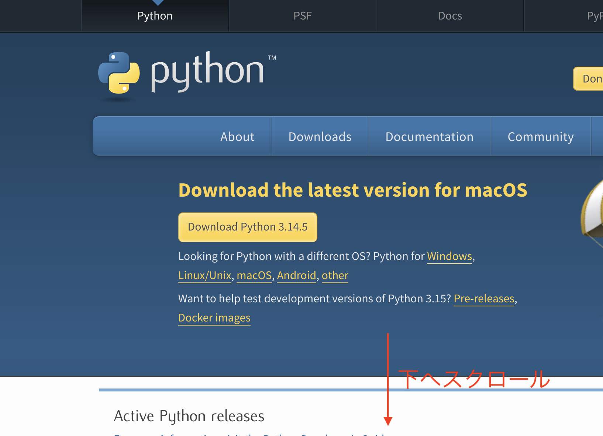
    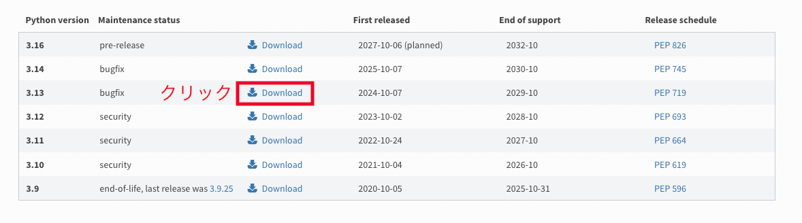
    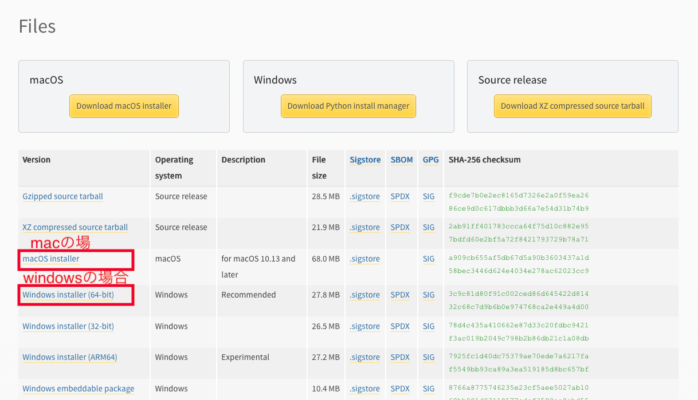

2. インストーラーを実行し画面に従ってインストールします。Setup画面で**Add python.exe to PATH**にチェックを入れてインストールしてください。  
    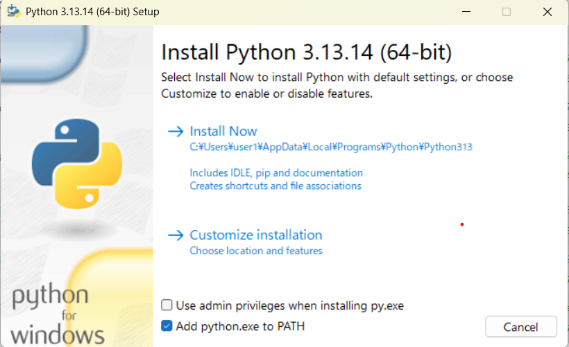
3. pythonのversionを確認します。  
    3-1. コマンドプロンプトを開く
    ```
    ### windowsの場合
    windowsキーを押してcmdと入力→Enter
    ### Mac/Linuxの場合
    アプリからターミナルと入力して開く
    ```
    3-2. pythonのversionの確認
    ```
    ### windowsの場合
    python --version
    ### Mac/Linuxの場合
    python3 --version
    ```
    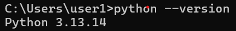  
    上記のように3.13が表示されたらOKです。


## Visual Studio Code (VSCode) のインストール・日本語設定・フォルダの準備
ファイル管理やコードエディットで効率的に操作できるエディターをダウンロードします。

1. [VSCodeの公式サイト](https://code.visualstudio.com)で最新版のVSCodeをダウンロードし画面に従ってインストールします。  
    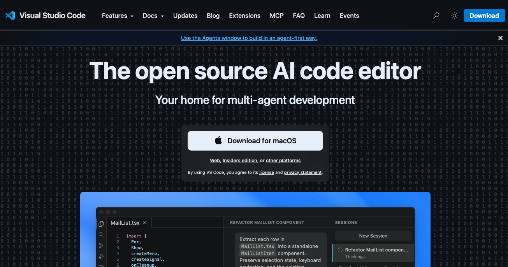

2. VSCodeの日本語化
Macではデフォルトでは英語になっているため下記手順に従って日本語化します。  
2-1. 拡張機能をクリックしjapanese language packを検索しインストールします。  
    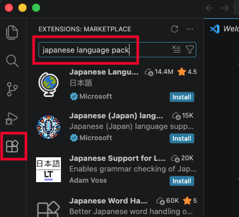  
2-2. ポップアップダイアログに従ってVSCodeをRestartします。  

3. VSCodeで操作するディレクトリの作成・ターミナルの起動  
このあとの手順で操作するファイルを格納するディレクトリを作成します。  
3-1. 任意のフォルダ配下に（windowsはCドライブ配下、Macはデスクトップなど）**adk**という名前でフォルダを作成します。  
3-2. VSCodeの**ようこそ**タブから**開く**をクリックします。  
    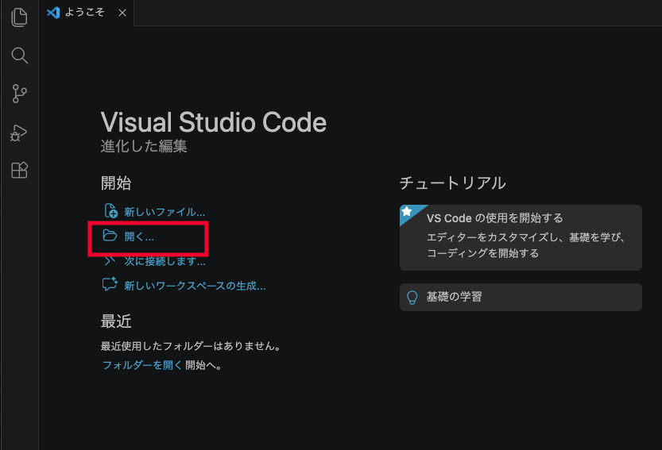  
3-3. 先ほど作成した**adk**フォルダを選択し開きます。  
3-4. **ターミナル**タブをクリック、**新しいターミナル**を開きます。  
    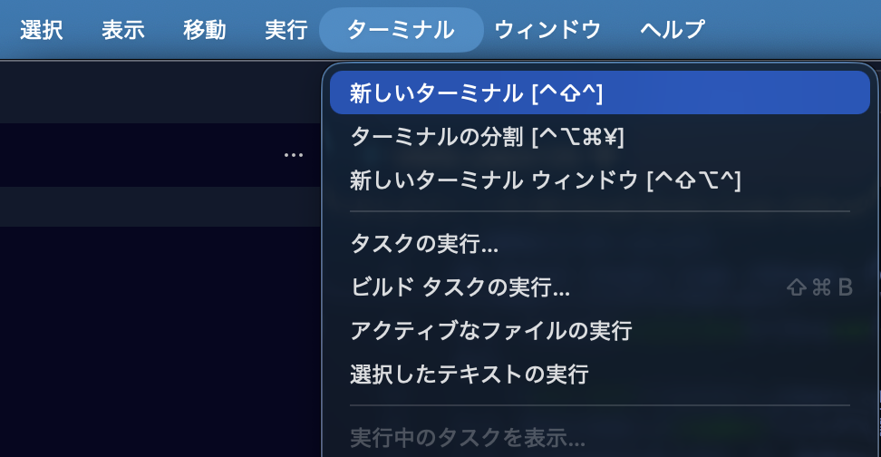  

## 仮想環境の構築
ここでは、windows上のマシンに、Visual Studio Code上のターミナルからvenvを用いて仮想環境を構築する手順について説明します。  

!!! note
    環境を構築するフォルダについては**C:\adk**を用い、pythonの3.11以上が導入済みの環境の前提とします。

1. Windowsメニューより、**環境変数**とタイプし、**環境変数を編集**を選択します。  
    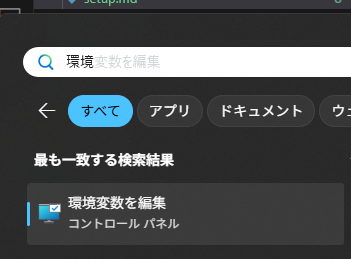

2. **新規**ボタンをクリックし、以下の変数を定義してください。この変数はPYTHONのデフォルト・エンコーディングを指定するものです。  
    - 変数名：PYTHONUTF8
    - 変数値：1

    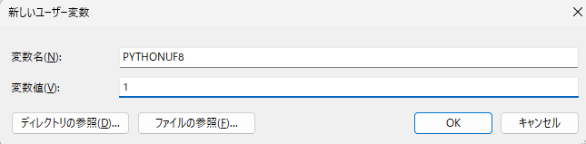

3. Visual Studio Codeを起動します。フォルダが開かれていない場合は、ファイル＞フォルダーを開くより、C:\adkフォルダを選択して開いてください。
    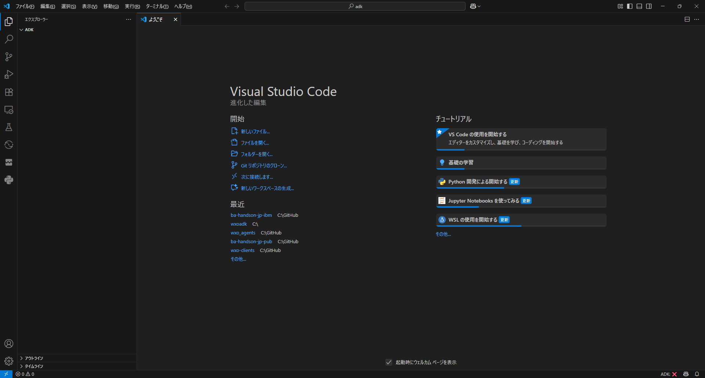
    
4. **ターミナル > 新しいターミナル**を選択しターミナルを開きます。

5. 以下のコマンドで、venvを作成します。
    ```
    ## windowsの場合
    python -m venv venv または py -3.13 -m venv venv
    ## mac/Linuxの場合
    python3 -m venv venv
    ```
    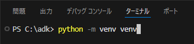
6. venvをactivateします。
    ```
    ## windowsの場合
    Set-ExecutionPolicy -Scope CurrentUser -ExecutionPolicy RemoteSigned
    . ./venv/Scripts/activate.ps1
    ## mac/Linuxの場合
    source ./venv/bin/activate
    ```
    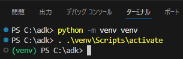  
## ADKのインストール
1. adkをインストールします。
    ```
    pip install --upgrade ibm-watsonx-orchestrate
    または
    py -3.13 -m pip install --upgrade ibm-watsonx-orchestrate
    ```
    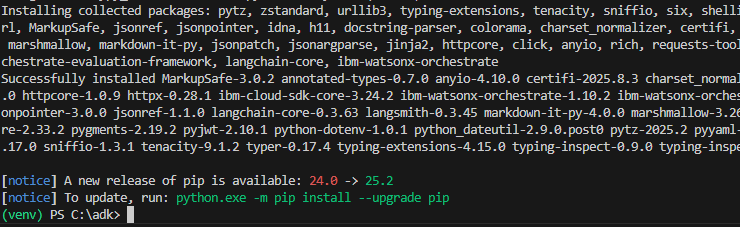
2. 以下のコマンドでインストールの確認をします。
    ```
    orchestrate --version
    ```
    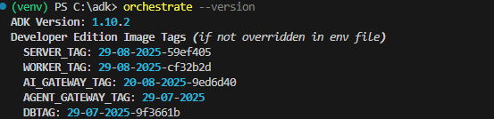
3. ヘルプも確認してみましょう。
    ```
    orchestrate --help
    ```
    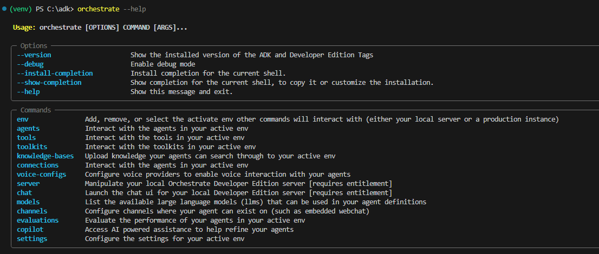
## お疲れさまでした！
このLabでは、windowsでvenvを用いてwatsonx OrchestrateのADKを導入する手順について学びました。
