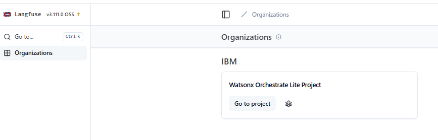
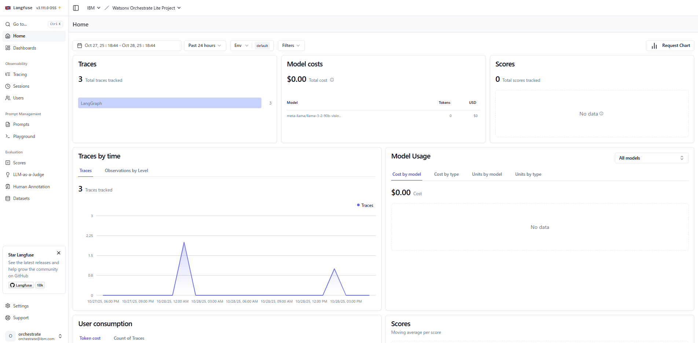
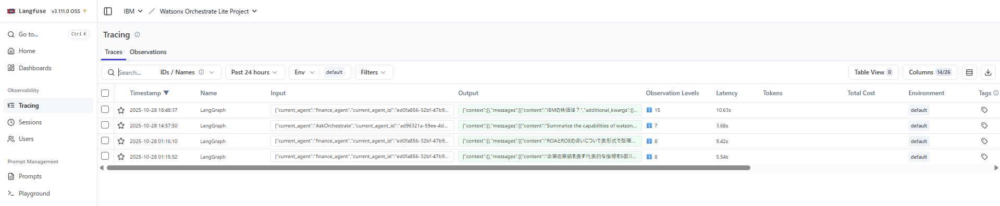
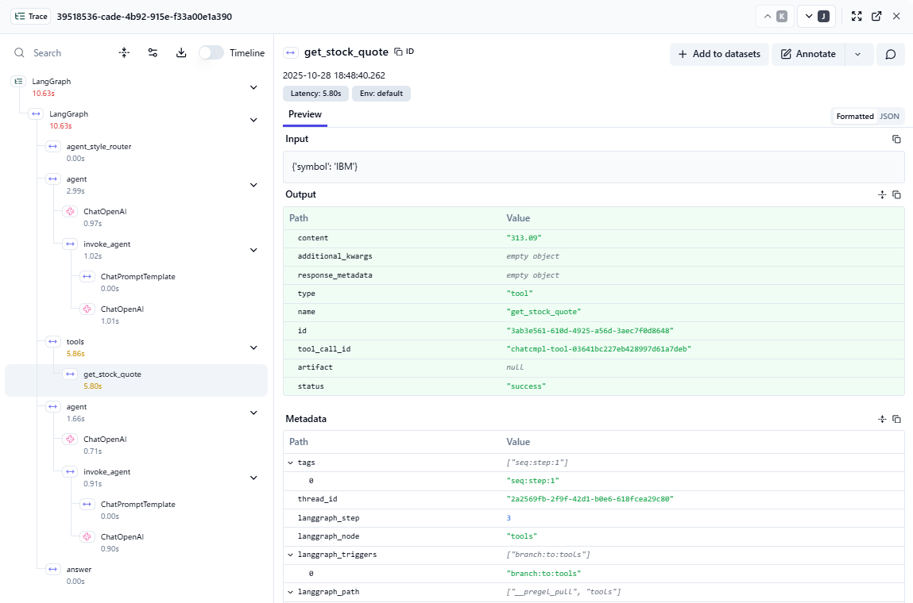
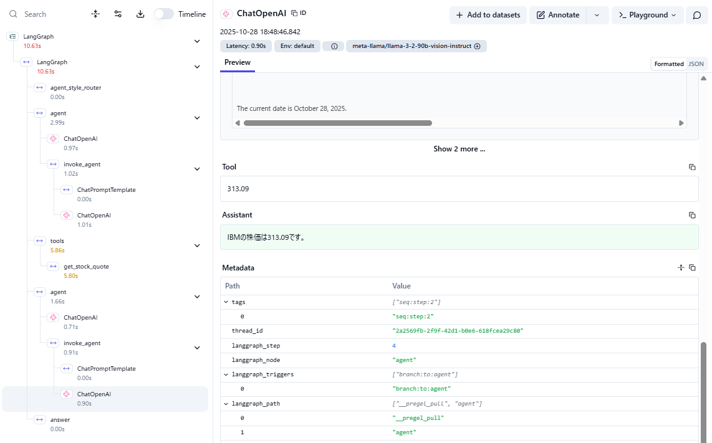

# Langfuseでエージェントの動きを観測してみよう！
watsonx Orchestrate Developer Editionには、オープン・ソースのLLMOpsプラットフォームであるLanguseが同梱されており、エージェント内部の動きを観測することが可能です。このLabでは、Langfuseサーバーを起動し、エージェントのトレースを確認する方法について学びます。  
なお、SaaS側にはLangfuseは組み込まれておらず、代わりの分析機能が提供されますが、構成をすることで外部のLangfuseサーバーと連携することも可能です。


## Langfuseサーバーの起動
Langfuseはwatsonx Orchestraeのサーバー起動時にオプションを付けることで、watsonx Orchestrateと同時に起動します。

1. まず、稼働中のサーバーを停止します。
    ```
        orchestrate server stop
    ```

2. サーバーが停止したら、-lオプション付きでサーバーを起動します。   
    ```
        orchestrate server start -e .\env -l
    ```
    サーバー起動が完了すると、以下のようなメッセージが表示されるはずです。  
    Langfuseには、以下でアクセス可能です。
     
      

2. ブラウザから、[http://localhost:3010](http://localhost:3010)にアクセスします。サイン・イン画面が表示されるので、以下を入力しサイン・インしてください。  
     - username: orchestrate@ibm.com
     - password: orchestrate

    
    

## トレースの確認
Langfuseを使用してエージェントのトレースを確認してみましょう。

1. watsonx Orchestrate Developer Editionでは、Langfuseの構成が自動的に行われており、インストール後にすぐに利用することが可能です。  
watsonx Orchestrate Lite Projectというプロジェクトが作成済みなので、go to Projectをクリックしてプロジェクトを開いてください。

      

2. Home外面が表示されます。Langfuseには様々な機能があり、ダッシュボードの構築なども可能です。
    

3. 左側のメニューより**tracing**を選択してください。本日チャット画面から実行した処理のリストが表示されるはずです。
    

4. 今回は株価について確認したリクエストをベースに説明するため、orchestrate chat startコマンドでチャット画面を起動し、「IBMの株価は？」と入力してください。

5. トレース画面に新規レコードが追加されたはずです。

6. 左側に処理の順番にフローが表示され、またそれぞれの処理にかかった時間が表示されます。ChatOpenAIという名前のノードがいくつか表示されていますが、これらがLLMを呼び出しているノードになります。一番上のChatOpenAIノードをクリックしてください。  
    

7. レコードをクリックすることでその右側にLLMへのリクエスト内容の詳細が表示されます。このリクエストはガイドラインを判定するためのプロンプトが英語で指示されていることが分かります。

    

8. 2つ目のChatOpenAIノードをクリックしてください。エージェントとしてのプロンプトの下部に、Behaviorで設定した指示が追加されていることが分かります。  
    

9. Assistantと書かれているセクションを展開すると、get_stock_priceというToolを呼び出すという判断がなされたことが確認できます。
    

10. 左側からget_stock_priceというノードをクリックしてください。ツール呼び出しの詳細が右側に表示さ、ツール呼び出しの結果株価が返ってきていることが分かります。
    

11. 同様に3つ目のChatOpenAIノードをクリックしてください。このLLM呼び出しにより、最終的なクライアントへの返答のテキストが生成されています。  
    


## お疲れさまでした！
このLabでは、Langfuseを用いて、エージェントの動作の詳細を確認する方法について学びました。AIエージェントが動作する際にはシンプルなエージェントの応答においてもLLMへの呼び出しが複数回発生し、その速度や応答の内容が問題となるケースがあります。Langfuseのような仕組みを用いることで問題の特定、改善を行う際に役立てることが可能です。