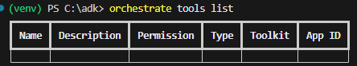
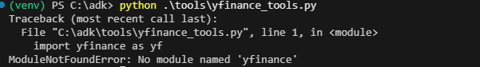
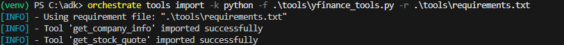
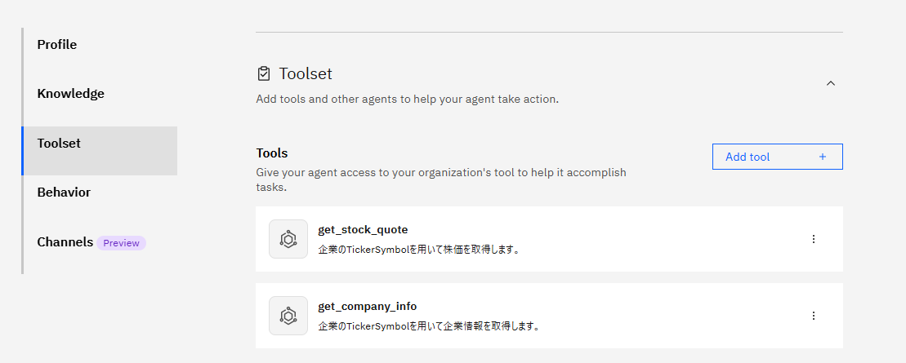
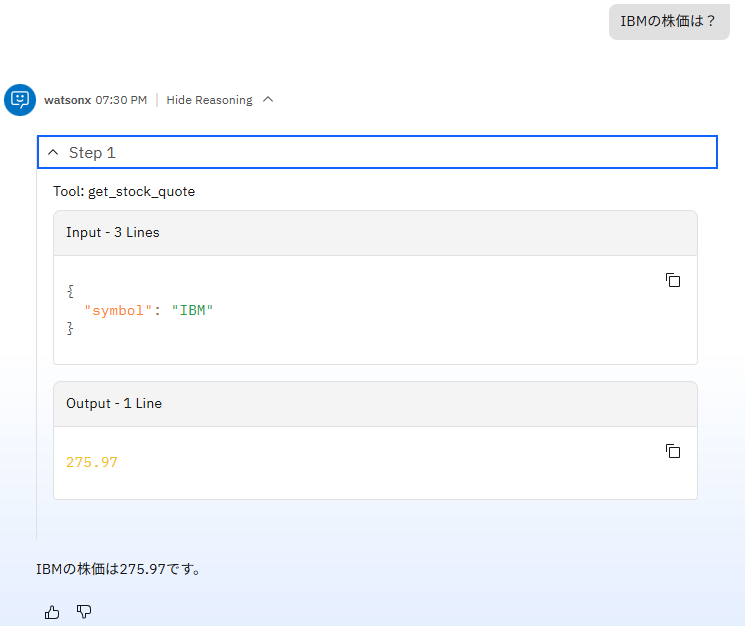
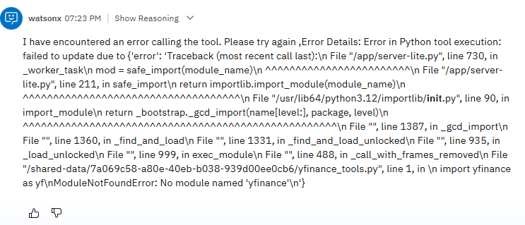

# ツールを作ってみよう！
watsonx Orchestrateでは、OpenAPI、Python、フローなど、様々なタイプのツールをサポートします。このLabではPtyonベースのツールの基本的な作成方法について学びます。


## ツールの確認
ツールをを作成する間に、現在の環境に存在するツールを確認してみましょう。

1. 必要に応じて、local環境をactivateします。
    ```
        orchestrate env activate local
    ```
2. ツールの一覧をtools listコマンドで確認します。
    ```
        orchestrate tools list
    ```
      
    ツールの一覧を確認することができます。


## ツールの作成
Pythonを用いたツールを作成してみます。ここでは、yfinanceというpythonのパッケージを使用して、企業の株価情報を取得するツールを作成してみることにします。

1. toolsフォルダを必要に応じて作成し、以下の内容でyfinance_tool.pyを作成します。

    !!! note
        ハンズオン環境には既に配置済みですので、ファイルの中身を確認してください。  
          
         - Pythonのfunctionに@toolデコレータを適用することでツールとして動作させることが可能です。  
         - 関数の引数、戻り値などの説明はGoogleスタイルのDocStringとして定義します。  
         - yfinanceモジュールをインポートしています。  
         - get_stock_quote,get_company_infoの2つのツールが定義されています。


    ``` yfinance_tool.py
        import yfinance as yf
        from pydantic import Field, BaseModel
        from ibm_watsonx_orchestrate.agent_builder.tools import tool

        @tool
        def get_stock_quote(symbol:str) -> str:

            """
            企業のTickerSymbolを用いて株価を取得します。
            Args:
                symbol: Symbol of the company.
            Returns:
                Price of the stock.
            """
            try:
                ticker=yf.Ticker(symbol) 
                print(ticker)

                current_price = ticker.fast_info.last_price
                return "{:.2f}".format(current_price)
            except Exception as e:
                return e


        class TickerInfo(BaseModel):
            """
            Represents the details of a company info.
            """
            longBusinessSummary: str = Field(description='business summary of the company')
            sector: str = Field(description='sector of the company')
            industry: str = Field(description='industry of the company')
            fullTimeEmployee: int = Field(description='number of the fulltime employee of the company')
            per: float = Field(description='price earning ratio of the company')
            pbr: float = Field(description='price book ratio of the company')
            analyst_price_targets: dict = Field(description='analyst_price_targets')


        @tool
        def get_company_info(symbol:str) -> TickerInfo:

            """
            企業のTickerSymbolを用いて企業情報を取得します。
            Args:
                symbol: Symbol of the company.
            Returns:
                TickerInfo: company info of the company.
            """
            try:
                ticker=yf.Ticker(symbol) 
                print(ticker.actions)
                return TickerInfo(analyst_price_targets=ticker.analyst_price_targets,longBusinessSummary=ticker.info['longBusinessSummary'],fullTimeEmployee=ticker.info['fullTimeEmployees'],sector=ticker.info['sector'],industry=ticker.info['industry'],per=ticker.info['trailingPE'],pbr=ticker.info['priceToBook'])
            except Exception as e:
                return e

        if __name__ == '__main__':
            price = get_stock_quote('IBM')
            print(price)

            info = get_company_info('IBM')
            print(info)
    ```

2. まずは単体のPythonのプログラムとしての動作を確認してみましょう。以下のコマンドを入力します。
    ```
        python  .\tools\yfinance_tools.py
    ```
    エラーが返ってくるはずです。これは、この環境にyfinanceというPythonのモジュールが未導入のため発生するエラーです。ツールを実装する際には、Python単体で動作するのか、watsonx Orchesrateの環境に問題があるのかを切り分けるためにもまずは単体での動作確認をすることをお勧めします。  
    

3. yfinanceのモジュールをインポートし、再度先ほどのコマンドを実行してみましょう。
    ```
        pip install yfinance
        python  .\tools\yfinance_tools.py
    ```
    今回は、以下のように、IBMの株価や会社情報が表示されたはずです。  
    


## ツールのインポート
作成したツールをwatsonx Orchestrateにインポートします。

1. 先ほどインストールしたyfinanceモジュールはあくまでローカルの環境に対してのインストールであり、watsonx Orchestrate側に自動的にインストールされるわけではありません。ツールをインポートする際にはrequirements.txtに必要なモジュールをリストし、指定してあげることが必要です。以下の内容のrequirements.txtというファイルを作成します。ハンズオン環境には既に作成済みですので中身を確認してください。

``` requirements.txt
    yfinance
```

2. ツールをインポートします。まず、インポート・コマンドの利用方法を確認してみましょう。
```
    orchestrate tools import --help
```
　　

-f オプションでファイルを、-k オプションでツールの種類を渡します。今回はPythonのToolなので、 -k python を指定、-r オプションでrequirementsファイルを指定します。
```
    orchestrate tools import -k python -f .\tools\yfinance_tools.py -r .\tools\requirements.txt
```



正しくツールがインポートされました。

## ツールの実行
インポートしたツールをエージェントから実行してみましょう。AgentBuilderを用いてfinance_agentにツールを追加することもできますが、今回はADKを用いて追加をしてみます。

1. finance_agent.yamlの末尾に、次の3行を追加して保存してください。
```
tools:
  - get_stock_quote
  - get_company_info
```

2. finance_agentを更新します。
```
    orchestrate agents import -f .\agents\finance_agent.yaml
```
  
エージェントが更新されました。

3.  チャットUIにアクセスし、Manage Agentsからfinance_agentを表示します。既に開いている場合には、一度Manage Agentsをクリックしてから開きなおしてください。

      

4. エージェントにツールが追加されているはずです。
    

5. チャット入力欄に、「IBMの株価は？」と入力してみましょう。ツールが呼びだされ、株価が表示されるはずです。 Show_Reasoningをクリックして展開し、Toolの呼び出し結果を確認してみましょう。 


!!! Error
    以下のようなエラーが表示された場合、モジュールが正しく追加されていないことが原因です。  
    -r requirementsのオプションが正しく指定されていることを確認し、再度ツールをインポートしてみてください。  
    

6. チャット欄に「IBMの会社情報は？」と入力し、get_company_infoツールが正しく動作することを確認してみましょう。  


## お疲れさまでした！
このLabでは、ADKを用いてツールを実装し、インポート、エージェントに追加する手順について学びました。