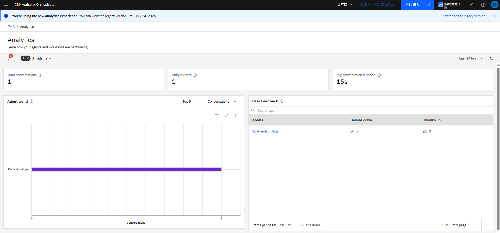
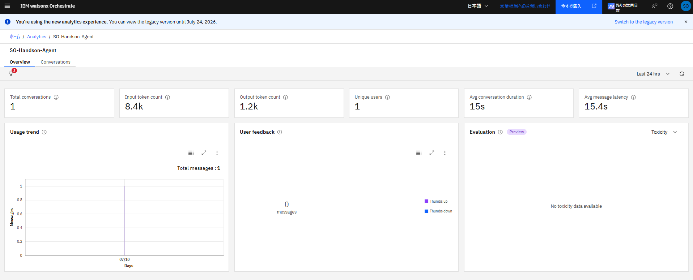
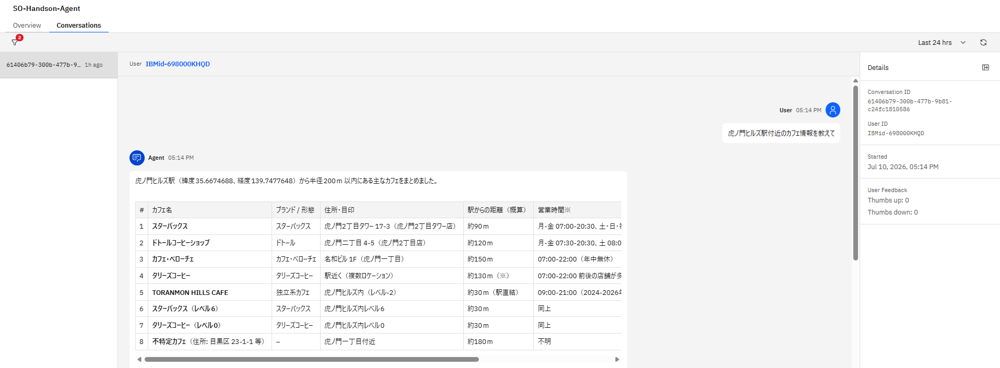
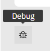
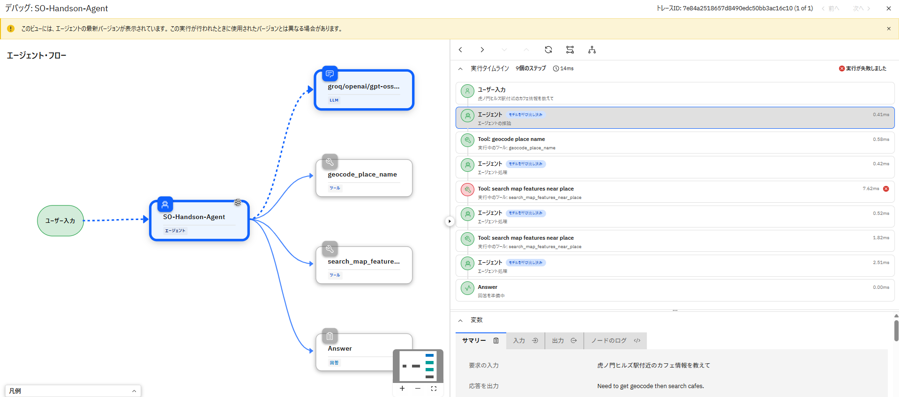
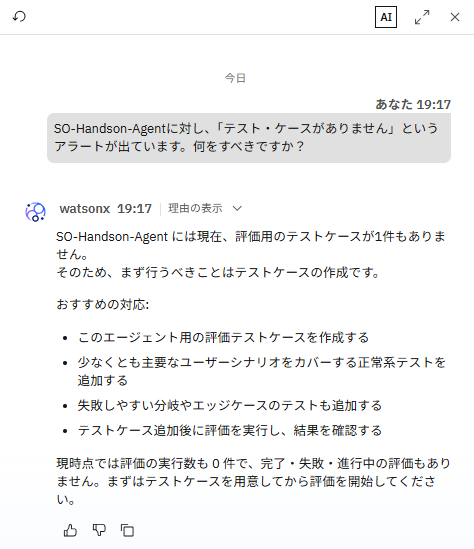
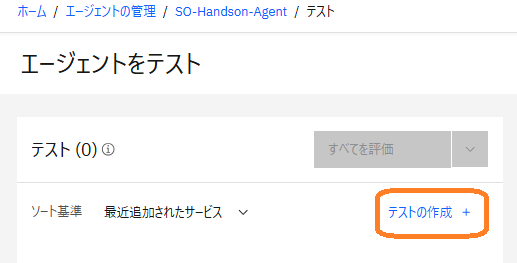
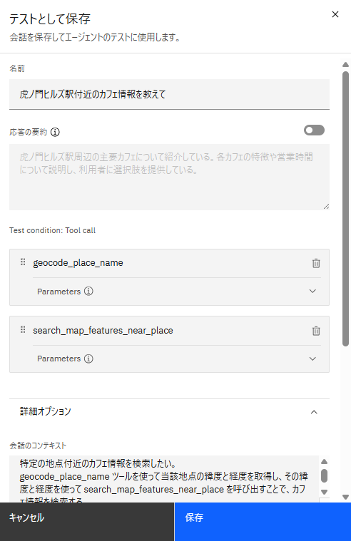
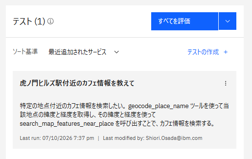
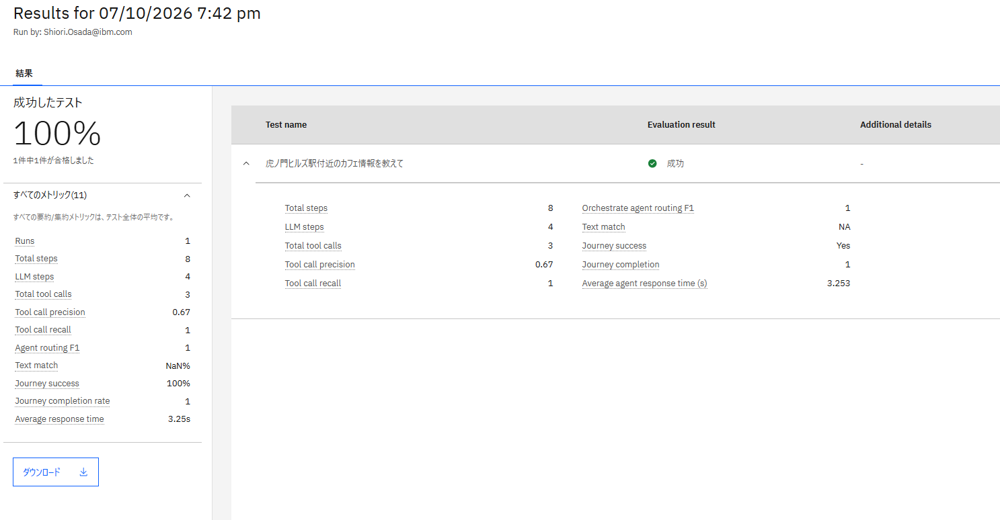

# エージェントの分析
この Lab では、Control Plane のダッシュボードや各機能を使ってエージェントの状況を分析します。


## エージェントの実行ログを分析
テスト実行したデータを用いて、どのようにエージェントの利用状況が確認できるか見てみましょう。  

1\. 左上のハンバーガーメニューから **分析** をクリックします。  
   先ほど自身が作成したエージェントのデータが表示されていることが確認できます。  
     

!!! note
    - この画面では、直近のタイムライン（右側のプルダウンより指定可能）におけるエージェントの利用状況が以下の項目で整理されています。
         - 会話の総数、ユーザー数、平均会話継続時間
         - よく使われているエージェント
         - エージェントの応答に対する Feedback

2\. **ユーザーフィードバック** のエリアから自身のエージェントをクリックし、エージェントごとの詳細分析画面に遷移します。  
       

!!! note
    - エージェントの個別詳細分析画面は、Control Plane ダッシュボードの **エージェント分析** のエリアから **分析の表示** 遷移することもできます。
    - **概要** のタブでは、直近のタイムライン（右側のプルダウンより指定可能）における選択したエージェントの利用状況が以下の項目で整理されています
         - 会話の総数、トークン数、ユーザー数、平均会話継続時間、平均レイテンシー
         - 利用状況の変化
         - エージェントの応答に対する Feedback
         - モデルの評価（有害 / 偏った / 不適切な表現、ハルシネーションなどを生成していないかどうかの判断）

3\. **会話** タブに移動すると、先ほどテストしたチャットの履歴が確認できます。  
       

4\. この会話ログに対し、具体的にどのような処理が行われたのかさらに確認します。  
   会話の最後にある、**デバッグ** のアイコンをクリックしてください。  
     

5\. この会話ログの処理フローと詳細ログが確認できるデバッグ画面に遷移します。  
   左側には処理のフローが図で表示されています。右側には処理のステップがタイムライン形式で表示されており、その下部では詳細のログを確認できます。  
   右側にある **実行タイムライン** より、任意のステップを選択してみましょう。左側のフロー図、および右側下部の **変数** や **ノードのプロパティ** に表示される詳細ログが選択したステップ段階のものに変更されることが分かります。  
     

!!! note
    - エラーが起こった場合、実行タイムライン上のステップでエラー箇所が分かるようになっています。そのステップを選択し、入出力データやログを確認することでエラーの分析に役立ちます。


## Control Plane のアラートを確認
詳細分析や、設定変更などを行ったほうがよいエージェントがある場合、Control Plane がアラートや洞察として注意喚起します。  
画面左上の **IBM watsonx Orchestrate** ロゴ、もしくは左上のハンバーガーメニューから **ホーム** をクリックして Control Plane ダッシュボードを確認しましょう。  

1\. **アラート** の部分に、洞察として「xx（作成したエージェント名）にはテスト・ケースがありません」というメッセージが表示されています。  

2\. 左側の Control Plane エージェントに、このメッセージについて質問してみましょう。  
   ```
   【作成したエージェント名】に対し、「テスト・ケースがありません」というアラートが出ています。何をすべきですか？
   ```
     
   このままでも実行は可能ですが、今後の改修のために、エージェント評価用のテストケースを設定することを Control Plane が推奨しているようです。  

!!! note
    - Control Plane エージェントにはその他にも以下のような依頼をすることができます。
         - パフォーマンス分析：会話量または会話時間が長いエージェントを特定する
         - 品質評価：テストの実施率が低い、または評価が欠落しているエージェントを特定する
         - フィードバック調査：ユーザーからの否定的なフィードバックを受けているエージェントを特定する
         - コード生成：洞察を生成するために使用された Python コードを表示する

3\. Control Plane エージェントの勧めに従い、テストケースを作成します。  
   右側のアラート欄より、**アクション** 列の下にある **評価に移動** をクリックします。  
   テストの管理画面に遷移しますが、まだこのエージェントにはテストケースが設定されていないため、**テストの作成** をクリックします。  
     

4\. Agent Builder に戻ってきました。  
   もう一度、プレビューチャットに先ほどと同じ質問を行います。  
   問題なくツールが呼び出され、応答が返ってきたことを確認できたら、チャットの入力欄上に表示される **テストとして保存** をクリックします。  

5\. テストケースとして登録するための設定ウィンドウが表示されます。  
     
   特定のユースケースパターンと、そのパターンにおける期待する処理やパラメータを設定し、一致するかどうかでテストを行うことができます。  
   既に入力されている項目はそのまま、**保存** してください。
   もし **会話のコンテキスト** が英語になっている場合は、例として以下のように変更しておきます。  
   ```
   特定の地点付近のカフェ情報を検索したい。
   geocode_place_name ツールを使って当該地点の緯度と経度を取得し、その緯度と経度を使って search_map_features_near_place を呼び出すことで、カフェ情報を検索する。
   ```

6\. 保存できたら、プレビューチャットの上部にある **エージェントをテスト** をクリックし、先ほどのテスト管理画面に戻ります。  
   左側に追加したテストケースが表示されています。**すべてを評価** ボタンを押下して、テストを実行します。  
   テストの実行には数分かかります。  
     

7\. テストが完了すると、先ほど設定した期待値通りに動いたかどうか等が確認できます。  
     

!!! note
    - エージェントの動作 / ガイドライン / ツールなどに変更を加えた場合や、LLM を変更したとき、サービスのアップデートが行われた場合などにテストを行い、以前までと応答が大きく変わっていないかを確認するために利用できる機能です。  

8\. もう一度 Control Plane のダッシュボードに戻ると、洞察のメッセージが無くなっていることが確認できます。  
