# エージェントの管理・統制
この Lab では、エージェントやツールなどのアセットに対するコントロール（ポリシー）を設定し、利用統制を行います。  
また、watsonx Orchestrate 外部のエージェントも管理対象として追加します。  


## コントロールの設定
コントロールは、環境全体への設定項目とエージェントに関連する各アセットごとの設定項目があります。  
各アセットに対するコントロールの設定・適用は、基本的に以下のような流れで行われます。  

1. 対象のアセットを選択：対象をエージェント / ツール / モデルから選択  
2. 1つ以上のコントロールを割り当て：セキュリティやパフォーマンスなど、必要なコントロールの種類を選択して割り当て  
3. パラメータの設定：各コントロールに対する詳細設定値を定義  
4. 適用と運用監視：設定したコントロールは対象アセットが実行される際に自動的に適用され、結果を Control Plane ダッシュボードで確認

各アセットにどのようなコントロールを適用できるのか確認し、実際に設定を行いましょう。  

1\. Control Plane ダッシュボードより、**プラットフォーム分析** エリア > **コントロール** 欄より、**コントロールの追加** をクリックします。  
   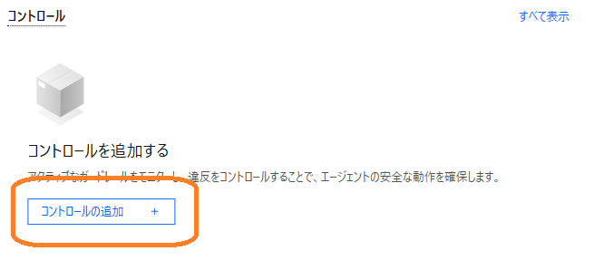  

2\. 画面中央または右側にある **コントロールの作成** ボタンをクリックします。  
   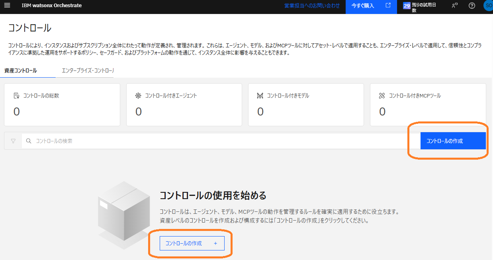  

3\. 作成可能なコントロールの一覧が表示されます。  
   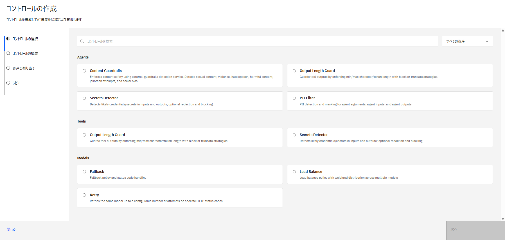  

   <u>エージェントに対するコントロール</u>  
   ○ Content Guardrails：暴力的な言葉、ヘイトスピーチ、有害コンテンツ、偏見などの社会的に不適切なコンテンツを検出しブロック  
   ○ Output Length Guard：最小文字数 / 最大文字数 / トークン長を強制  
   ○ Secrets Detector：認証情報（API key やパスワードなど）を検出し、必要に応じて編集またはブロック  
   ○ PII Filter：メールアドレスなどの個人情報を検出しマスキング  

   <u>ツールに対するコントロール</u>  
   ○ Output Length Guard：（同上）  
   ○ Secrets Detector：（同上）  

   <u>モデルに対するコントロール</u>  
   ○ Fallback：メインモデルが機能しない場合や特定のエラーコードを返した場合に、自動的にバックアップモデルに切り替え  
   ○ Load Balance：複数のモデルにリクエストを分散しレイテンシを削減  
   ○ Retry：設定されたステータスコードと再試行回数制限に基づいてリクエストを自動的に再試行  

!!! note
    - コントロールを適用できるエージェントは下記の種類です。
         - watsonx Orchestrate で作成したエージェント
         - インポートした LangGraph エージェント
         - A2A で接続した外部のエージェント
    - コントロールを適用できるツールは MCP ツールです。
    - 適用対象のエージェントやツールは今後のアップデートで順次拡大されます。
    - コントロールには、ロジックベースで検出する場合と生成 AI を使って検出する場合、およびハイブリッドで検出する場合があります。

4\. 今回は、エージェントに対する PII Filter コントロールを使い、ユーザーがメールアドレスを入力したらブロックするという設定を行ってみます。  
   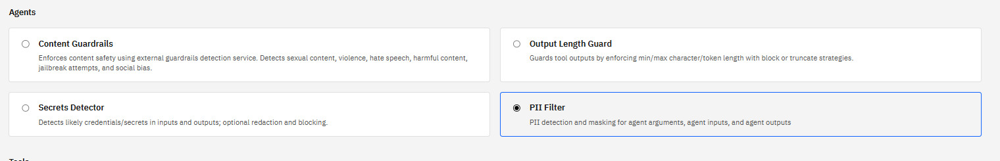  

5\. 任意のコントロール名を入力し、以下のように設定します。  
&emsp;他の項目はデフォルト状態のまま、**次へ** に進みます。  
&emsp;・適用タイプ：✅ Input  
&emsp;・Detection Type：✅ Detect Email  
&emsp;・Default mask strategy：Redact（別の文字でマスクする）  
   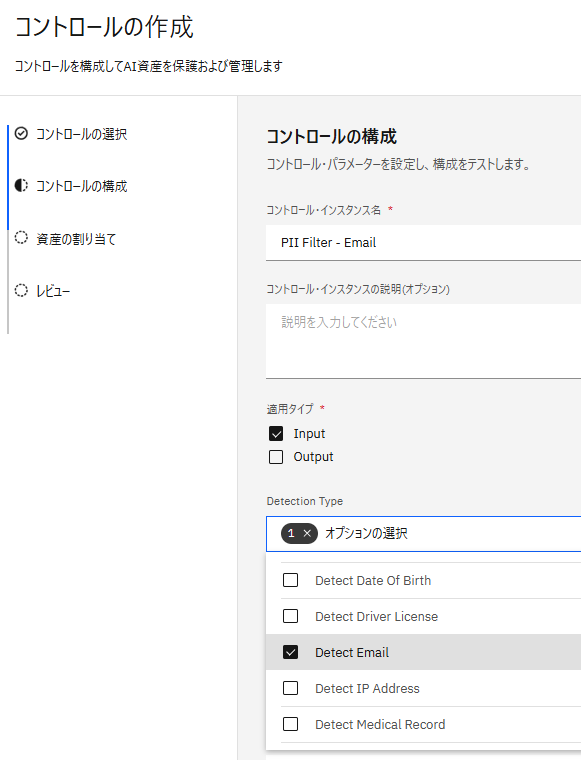  

6\. **資産の割り当て** のページで、**エージェントの追加** をクリックし先ほど作成した自身のエージェントを選択します。  
   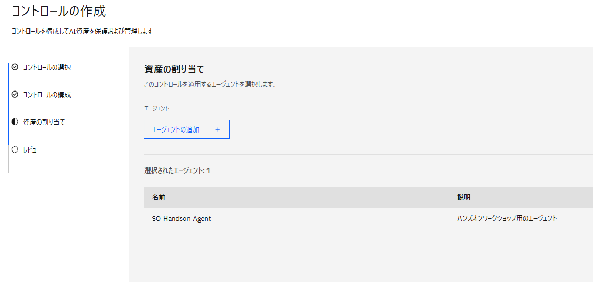  

7\. **レビュー** のページで **コントロールの作成** ボタンを押下し、コントロールを作成します。  
   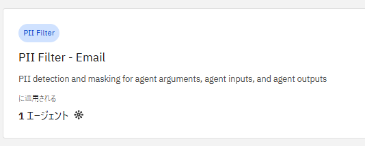  

8\. 左上のハンバーガーメニューから **ビルド** をクリックし、自身のエージェントを選択して Agent Builder を開き、プレビューチャットでダミーのメールアドレスを含んだチャットを送信します。
   ```
   私のメールアドレスは test@testibm.com です
   ```

9\. 適切なツールや処理は定義されていないため、おそらく LLM が作成した回答が返ってきます。   
   その返答の下の **Debug** のアイコンをクリックし、デバッグ画面でユーザーの入力ステップを確認すると、メールアドレス部分がマスクされていることが確認できます。  
   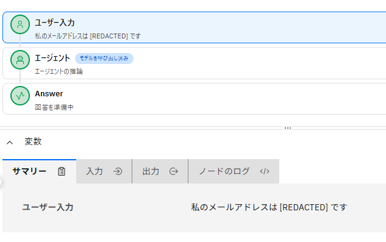  

   また、[Lab2：エージェントの分析](analyze.md) で確認した分析ダッシュボードから個別の Conversation ログを見ても、同じようにマスクされていることが確認できます。  

!!! note
    - 今回の設定では、ユーザーがエージェント利用においてメールアドレスを入力した際、管理者がログを見ても個人情報部分だけをマスクして表示するというものになっています。  
      ユーザーがエージェントにメールアドレスを入力すること自体をブロックしたい場合は、コントロールの構成で以下の設定を行うことで適用できます。  
     ・Enforcement Mode：✅ Block on Detection 

!!! note
    - 環境全体に対するコントロールは、コントロールの管理画面で **エンタープライズ・コントロール** のタブより、以下のような項目が設定可能です。
         - データ保存期間
         - アウトバウンドアクセス制限
         - 管理画面における PII データマスキング


## 外部エージェントの管理
watsonx Orchestrate 以外のプラットフォームやフレームワークで作成したエージェントを追加し、コントロールの適用対象として管理しましょう。  
watsonx Orchestrate は、外部のエージェントに対しても連携実行（マルチエージェント）やコントロールの適用などの設定を行うことができ、組織のあらゆるエージェントを統合管理基盤として活用できます。  


### A2A で Dify エージェントと連携
A2A はエージェント同士が連携可能な汎用プロトコルです。
当ハンズオンでは、watsonx Orchestrate で作成した自身のエージェントとあらかじめ講師が用意した Dify のエージェントを接続し、マルチエージェント設計を行います。  

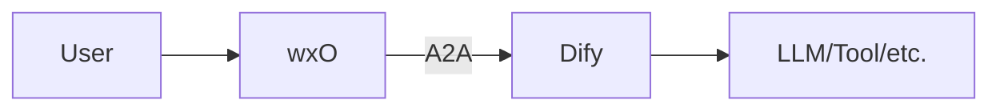

1\. 左上のハンバーガーメニューから **ビルド** をクリックし、自身のエージェントを選択して Agent Builder を開きます。

2\. **エージェントの追加** より、「インポート」を選びます。  
&emsp;エージェント・タイプは「外部エージェント」を選択したまま **次へ** に進みます。  
   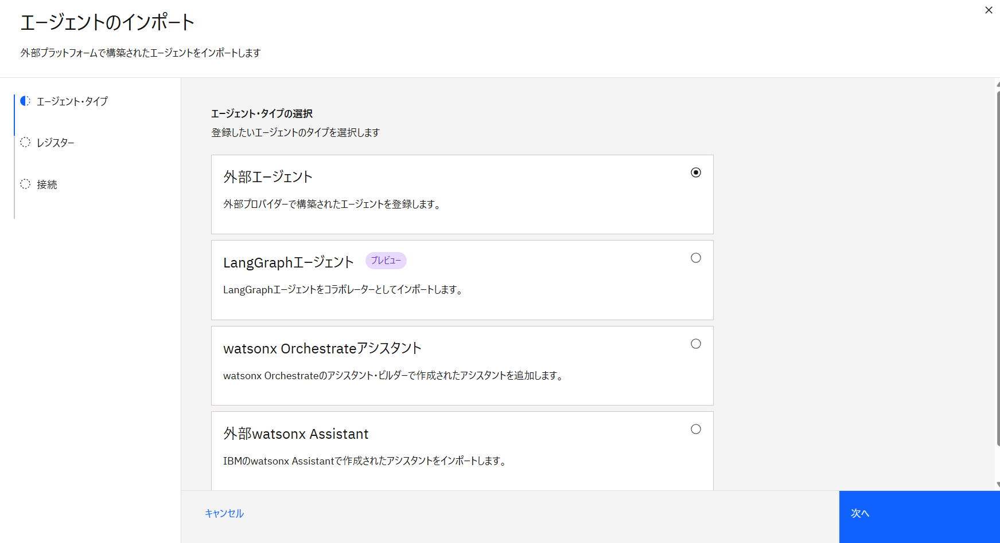  

3\. **外部プロトコル** は「A2A 標準を介した外部エージェント」を選択します。  
&emsp;その他の項目は、講師から別途連携された Dify エージェントの接続情報を入力し、**次へ** をクリックします。  
   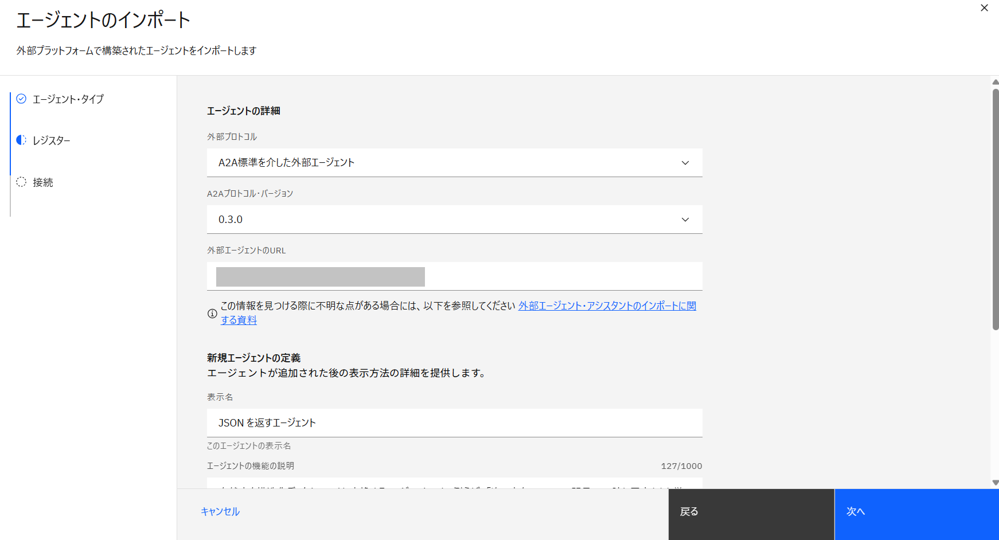  

4\. **接続** の画面で **Add A2A agent connection** または **接続の追加** をクリックし、接続設定画面に進みます。  

5\. **接続の追加** 画面では任意の接続 ID や説明を入力し、**保存して続行** をクリックします。  
&emsp;接続追加の確認画面が表示されるので、**続行** をクリックします。  
   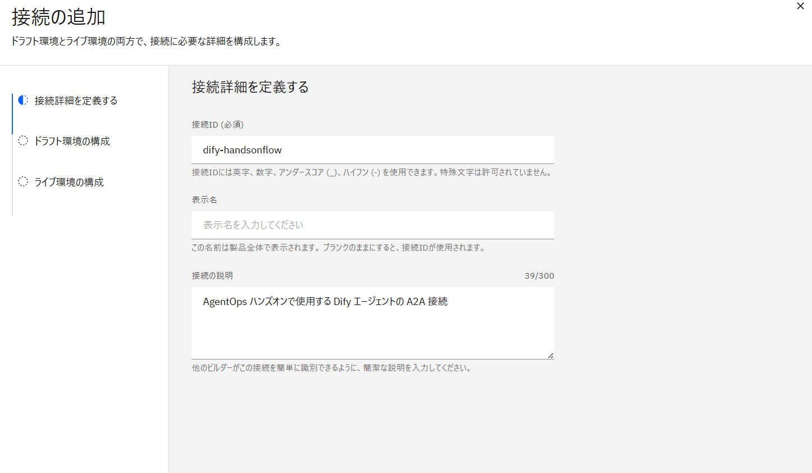  

6\. **ドラフト環境の構成** では、講師から別途連携された Dify エージェントの接続情報を入力し、**次へ** をクリックします。  
&emsp;**ライブ環境の構成** では、**ドラフト設定の貼り付け** をクリックし、**完了** します。
   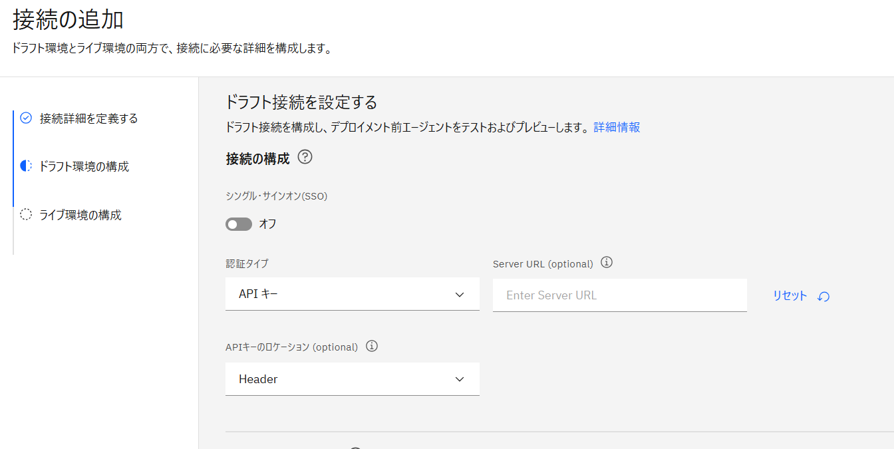  

7\. 手順4の画面に戻り、追加した接続情報が表示されていることを確認します。  
&emsp;その接続のラジオボタンを選択し、**完了** をクリックします。  
   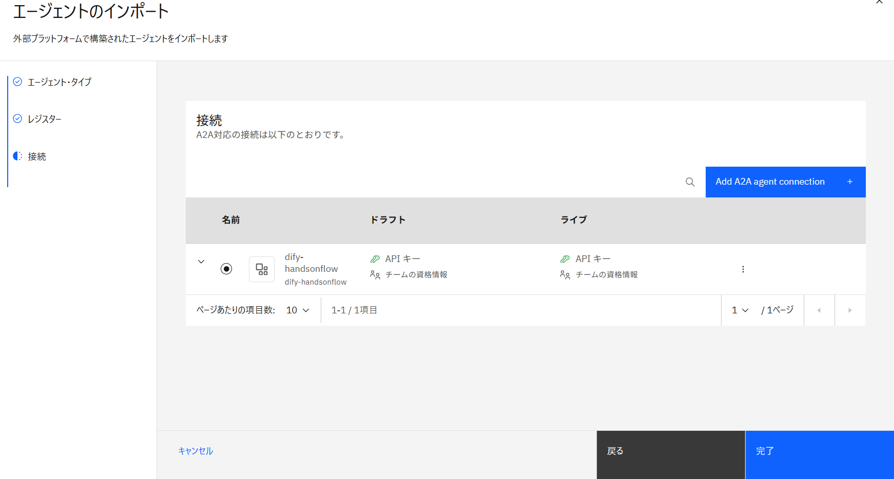  

8\. コラボレーターとしてのエージェントが追加されていることを確認します。  
   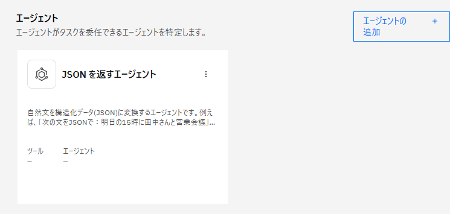  

9\. 設定した Dify エージェントの情報を参考に、プレビューチャットでテストを行い、マルチエージェント呼び出しが出来ることを確認します。  
   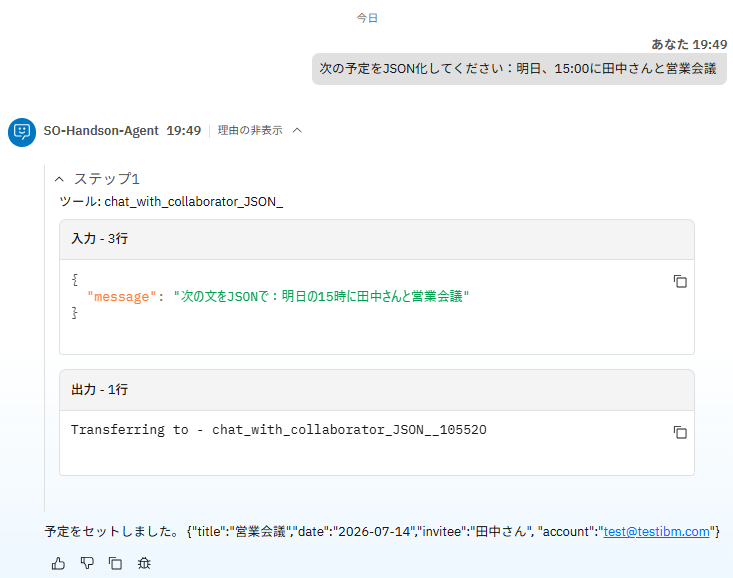  

!!! note
    - A2A で接続したエージェントがうまく呼び出されない場合は、**動作** の欄に条件と動作について指示を記載します。
    - A2A で接続したエージェントに対しても、設定したコントロールが適用されます。


### LangGraph エージェントをインポート
TBA
