# 画面の確認と事前準備
この Lab では、Control Plane のダッシュボード画面について確認します。  
また、事前準備としてサンプルのエージェントを作成します。  


## 事前準備
UI が英語になっている場合は、日本語に変更します。  
既に日本語になっている場合は、[ダッシュボードについて](#_3) セクションへ進んでください。  

1\. 画面右上にある自身のイニシャルアイコンをクリックし、**Setting** を選択します。  
   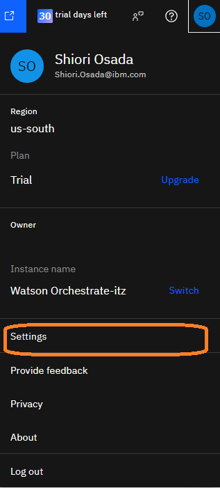

2\. **Platform Language** のタブを選択します。  
   **Add a language** のプルダウンで「Japanese / 日本語」を選択し、**Defaulf languages for all users** のプルダウンでも「Japanese / 日本語」を選択して **Save** を押下します。  
   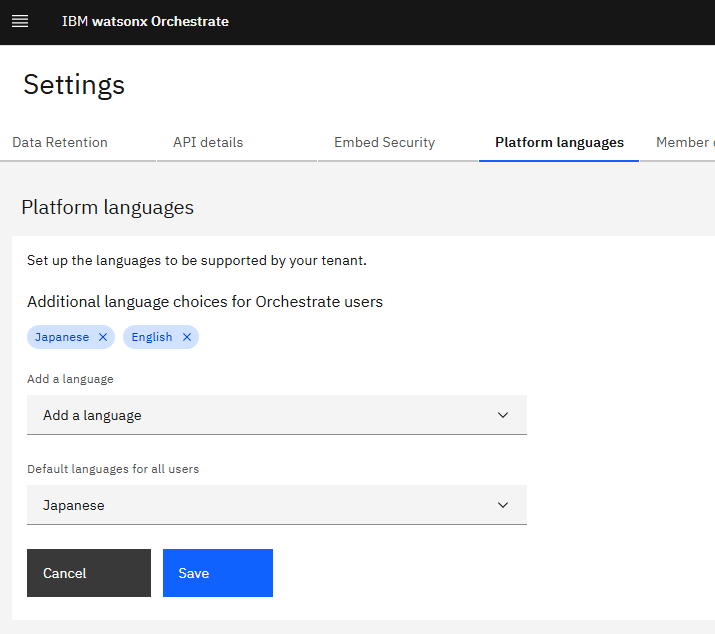  
   "You're changing the default language for your users" というメッセージが出るので、**Confirm** を選択します。

3\. 設定が完了すると、上部のバーの **Engligh** と記載されている部分がプルダウンで選べるようになっているので、「Japanese / 日本語」を選択して **Apply** を押下します。  
   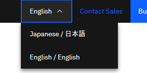


## ダッシュボードについて
画面左上の **IBM watsonx Orchestrate** ロゴ、もしくは左上のハンバーガーメニューから **ホーム** をクリックすると、Control Plane のダッシュボードが表示されます。  

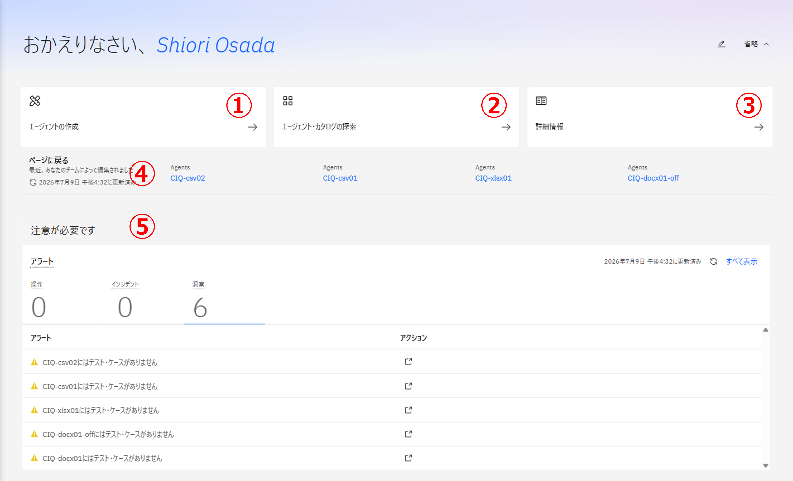  

① エージェント作成メニュー：新しいエージェントを作成するウィンドウが開きます。  
② カタログ：事前構築済みのエージェント（テンプレート）やツール（コネクター）等の一覧メニューに遷移します。  
③ ドキュメント：製品ドキュメントに遷移します  
④ 最近の編集履歴：直近編集が行われたエージェントが表示されています。  
⑤ 注意事項：設計に不備があるエージェントに対するアラートや、対応が修正される洞察が記載されています。  
　**アクション** より、詳細の確認や対応するためのメニューに遷移できます。  

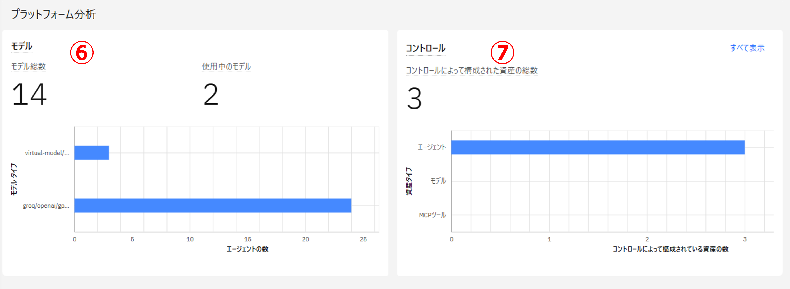  

⑥ モデル状況：エージェントが利用している LLM の利用分布が表示されています。  
⑦ コントロール：エージェント、モデル、MCP ツールなどの各アセットに対するコントロール（ポリシー設定）の数が表示されています。  

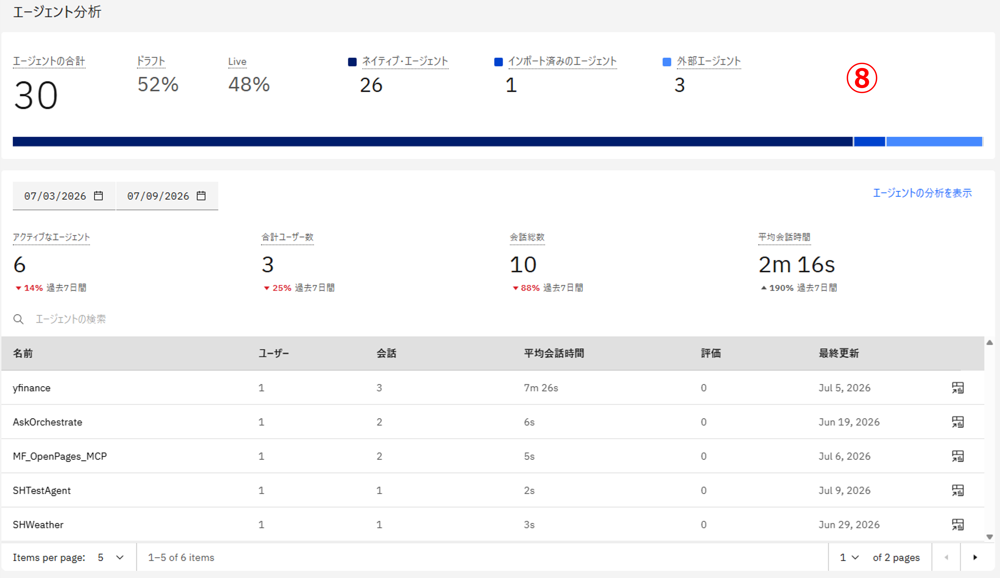  

⑧ エージェントの利用分析：エージェントの開発・利用状況が確認できます。  
　この画面ではエージェントの種類分布や、直近の利用実績情報が表示されており、特定のエージェント名をクリックすると **Agent Builder**（開発画面） へ、右側列にある **分析の表示** をクリックするとさらに詳細の分析情報へ遷移します。  

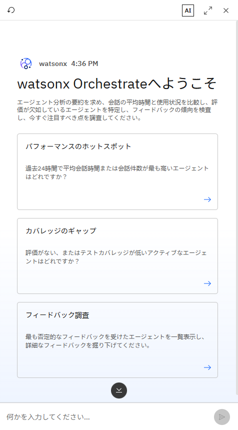  

⑨ Control Plane エージェント：このテナントで管理しているエージェントやアセットについて分析や洞察を質問することができる管理者用のエージェントです。


## サンプルエージェントの作成
Control Plane で実際のデータを確認するために、サンプルのエージェントを作成します。

!!! note
    - このセクションでは、Agent Builder の基本的な説明や使い方は省略しています。初めての方は、まず <a href="https://ibm.github.io/ba-handson-jp/wxoagent/">こちらの基礎ハンズオン</a> を参照ください。

1\. Control Plane 上部、または左上のハンバーガーメニュー > ビルド より **エージェントの作成** ボタンを押下します。  
   「最初から作成」を選んで、任意の名称と説明を付与したエージェントを作成してください。  
   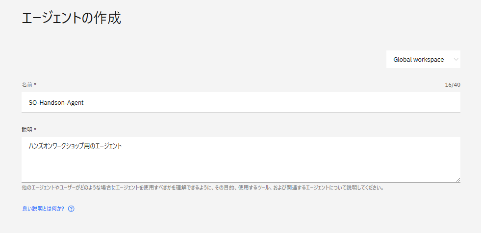  

2\. 以下2つの OpenAPI ツールをダウンロードし、エージェントにインポートしてください  
   ① [Nominatim Geocoding ツール](files/nominatim_geocode.yaml)  
     ▶ OpenStreetMap の Nominatim を使って、地名・住所・施設名などのテキストから
    緯度経度（WGS84）を検索するツールです。  
   ② [OpenStreetMap Overpass ツール](files/overpass_map_search.yaml)  
     ▶ OpenStreetMap の Overpass API を使って、指定した場所の周辺にある施設・地物を検索するツールです。  
   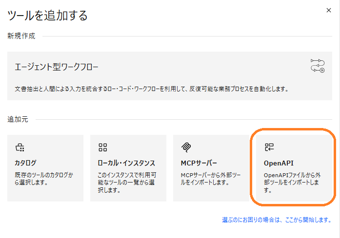  
   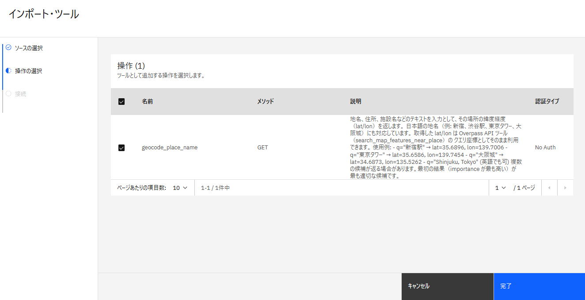  
   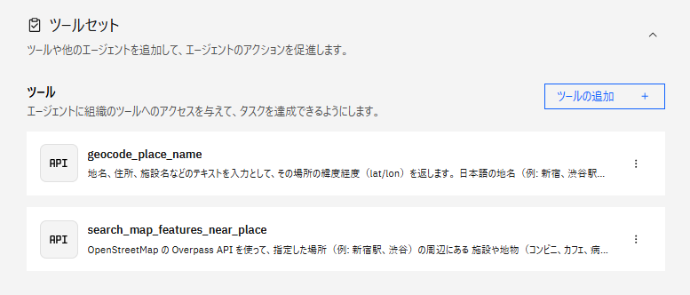  

3\. 右側のプレビューチャットより、エージェントとのテスト会話をします。  
!!! note
    - 特定の地名から緯度経度を取得し、緯度経度の情報周辺の地図情報を取得できるようになったので、以下のような質問ができるようになっています。
    ```
    虎ノ門ヒルズ駅付近のカフェ情報を教えて
    ```
    - エージェントの回答から **理由の表示** を開くと、エージェントが2つのツールの機能を理解し適切に使い分けていることが分かります。
