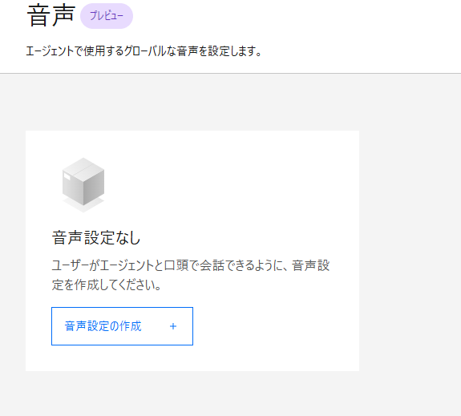
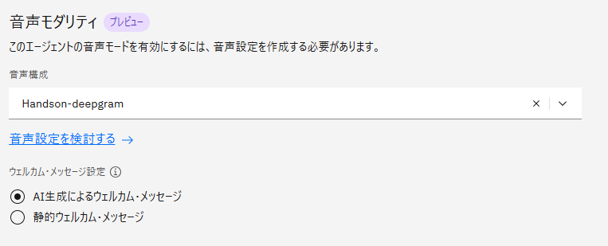
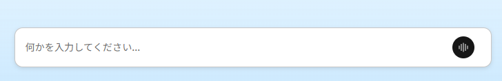
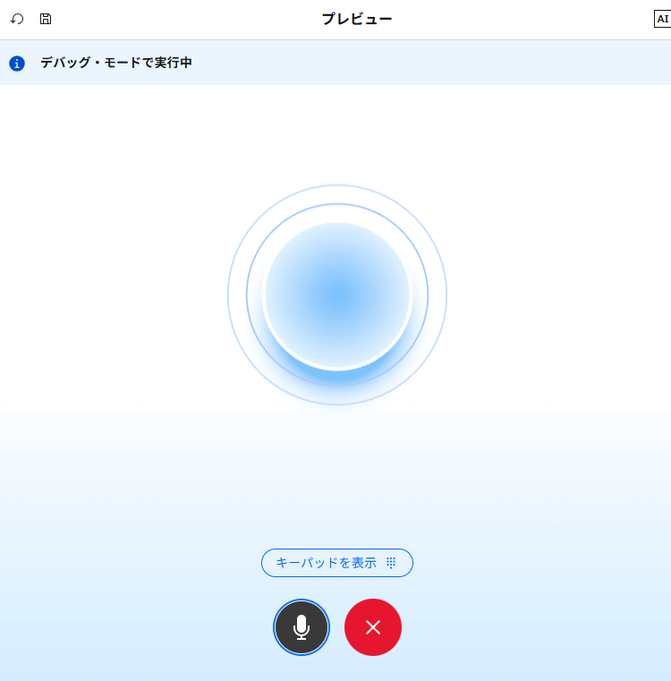

# オプション：音声エージェント
この Lab では、watsonx Orchestrate で作成したエージェントに対する音声対応設定を行います。  
組織の持つ音声プロバイダー、もしくは watsonx Orchestrate に利用権が付随する音声プロバイダーをエージェントに設定可能です。詳細のガイドは <a href="https://www.ibm.com/docs/ja/watsonx/watson-orchestrate/base?topic=configuring-voice" target="_blank" rel="noopener noreferrer">こちら</a> を参照ください。  

## 音声サービスの設定
まず、エージェントにセットするための音声会話設定を行う必要があります。  
watsonx Orchestrate における音声の設定は以下のような流れで行われます。

1. **Speech to Text** （音声→テキストへの変換）を行うプロバイダーの設定
2. **Text to Speech** （エージェントの生成したテキスト→音声への変換）を行うプロバイダーの設定
3. 作成した音声設定を対象のエージェントにセット

!!! note
    - 以下は watsonx Orchestrate で利用可能な音声プロバイダーの一覧です。  
      製品アップデートによって拡充予定のため、最新情報は公式ガイドをご確認ください。
         - Speech to Text
            - Watson Speech to Text
            - Deepgram
         - Text to Speech
            - Watson Speech to Text
            - Deepgram
            - ElevenLabs
    - Watson Speech to Text を利用するためには別途契約したサービスの API key が必要です。

このハンズオンでは API key が不要なサービス（watsonx Orchestrate だけで利用可能なサービス）を使って音声設定を作成します。  

1\. 左上のハンバーガーメニューから **管理** > **音声** をクリックします。  

2\. **音声設定の作成** ボタンをクリックします。  
     

3\. **音声設定名** は任意の名称を入力し、**次へ** に進みます。  

4\. **Speech to Text** の設定では、「Deepgram」を選択します。  
&emsp;モデルは、Flux シリーズを使う場合は「Multilingual」を選択し、**言語ヒント** として「Japanese」を選択します。Nova シリーズを使う場合は、言語は「Japanese」を選択します。  
   .png)  

5\. **Text to Speech** の設定でも同じく「Deepgram」を設定し、言語は「Japanese」を選択します。  
&emsp;音声の種類は任意で選んでください。  
   .png)  

6\. **拡張設定** では、デフォルト設定のままにして **完了** します。  

<!-- ToDo：拡張機能の各設定について補足を記載する -->

## エージェントへの設定
Lab1 で作成したエージェントに音声設定をセットし、口頭会話でやり取りできるようにします。  

1\. 左上のハンバーガーメニュー > **ビルド** より自身のエージェントを選択して Agent Builder を開きます。  

2\. **音声モダリティ** の欄より、先ほど作成した音声設定を選択します。  
     

3\. プレビューチャットの入力欄に、**音声モード** ボタンがあるのでクリックします。  
     

4\. 音声インプット可能な画面に遷移するので、ミュートを解除した状態でエージェントに質問します。少し後、音声で回答が返ってくることを確認します。  
&emsp;質問の例：「あなたにはどんなツールがありますか？」「虎ノ門ヒルズ駅付近のカフェ情報を教えて」
     

!!! note
    - 自分の発話が終わった後にエージェントの処理に入るまでの時間、エージェントが試行中のタッチキー音、処理に時間がかかる場合のコメントなどは音声設定の拡張設定として調整可能です。

