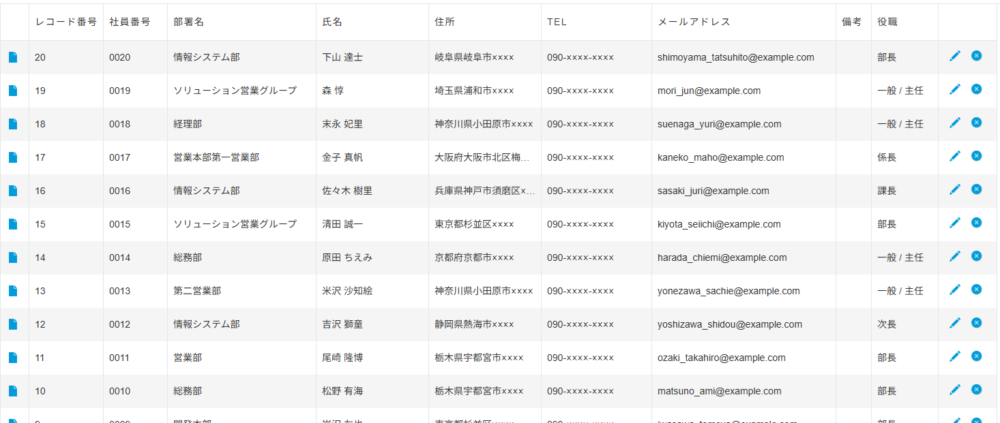
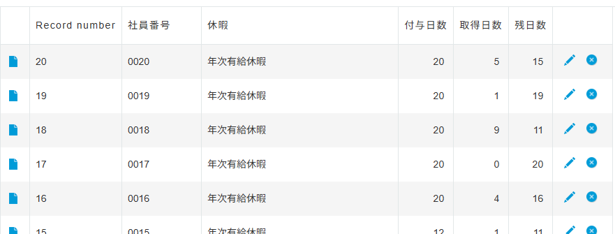
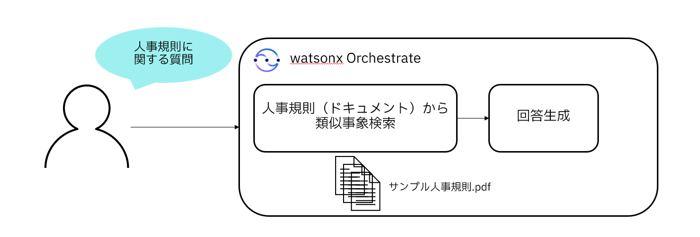
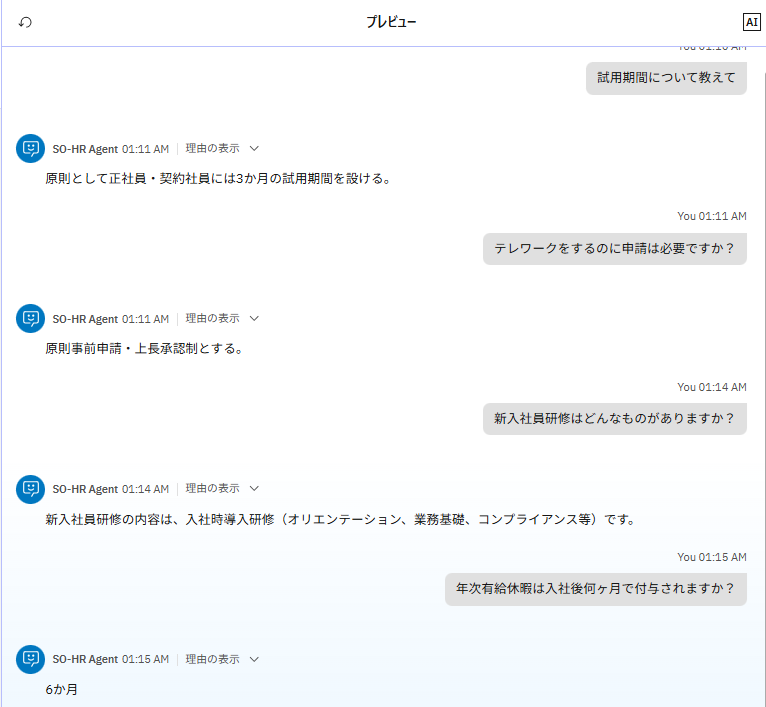
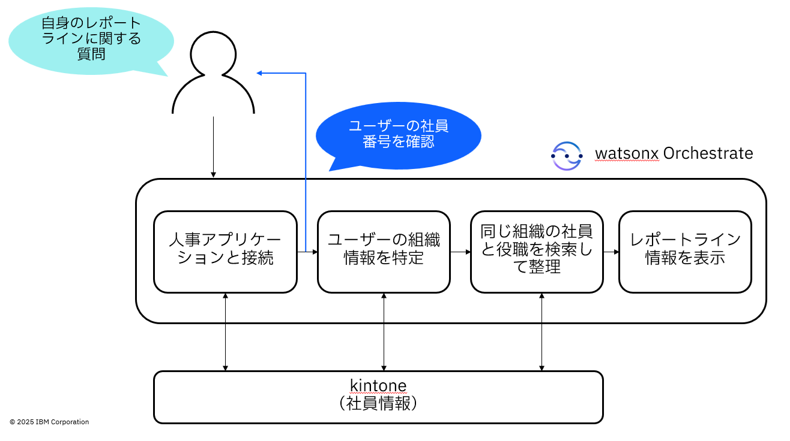
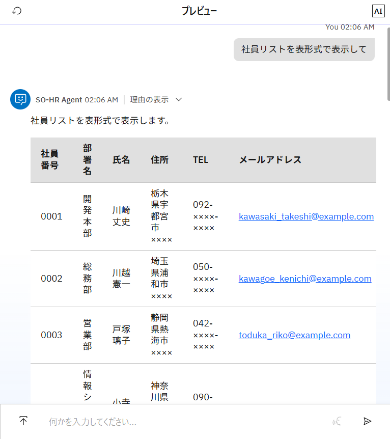
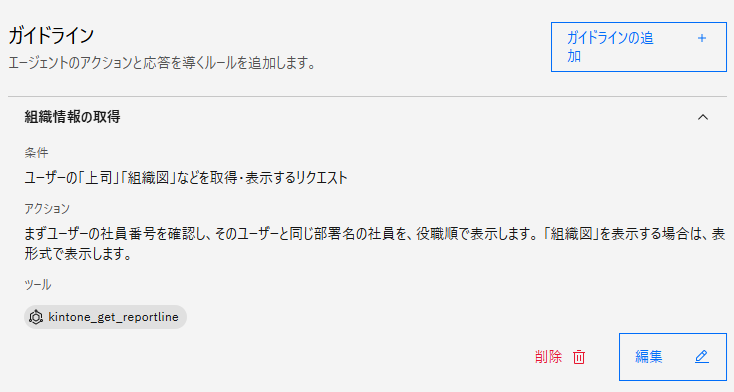
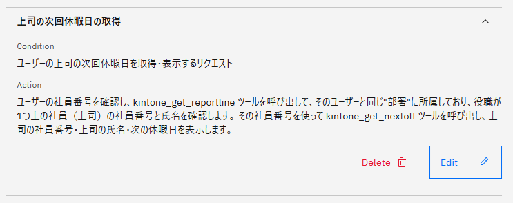
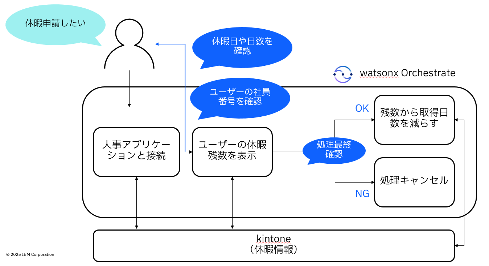
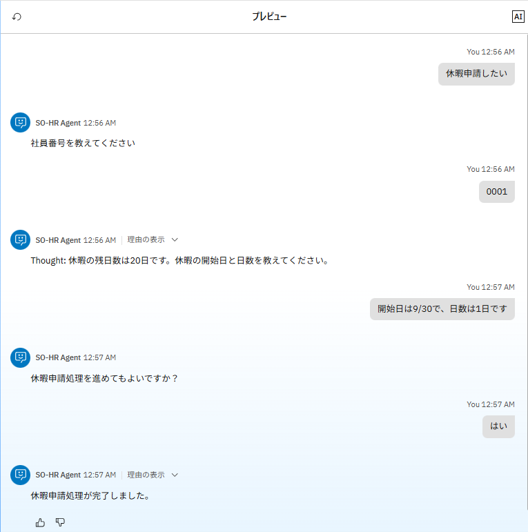

# 人事エージェント - 従業員向けアシスタントのユースケース

この Lab では、従業員が行う人事関連業務をアシストする AI エージェント作成を行います。  
対象システム（サンプル人事システム）は kintone を使って作成した Web アプリケーションです。kintone はプリビルドスキルの用意が無いため、当ハンズオンではカスタムで作成済みの Connections（接続設定）およびツールを利用します。


## 実装シナリオ
下記の処理を行うことができるエージェントを実装します。  
**①人事規則を確認する**  
**②自身の組織情報を確認する**  
**③自身の上司の休暇予定を確認する**  
**④休暇申請する**


## Connections（接続設定）の設定確認
あらかじめ定義済みの接続設定を確認します。  
1. 左側のメニューより、「管理」 > 「接続」を選択してください。  
2. 接続設定の管理画面が表示されます。  
3. 検索ボックスに、**kintone** と入力してください。kintone が名称に含まれるいくつかの接続設定が表示されます。今回のハンズオンで利用する **kintone-os-employeelist** および **kintone-os-timeoff** の接続設定が存在することを確認します。

!!! warning
    - 接続設定は参加者が共通で使う設定のため、**変更しないようご注意ください。**

!!! note
    - kintone はプリビルドツールが無いため、watsonx Orchestrate のエージェントから接続するためにはカスタムで接続設定およびツールの追加が必要になります。接続設定はこの画面の「新規接続の追加」または ADK の Connections コマンドにより追加し、ツールは python または json/yaml ファイルを作成してインポートします。
    - 今回のハンズオンでは、kintone で作成した **社員名簿** のアプリケーションと **休暇情報** のアプリケーションに接続するため、それぞれのアプリケーションに対する接続設定があらかじめ設定されています。

**社員名簿** アプリケーションのイメージ


**休暇情報** アプリケーションのイメージ



## シナリオ① - 人事規則を確認する
エージェント・ビルダーからご自身の名前をつけたエージェントを作成し、人事規則に関する回答ができるよう設定していきます。
サンプルの人事規則は [こちらのファイル](./files/サンプル人事規則.docx) からダウンロードしてください。



### 完成したエージェントの挙動イメージ
サンプル人事規則に記載されている内容を元にした、たとえば以下のような質疑応答ができるようになっていれば、完成です。

- Q：試用期間について教えてください  
    A：原則3ヶ月
- Q：テレワークをするのに申請は必要ですか？  
    A：原則事前申請・上長承認が必要
- Q：新入社員研修はどんなものがありますか？  
    A：入社時導入研修（オリエンテーション、業務基礎、 コンプライアンス等）
- Q：年次有給休暇は入社後何ヶ月で付与される？  
    A：6ヶ月



??? question "エージェント作成のヒント"
    - ファイルを追加する際、どういった内容のファイルなのかをナレッジソースの説明に追加することでエージェントの参考になります。
    ```
    [Sample]
    このファイルは人事規則を記載しています。採用・勤務・賃金・休暇・退職・福利厚生などの情報が含まれます。
    ```
    - どの情報を使ってどんな処理をすべきエージェントなのか、Behavior（動作）に定義することで LLM の挙動を操作できます。
    ```
    [Sample]
    ナレッジソースを使用して、人事規則に関する質問に回答します。

    ナレッジソース：
    - サンプル人事規則.pdf：人事規則に関するドキュメント

    エージェントの動作方針：
    - 回答が分からない場合は、それを伝えます。LLMの知識でオリジナルの回答を作成しません。
    - ユーザーとのコミュニケーションは、必ずユーザーが話す言語で行います。例えば、ユーザーが日本語で話す場合は、日本語で回答します。
    ```
    - LLM が質問を上手く理解できない場合は、エージェント・スタイルを **ReAct** に変更したり、他の AI モデルに変更して試します。  
    ※上記に載せているサンプルの会話は、llama-3-2-90b-vision-instruct モデルと ReAct スタイルで実行しています
    - LLM がナレッジソースではなく独自の回答を含めてしまう場合は、Knowledge setting（知識設定）の「応答」値の変更を試します。
    
    


## シナリオ② - 自身の組織情報を確認する
kintone で作成された社員情報アプリにアクセスし、ユーザーと同じ組織の情報を回答できるよう設定していきます。
社員情報アプリから社員情報を取得するツールは、ローカル・インスタンスから **kintone_get_employeelist** および **kintone_get_reportline** を追加して利用してください。



ツールを追加したら、まずはどのような社員データがあるのか確認してみましょう。社員の全情報が取得できる **kintone_get_employeelist** を呼び出すと、以下のようなデータが確認できます。

!!! note
    - リスト系データを複数行表示する場合は、表形式で表示させるようプロンプトに含めると見やすくなります。
    - 件数が多いと表示に時間がかかってしまう場合があるため、ここでのテストは "10件まで" のように数を絞って表示させることを推奨します。



### 完成したエージェントの挙動イメージ
ご自身の社員番号を仮で決め、たとえば以下のように同じ部署の社員やそのレポートラインを共有できるようになっていれば、完成です。  
※今回利用するツールは個人認証を行わないため、特定ユーザーの組織情報を取得するためには対象のユーザーの社員番号を AI エージェントに連携します。


??? question "エージェント作成のヒント"
    - 対象ユーザーと同じ組織の情報を上手く出力できない場合は、組織情報について聞かれた際のデータの検索方法を Behavior（動作）あるいは Guidelines に示します。  
    以下は特定条件のガイドラインとして定義した例です。

    

    条件
    ```
    [Sample]
    ユーザーの「上司」「組織図」などを取得・表示するリクエスト
    ```
    アクション
    ```
    [Sample]
    まずユーザーの社員番号を確認し、そのユーザーと同じ部署名の社員を、役職順で表示します。「組織図」を表示する場合は、表形式で表示します。
    ```


## シナリオ③ - 自身の上司の休暇予定を確認する
先ほど実装した組織情報を利用し、自身の上司の次回休暇予定を確認できるよう設定していきます。
特定社員の次回休暇情報を取得するツール **kintone_get_nextoff** を追加し利用してください。

### 完成したエージェントの挙動イメージ
ご自身の社員番号を仮で決め、たとえば以下のように上司（＝同じ部署で役職が1つ上の社員）の次回休暇日を表示することができるようになっていれば、完成です。  
※「理由の表示」をクリックして、上司の社員を正しく認識できていることを確認してください。


??? question "エージェント作成のヒント"
    - 対象ユーザー（質問者の上司）を探し、その上司に対して休暇日取得のツールを実行するよう Behavior（動作）あるいは Guidelines に示します。  
    以下は特定条件のガイドラインとして定義した例です。

    

    条件
    ```
    [Sample]
    ユーザーの上司の次回休暇日を取得・表示するリクエスト
    ```
    アクション
    ```
    [Sample]
    ユーザーの社員番号を確認し、kintone_get_reportline ツールを呼び出して、そのユーザーと同じ"部署"に所属しており、役職が1つ上の社員（上司）の社員番号と氏名を確認します。 その社員番号を使って kintone_get_nextoff ツールを呼び出し、上司の社員番号・上司の氏名・次の休暇日を表示します。
    ```


## シナリオ④ - 休暇申請する
休暇申請処理ができるよう設定していきます。kintone で作成された休暇情報アプリにアクセスし、有給休暇データを取得できるツール **kintone_get_timeofflist** および更新できるツール **kintone_update_timeoff** を追加し利用してください。



!!! warning
    - 休暇情報アプリは参加者が共通で使うため、**ご自身に割り当てられた社員番号データのみ更新するようご注意ください。**

ツールを追加したら、まずはご自身の有給休暇が何日あるのか確認してみましょう。社員の有給休暇日数が取得できる **kintone_get_timeofflist** を呼び出すと、以下のようなデータが確認できます。


### 完成したエージェントの挙動イメージ
ご自身のデータに対し、休暇申請処理（休暇申請アプリの残日数データを更新）することができるようになっていれば、完成です。  
※「理由の表示」をクリックしたり、実施後に再度 **kintone_get_timeofflist** を呼び出したりして、正しく処理が行われたことを確認してください。



??? question "エージェント作成のヒント"
    - 申請前に、休暇の残数確認や、休暇の取得開始日および日数を確認する必要があります。  
    以下は特定条件のガイドラインとして定義した例です。休暇申請ツールの実行前にユーザーに最終確認を入れるよう指示しています。

    

    条件
    ```
    [Sample]
    有給休暇申請処理のリクエスト
    ```
    アクション
    ```
    [Sample]
    Step1: ユーザーの社員番号を確認して、kintone_get_timeofflist ツールを呼び出し、有給休暇の残日数を回答します。
    Step2: 休暇の開始日（日付）・日数を確認します。
    Step3: 休暇申請処理を進めてもよいかどうか、ユーザーに必ず確認します。
    Step4: OKの場合は、kintone_update_timeoff ツールを呼び出します。NGの場合は、処理をキャンセルします。
    ```


## お疲れさまでした！
このハンズオンでは、カスタムの接続設定とツールを使い、kintone で作成した人事アプリケーションと連携したエージェントを実装しました。