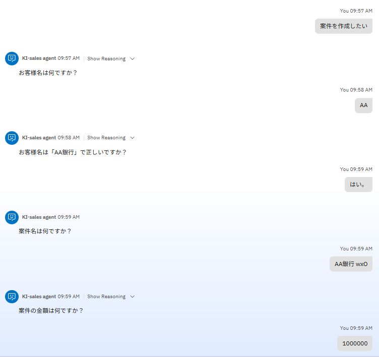
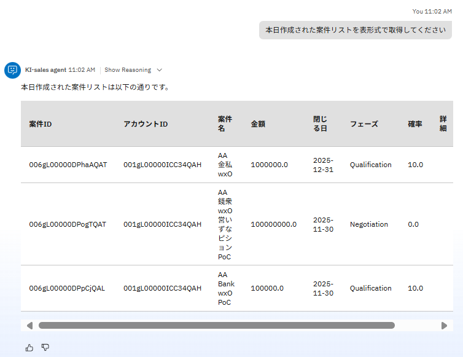

# 営業支援のユースケース

営業支援のユースケースを想定して、watsonx Orchestrateでの実践的なエージェント作成について学びます。


## 実装シナリオ

下記の業務シナリオを実装します。

**お客様名を検索→新規案件を登録、Slackで共有**  


## オプション: 外部アプリケーションとの接続

この Lab では Salesforce と Slack を watsonx Orchestrate に接続してエージェントを作成します。環境作成と接続手順は、以下のQiita記事を参考にしてください。  
- [Salesforce の環境作成と接続手順](https://qiita.com/y175/items/4aa9ee1fde4f12171ca3)  
- [Slack の環境作成と接続手順](https://qiita.com/ikeda_24/items/7b94effc4eafd008203f)


## エージェント作成のヒント

エージェントでの **会話フロー例** です。以下のイメージの通りにならなくても問題ございません。  
  
  

!!! note
    講師から提供される Salesforce 環境を使用する場合は、お客様名は「AA」もしくは「BB」で検索してください。

<br>
Salesforceの商談一覧にはこのように登録されています。  
  

Slackにはこのようにメッセージが送信されています。
  

!!! note
    今回使用するモデルでは日本語が文字化けしてしまうことがあるため、気になる方は案件名を英語で入力してみてください。実運用では他のモデルに変更することで解消可能です。

<br>
以下はエージェント作成に関するヒントです。必要に応じてご参照ください。  

**プリビルドツール** は以下の3つを使用しています。

??? question "プリビルドツール"
    - Retrieve Salesforce accounts  <br>
    - Create an opportunity in Salesforce (Create opportunities in Salesforce)  <br>
    - Send a message in Slack  

<br>
ツールを呼び出す順番や、エージェントからの質問・回答の仕方を指定したい場合は、**動作** の指示に記載すると調整できます。  
動作の指示には、エージェントが行うべきこと、応答方法、および従うべき制限事項を指定してください。以下に参考例を記載いたします。  

??? question "参考例"

    ```vb
    質問・回答はすべて日本語で行ってください。
    
    案件を作成したいと言われたら、必ず以下の順番で処理を実行してください。ユーザーへの確認は行わず、すぐに実行してください。
    - Retrieve Salesforce accounts を実行する
    - お客様名を聞き、account_ID を取得する。
    - お客様名が正しいか確認し、Create an opportunity in Salesforce を実行する

    Create an opportunity in Salesforce の入力パラメータは、account_ID を前の処理から引き継ぎ、その他は必須パラメータのみユーザーに質問してください。必須パラメータにはユーザーが回答した値以外を入力しないでください。
    stage_name を質問する際は、「フェーズ」と言ってください。また、Prospecting、Qualification、Negotiation から選択させるようにしてください。

    最後に、案件を作成したというメッセージをSlackに送信してください。メッセージには案件名と案件IDを含め、送信前にメッセージの文面をユーザーに確認してください。
    チャンネルIDは C08NG6VCCE7 です。
    ```

<br> 
AIエージェントで無事にシナリオを実行できたら、最後に Salesforce で案件を作成できているか確認してみましょう。  
**List opportunities in Salesforce** というプリビルドツールをAIエージェントに追加し、本日作成された案件リストを表形式で取得してみます。ご自身で作成した案件が表示されているか確認してみましょう。  


## オプション: 様々なプリビルドツールの活用
2025年10月現在、Salesforce や Slack に関連する多くのプリビルドツールが用意されています。
これらのツールを組み合わせて、ご自身が使ってみたい実用的なエージェントを作成してみてください。

**参考ドキュメント:**  
- [Salesforce プリビルドツール](https://www.ibm.com/docs/ja/watsonx/watson-orchestrate/base?topic=tools-sales#salesforce)  
- [Slace プリビルドツール](https://www.ibm.com/docs/ja/watsonx/watson-orchestrate/base?topic=tools-productivity#slack)  


## お疲れ様でした！

このハンズオンでは、営業支援のユースケースを想定して、Salesforce や Slack と連携したエージェントを作成しました。
