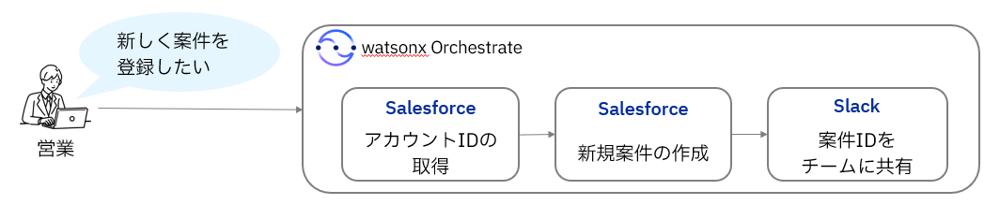
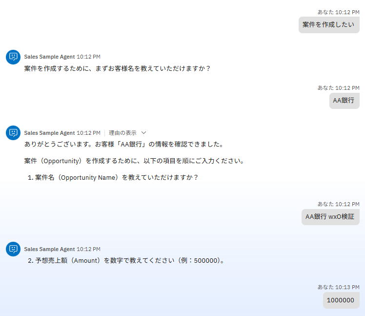
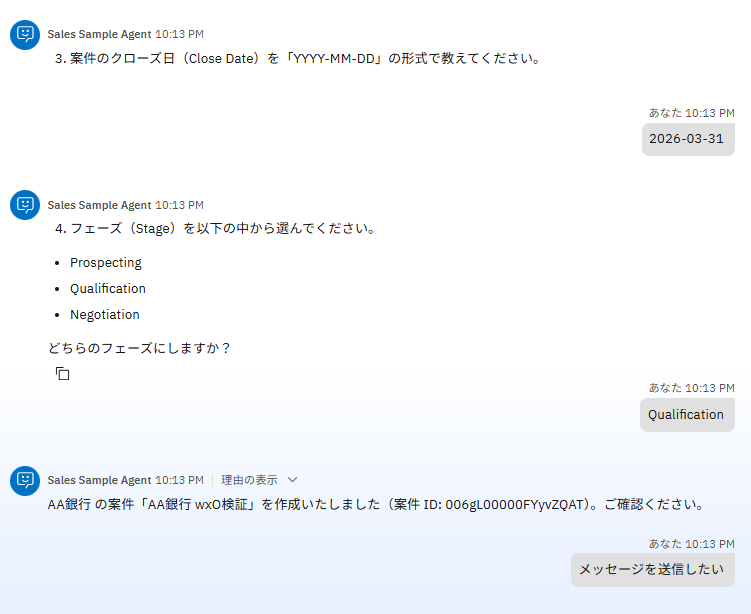
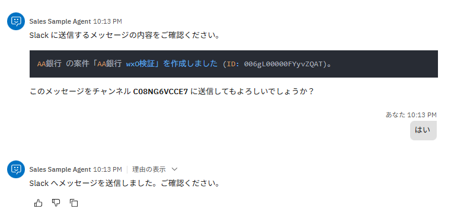
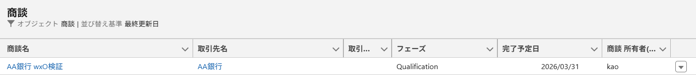
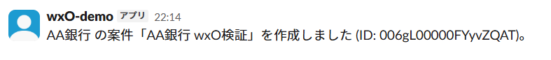
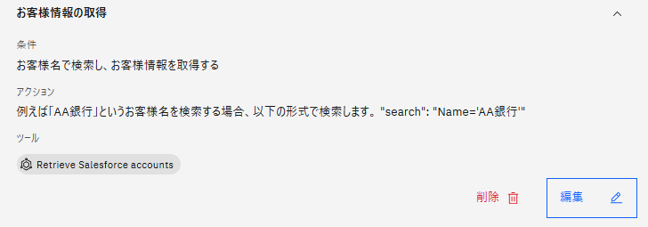
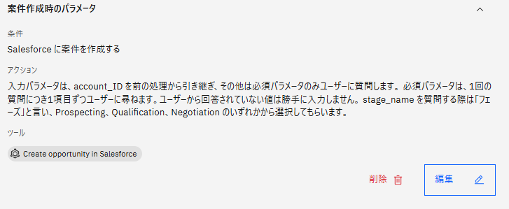
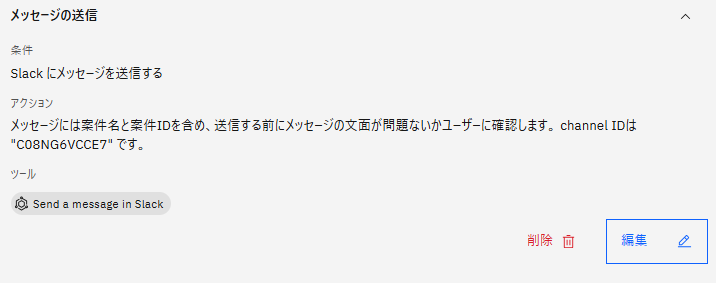
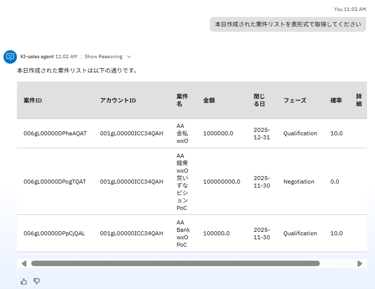

# 営業支援のユースケース

営業支援のユースケースを想定して、watsonx Orchestrateでの実践的なエージェント作成について学びます。


## 実装シナリオ

下記の業務シナリオを実装します。

**お客様名を検索→新規案件を登録、Slackで共有**  




## エージェント作成のヒント

エージェントでの **会話フロー例** です。以下のイメージの通りにならなくても問題ございません。  
モデルは **GPT-OSS 120B－OpenAI(via Groq)** を使用しています。  
  
  
  

!!! note
    お客様名は「AA銀行」もしくは「BB自動車」で検索してください。<br>
    また Slack へのメッセージ送信に必要なチャンネルIDは "C08NG6VCCE7" に指定してください。

<br>
案件が作成されると、Salesforce の 商談一覧には以下のように登録されます。  
  

<br>
また、Slack には以下のようにメッセージが送信されます。
  

<br>
以下はエージェント作成に関するヒントです。必要に応じてご参照ください。  

**プリビルドツール** は以下の3つを使用しています。

??? question "プリビルドツール"
    - Retrieve Salesforce accounts  <br>
    - Create opportunity in Salesforce  <br>
    - Send a message in Slack  

<br>
ツールを呼び出す順番や、エージェントからの質問・回答の仕方を指定したい場合は、**動作** や **ガイドライン** に記載すると調整できます。  
動作には、エージェントが行うべきこと、応答方法、および従うべき制限事項を指定してください。以下に参考例を記載いたします。  

??? question "動作の参考例"

    ```vb
    質問・回答はすべて日本語で行ってください。

    ユーザーに案件を作成したいと言われたら、必ず以下の順番で処理を実行してください。
    - ユーザーにお客様名を聞き、Retrieve Salesforce accounts を実行する
    - お客様名が正しいか確認し、Create an opportunity in Salesforce を実行する
    - 案件を作成したというメッセージを Slack に送信する
    ```

また、ガイドラインには特定の条件下（例：あるツールの実行時）にエージェントに行ってほしいアクションや応答を指定します。
以下に参考例を記載いたします。

??? question "ガイドラインの参考例 1 - お客様名の検索がうまくいかない時"
    

    名前:
    ```vb
    お客様情報の取得
    ```

    条件:
    ```vb
    お客様名で検索し、お客様情報を取得する
    ```

    アクション:
    ```vb
    例えば「AA銀行」というお客様名を検索する場合、以下の形式で検索します。
    "search": "Name='AA銀行'"
    ```

    ツール:<br>
    `Retieve Salesforce accounts`

??? question "ガイドラインの参考例 2 - 案件の作成時"
    

    名前:
    ```vb
    案件作成時のパラメータ
    ```

    条件:
    ```vb
    Salesforce に案件を作成する
    ```

    アクション:
    ```vb
    入力パラメータは、account_ID を前の処理から引き継ぎ、その他は必須パラメータのみユーザーに質問します。
    必須パラメータは、1回の質問につき1項目ずつユーザーに尋ねます。ユーザーから回答されていない値は勝手に入力しません。
    stage_name を質問する際は「フェーズ」と言い、Prospecting、Qualification、Negotiation のいずれかから選択してもらいます。
    ```
    ツール:<br>
    `Create opportunity in Salesforce`

??? question "ガイドラインの参考例 3 - メッセージの送信時"
    

    名前:
    ```vb
    メッセージの送信
    ```

    条件:
    ```vb
    Slack にメッセージを送信する
    ```

    アクション:
    ```vb
    メッセージには案件名と案件IDを含め、送信する前にメッセージの文面が問題ないかユーザーに確認します。
    channel IDは "C08NG6VCCE7" です。
    ```

    ツール:<br>
    `Send a message in Slack`

<br> 
AIエージェントで無事にシナリオを実行できたら、最後に Salesforce で案件を作成できているか確認してみましょう。  
**List opportunities in Salesforce** というプリビルドツールをAIエージェントに追加し、**本日作成された案件リストを表形式で取得してください** と入力します。ご自身で作成した案件が表示されているか確認してみましょう。  


## オプション: 様々なプリビルドツールの活用
Salesforce や Slack に関連するプリビルドツールは多数用意されています。
これらのツールを組み合わせて、ご自身が使ってみたいエージェントを作成してみましょう。

**参考ドキュメント:**  
- [Salesforce プリビルドツール](https://www.ibm.com/docs/ja/watsonx/watson-orchestrate/base?topic=tools-sales#salesforce)  
- [Slack プリビルドツール](https://www.ibm.com/docs/ja/watsonx/watson-orchestrate/base?topic=tools-productivity#slack)  


## オプション: 外部アプリケーションとの接続

この Lab では Salesforce と Slack を watsonx Orchestrate に接続してエージェントを作成しました。ご自身で環境作成や接続も含めて試してみたい際は、以下の Qiita 記事をご参照ください。  
- [Salesforce の環境作成と接続手順](https://qiita.com/y175/items/4aa9ee1fde4f12171ca3)  
- [Slack の環境作成と接続手順](https://qiita.com/ikeda_24/items/7b94effc4eafd008203f)


## お疲れ様でした！

このハンズオンでは、営業支援のユースケースを想定して、Salesforce や Slack と連携したエージェントを作成しました。
