# AIAgentを作ってみよう！

このLabでは、基本的なAIAgentの作り方を学びます。

## Agentの作成
1. 左上のメニューから**Build**を選択し、**Agent Builder**を選択します。  
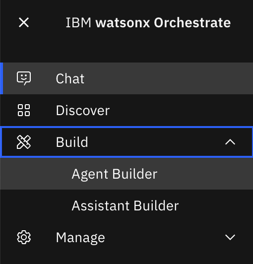

2. 右にある**Create agent**ボタンをクリックします。  
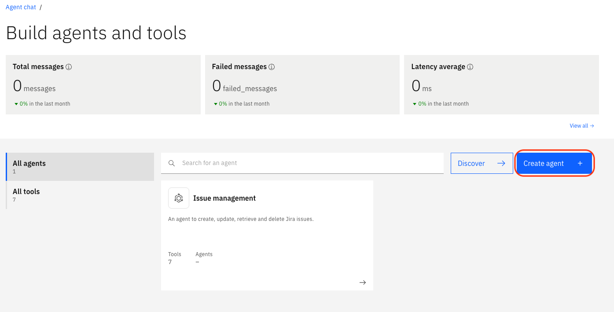

3. **Create from Scratch**を選択します。  
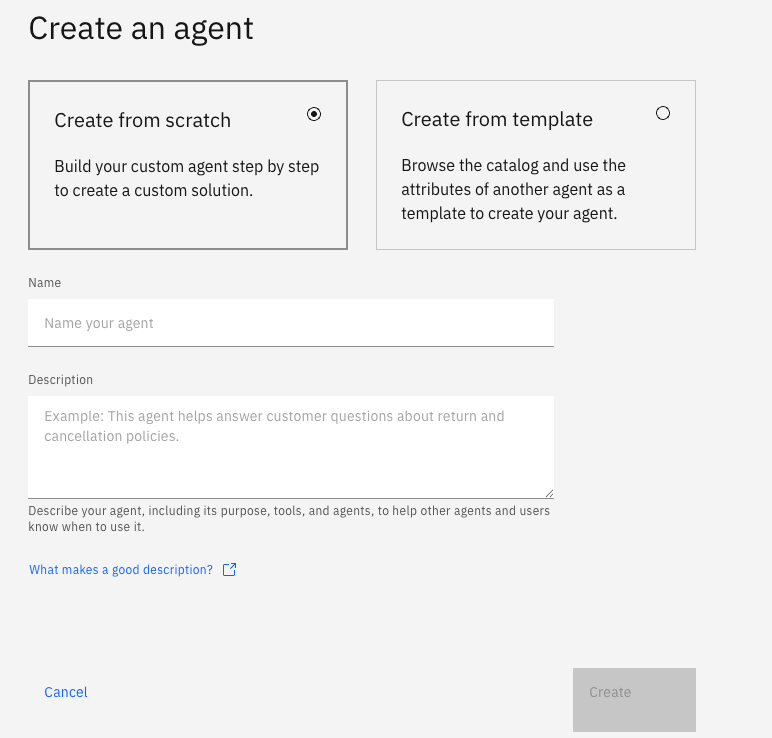

4. このハンズオンではIBMに関する質問に回答するエージェントを作成するため、Nameを**YourInitials-IBMInfo**と設定します。  

5. このエージェントの役割をDescriptionに記載します。watsonx Orchestrateは記載した内容をもとにどのエージェントを呼び出すかを判断するため、適切な記載が求められます。  
このハンズオンでは、Descriptionに**IBMの会社情報に関する質問に回答するエージェントです。**と設定し、**Create**をクリックします。  
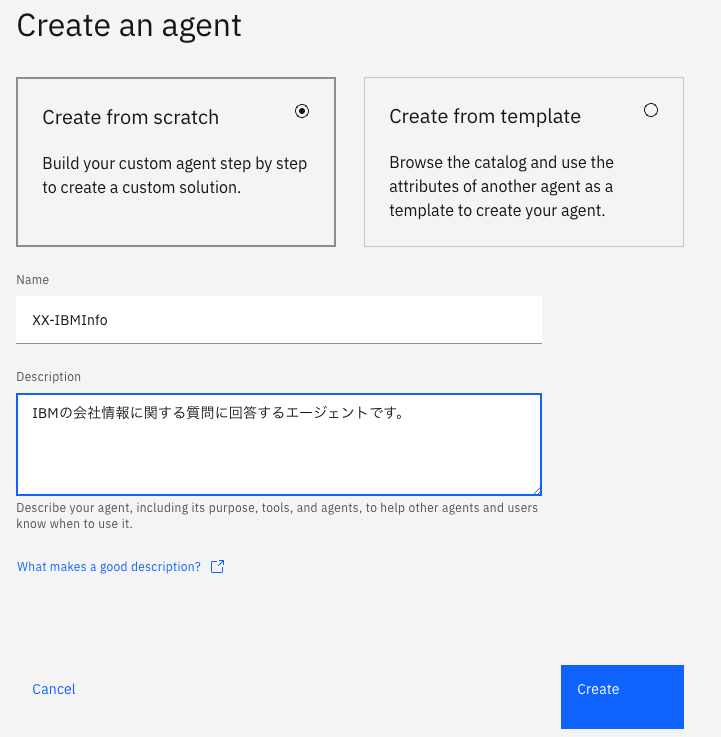

6. Agentが作成されました。先ほど入力したNameとDescriptionが自動的に入っています。  
※エラーが発生する場合は、エージェントの名前が重複している可能性があります。イニシャルを変更するなどして再度試してみてください。    
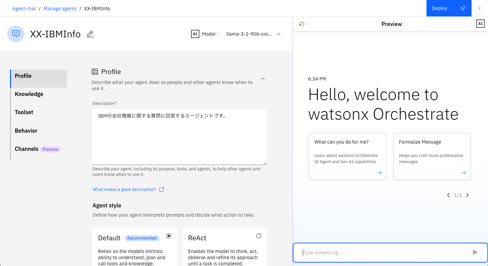

## 基本的な動きの確認
1. 右側にPreviewチャットが表示されています。ここで簡単に作成したエージェントを試すことができます。  
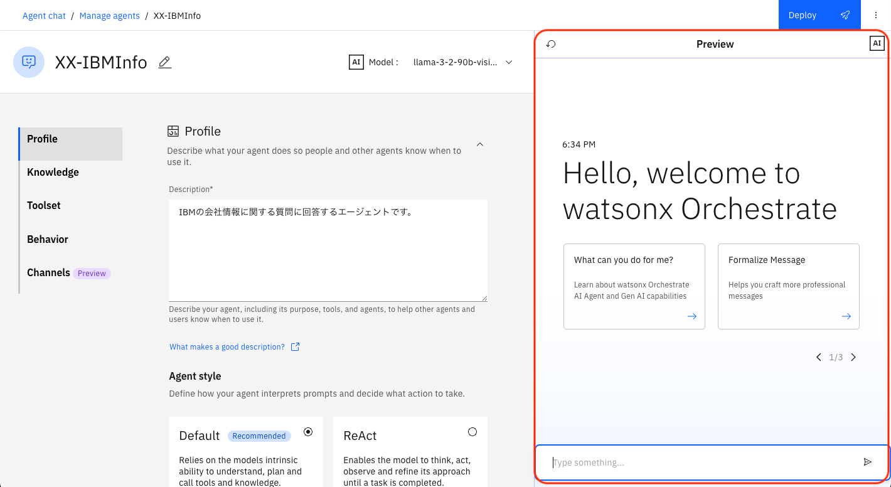

2. まずは**What is IBM?**と入力します。  
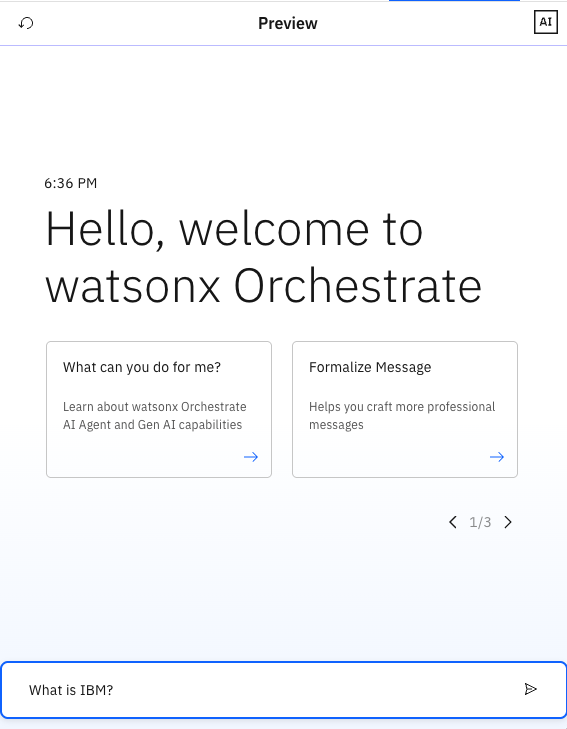

3. IBMに関する回答が返ってくることが確認できました。こちらは選択されたLLMが回答を作成しています。  
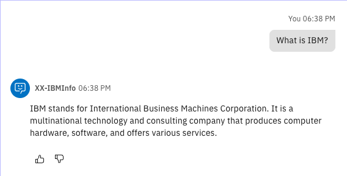

4. 続いて、**What is the stock price of IBM?**と入力します。日付などをきかれた場合には、必要に応じて回答してください。  
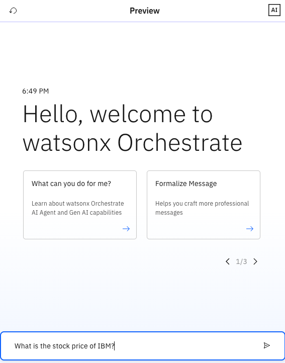

5. その結果、最新の株価情報を得ることができないことが確認できます。  
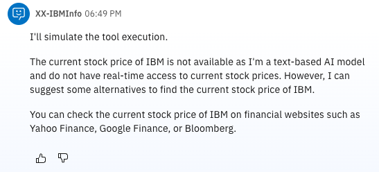
  
生成AIは案出し、要約などは得意ですが、新しい情報の取得は難しいことが確認できました。

## Behaviorの定義
1. Previewチャットに**IBMについて教えてください。**と入力します。  
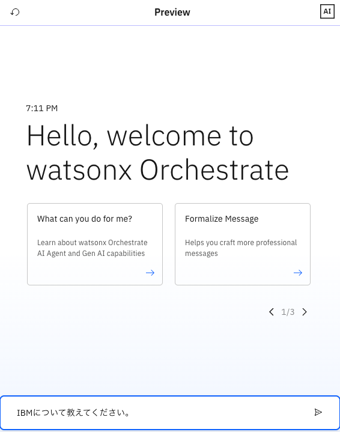

2. その結果、ユーザーの質問は理解しているようですが、英語で回答が返ってきました。  
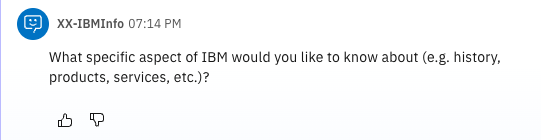

3. ユーザーが使いやすいよう利用ユーザーに合わせた動きを行うために、**Behavior**に応答の定義を行います。このハンズオンでは、日本人を対象としたAgentの作成のために、**回答は必ず日本語で行ってください。**と入力します。  
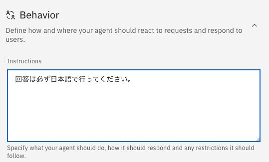

4. Previewチャットをリフレッシュしてください。  
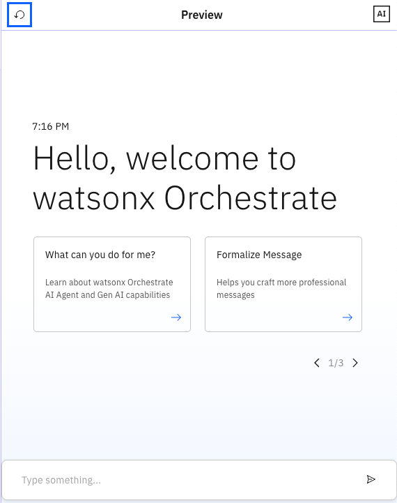

5. 再度、**IBMについて教えてください。**と入力します。  

6. 次は日本語で返ってくることが確認できました。  
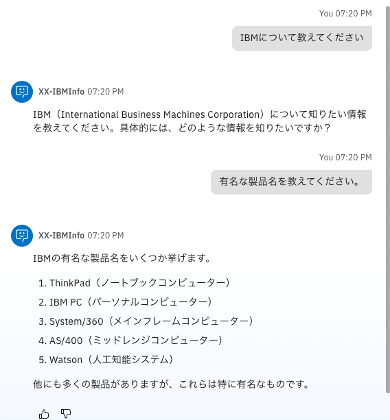
  
このように、ユーザビリティを上げるために、behaviorを適切に定義することが必須です。

## Knowledgeの使用
watsonx Orchestrateは組み込みのRAG (Retrieval Augmented Generation) 機能を提供し、エージェントごとにドキュメントをアップロードすることで、その内容をもとに回答を生成することが可能です。  
1. このハンズオンでは年次報告書を読み込ませて、それに基づいた質問に対応するエージェントを作成します。  
Choose Knowledgeのボタンをクリックします。  
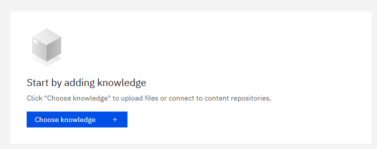  

2. Knowledgeの追加画面が出るので、**Upload Files**をクリックし、**Next**ボタンをクリックします。  
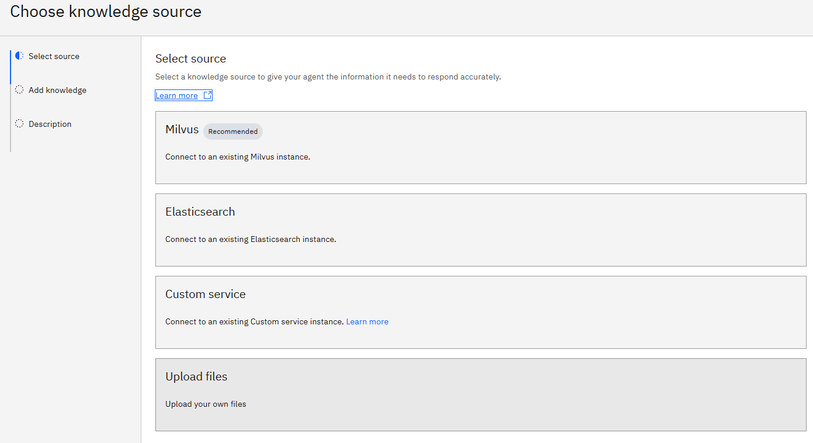

3. 今回のハンズオンでは、[こちらのファイル](./files/2024-annual-report.pdf)を使用します。 ダウンロードして保存して使用してください。**Upload files**のボタンをクリックします。ボックスにドラッグするか、または青字のテキストをクリックしてファイル・アップロード・ウィンドウを開いて、ファイルをアップロードし、**Next**をクリックします。   
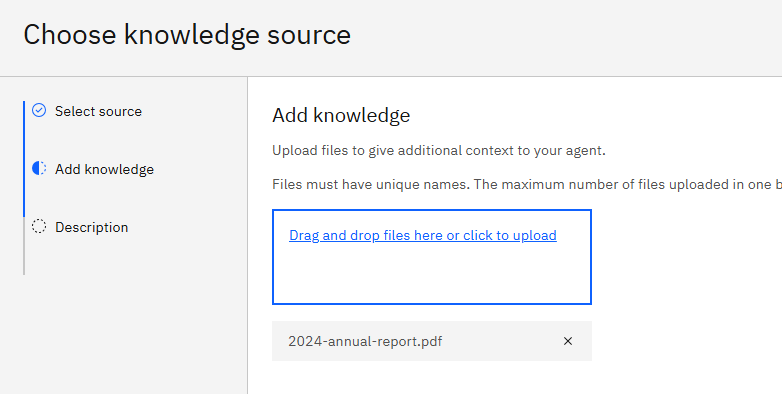

4.  エージェントが適切なタイミングでKnowledgeを使用するために、読み込むファイルがどのようなものであるかを定義する必要があります。 
今回は、Descriptionに**これは2024年のIBMの年次報告書です。財務情報とIBMのコア事業戦略を含んでいます。**と入力し**Save**ボタンをクリックしてください。  
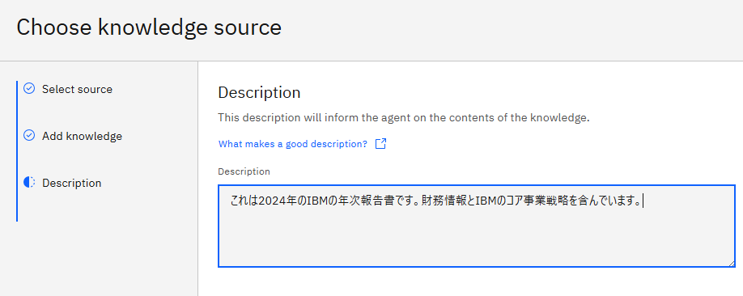

5. レポートが取り込まれるまでには少し時間がかかります。完了すると、ファイルがFilesのリストに表示されます。  
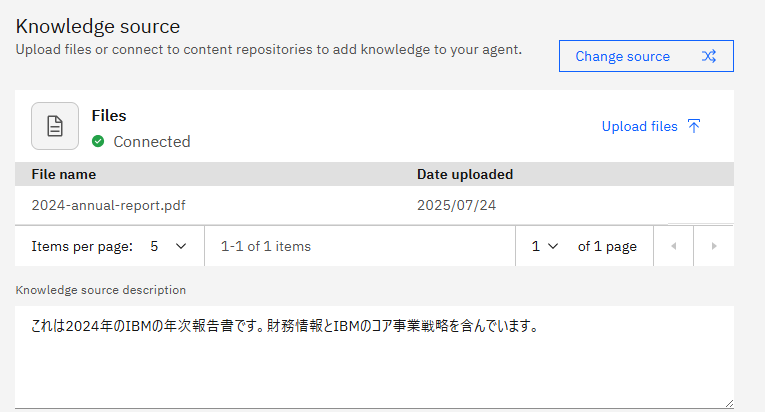

6. Previewチャットで**IBMの2024 年のフリー・キャッシュ・フローはいくらですか。**と入力します。  
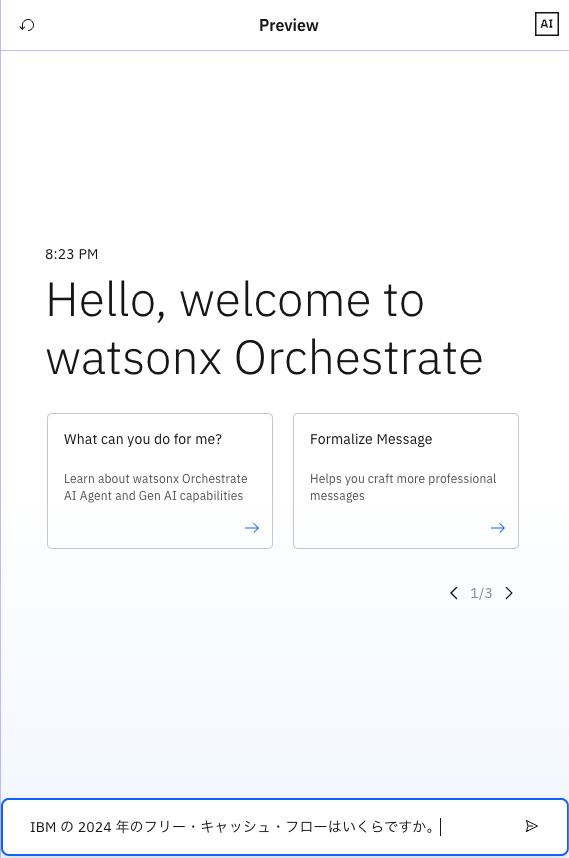

7. watsonx Orchestrateが先ほど読み込んだファイルの内容をもとに、適切な回答を行っていることが確認できます。  
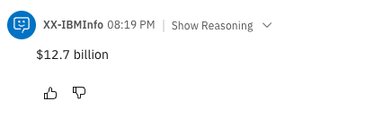
  
ドキュメントをアップロードすることで、エージェントに対して簡単にRAGを構成できることが確認できました。

## エージェントのデプロイ
誰でもこのエージェントを使うことができるように、エージェント作成後は**Deploy**をする必要があります。  
1. 右上の**Deploy**ボタンをクリックします。  
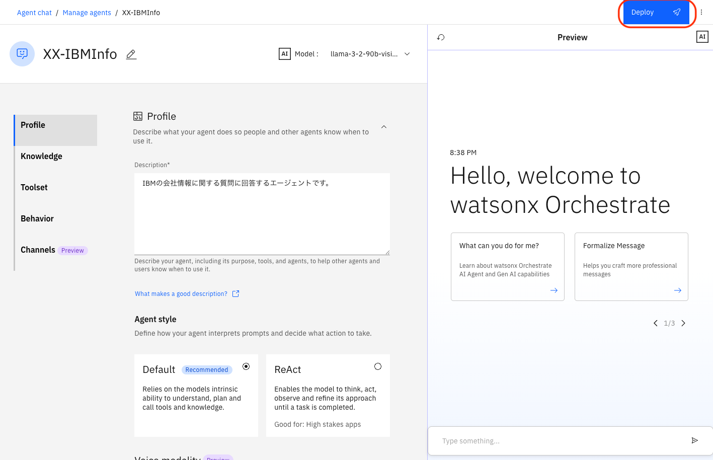
2. 特に何も入力せず、右下の**Deploy**をクリックします。  
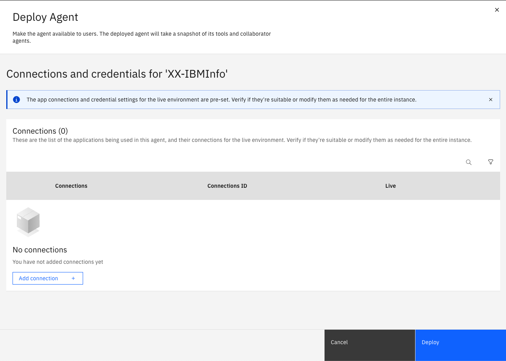
3. これでDeployが完了しました。  
左上のメニューから**Chat**を選択すると、チャット画面に移動します。Deployされていることが確認できました。  
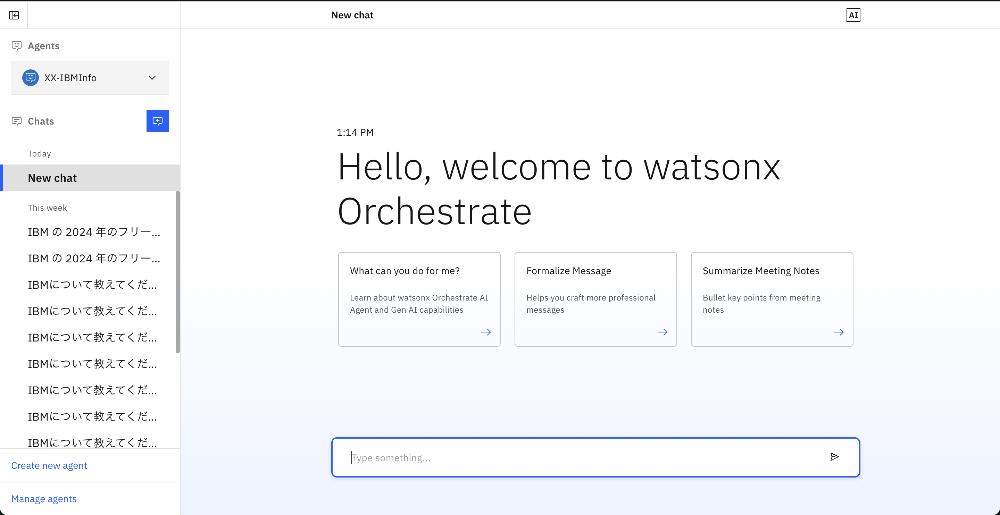

## フィードバックの実施
ユーザーからのフィードバックを元に、回答を改善することも重要です。watsonx Orchestrateではユーザーのフィードバックを受け付ける機能を提供します。どの様なフィードバックが可能かを見てみましょう。  

1. 再度**IBM の 2024 年のフリー・キャッシュ・フローはいくらですか。**と入力し、回答に対して👍をクリックします。  
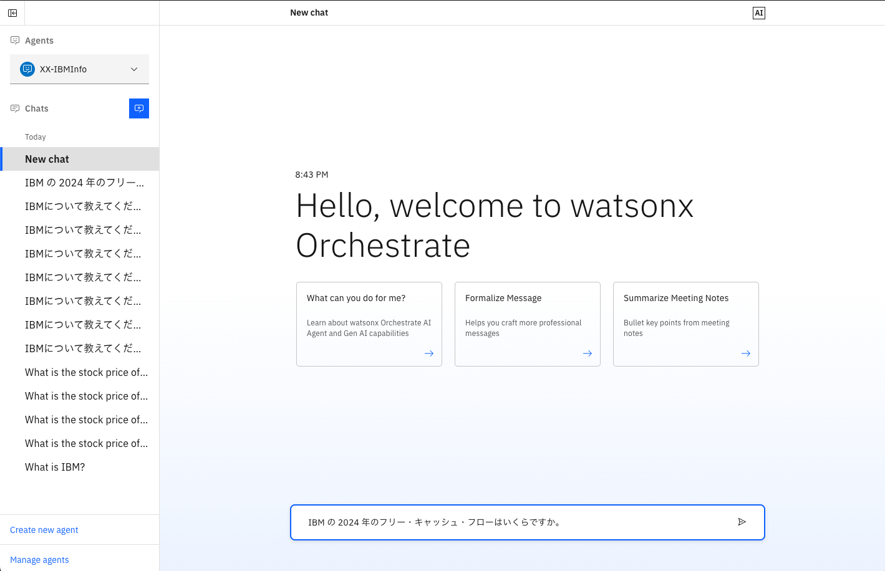

2. 回答が簡潔であったため、**Concise**を選択し、**Submit**をクリックします。  
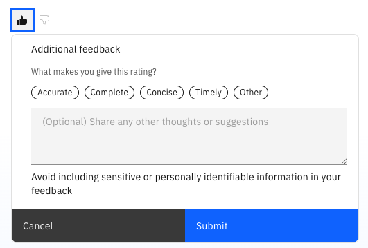

3. 一方で、再度**IBMの今日の株価を教えてください。**と入力すると、求めていた回答が返ってきませんでした。  
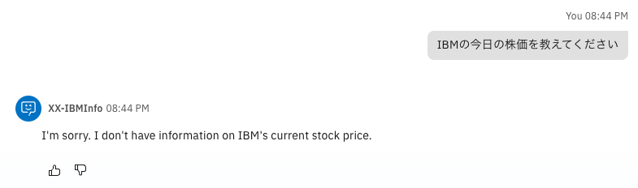

4. そのため、👎をクリックし、**Incomplete**を選択し、**Submit**をクリックします。  
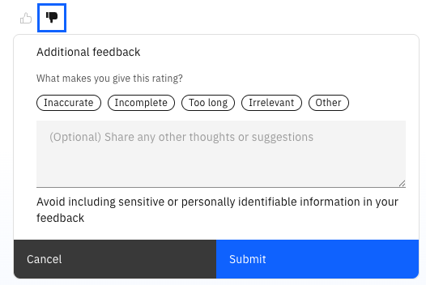

5. ビルダーと管理者はこのフィードバック結果を、APIで確認し、回答の改善に役立てることが可能です。APIの使用方法などは、今回のハンズオンでは省略します。  
  

## お疲れ様でした！
このLab1では、watsonx OrchestrateのGUIを使って、簡単にAgentを作成しました。利用ユーザーや業務内容に合わせてカスタマイズを行うことで、ユーザービリティを上げることが可能です。  

## オプション：モデルの変更
1. デフォルトでLLMが選択されています。現在のバージョンでは、**llama-3-2-90b-vision-instruct**が選択されています。  
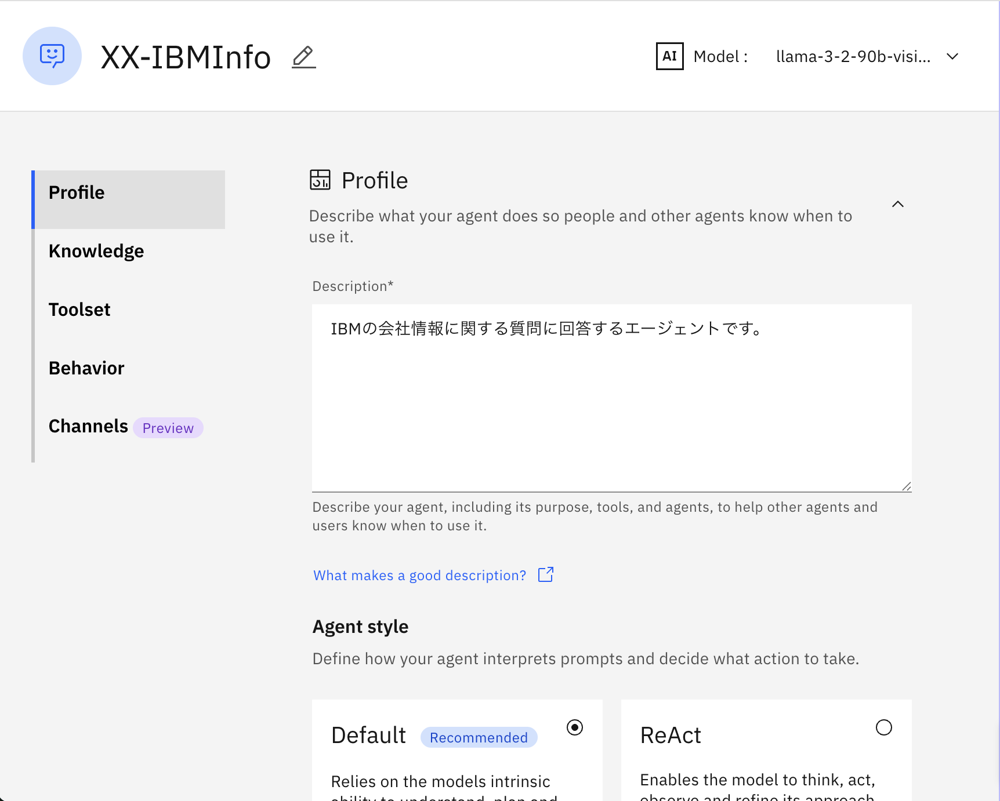

2. wxOがサポートしているモデルに切り替えることが可能になります。このハンズオンでは、**llama-3-405b-instruct**に切り替えます。  
現在サポートしているLLMは[こちら](https://www.ibm.com/docs/ja/watsonx/watson-orchestrate/base?topic=agents-choosing-foundation-model)です。  
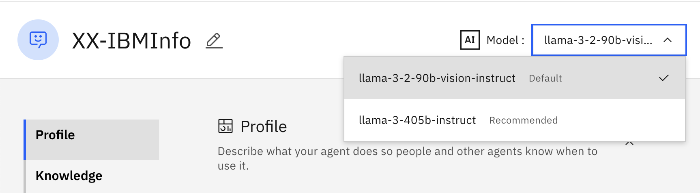

ユースケースに合わせたLLMを選択することで、適切な回答、処理を行うエージェントを作成することができます。

## オプション：エージェントに知識を加える（ppt）
Knowledgeは、PDF以外にもPowerPointなどのファイルも使用可能です。

1. [こちらのリンク](./files/BWL_Pricing_Overview.PPTX)を右クリックしてファイルに保存してください。このファイルはBWLの価格について説明した資料です。

2. P4,5にそれぞれ汎用版とUS版のBWLの価格が記載されていることを確認します。  
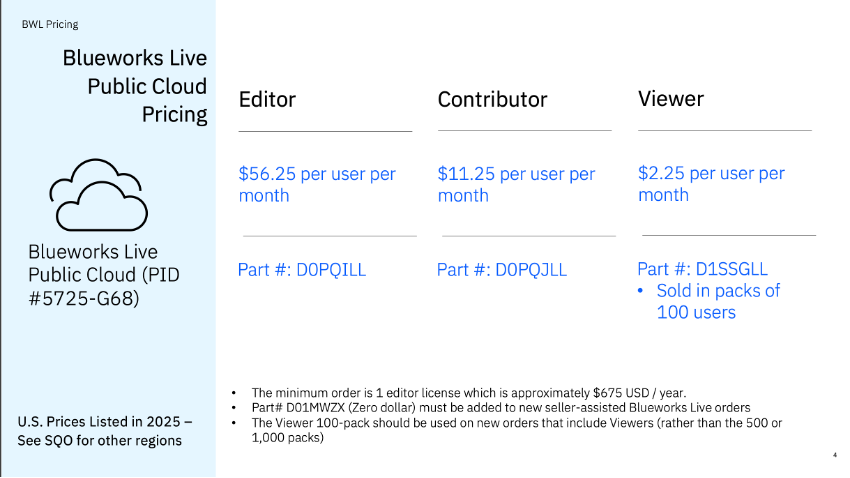  
  

3. チャット画面で、**Blueworks Liveの価格について教えてください。**のように入力してください。AIから何度か回答までに質問が繰り返されますが、正しい回答は得られないはずです。
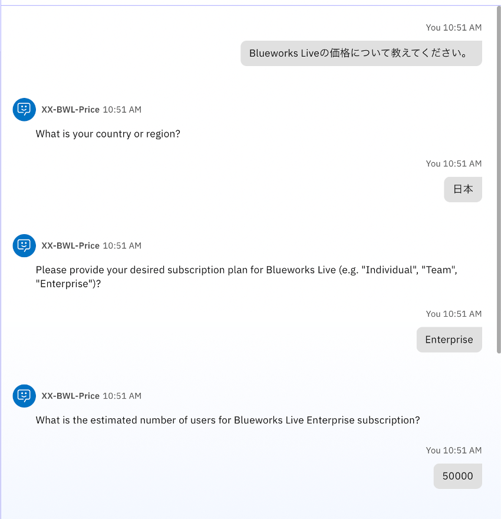

4. 先ほど実施した手順と同じようにPPTファイルをアップロードし、適切な説明を追加してください。

5. ファイルの処理が完了したら、再びチャット画面で「Blueworks Liveの価格について教えてください。」と入力します。ファイルをアップロードする前の結果とは異なり、プランごとの価格が一覧として表示されることがわかります。  
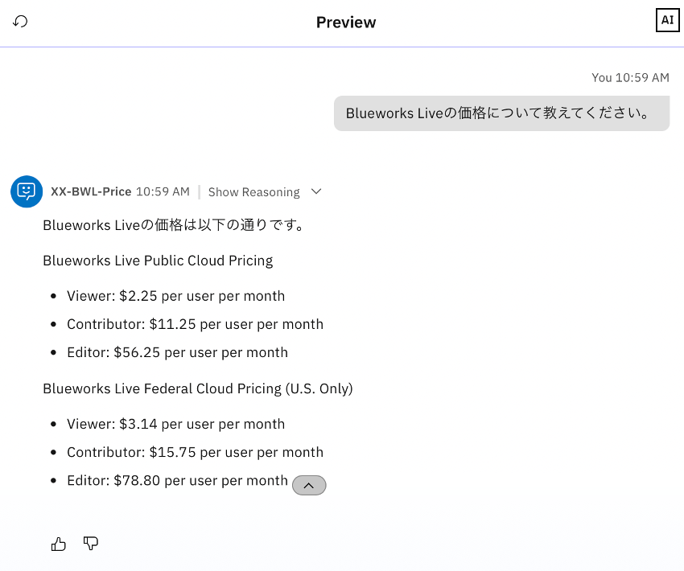