# AIAgentを作ってみよう！

このLabでは、基本的なAIAgentの作り方を学びます。

## Agentの作成
1. 左上のメニューから**エージェント**を選択します。  
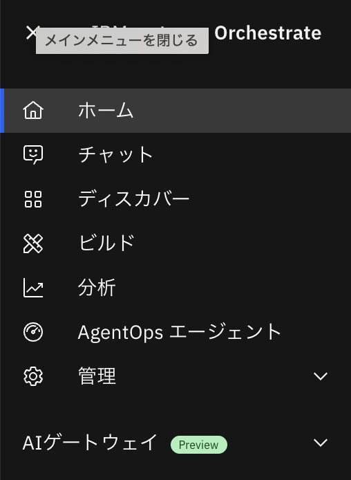

2. 右にある**エージェントの作成**ボタンをクリックします。  
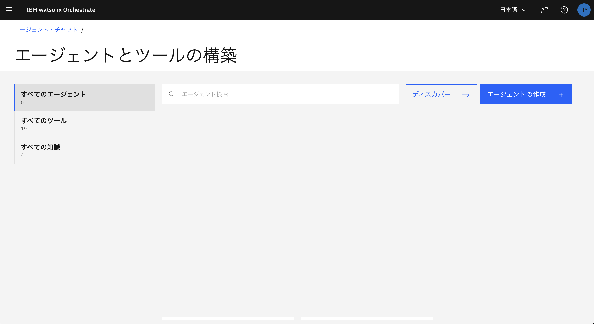

3. **最初から作成**を選択します。  
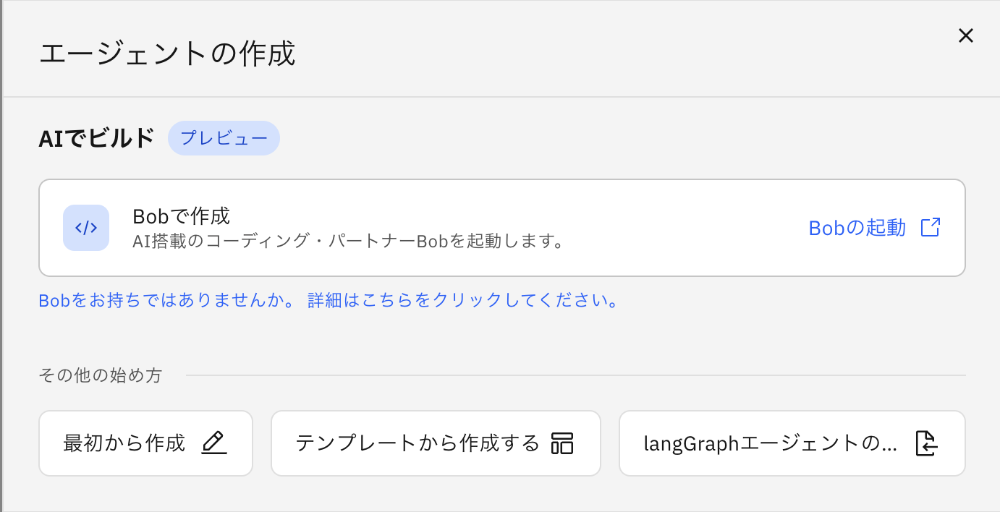

4. このハンズオンではIBMに関する質問に回答するエージェントを作成するため、エージェント名を**YourInitials-IBMInfo**と設定します。  


5. LLMは**GPT-OSS 120B- OpenAI(via Groq)**が設定されています。サードパーティーのライセンスのため、規約に関するメッセージが表示されています。

6. このエージェントの役割を説明に記載します。watsonx Orchestrateは記載した内容をもとにどのエージェントを呼び出すかを判断するため、適切な記載が求められます。  
このハンズオンでは、説明を以下のように設定します。
```
IBMの会社情報に関する質問に回答するエージェント
```
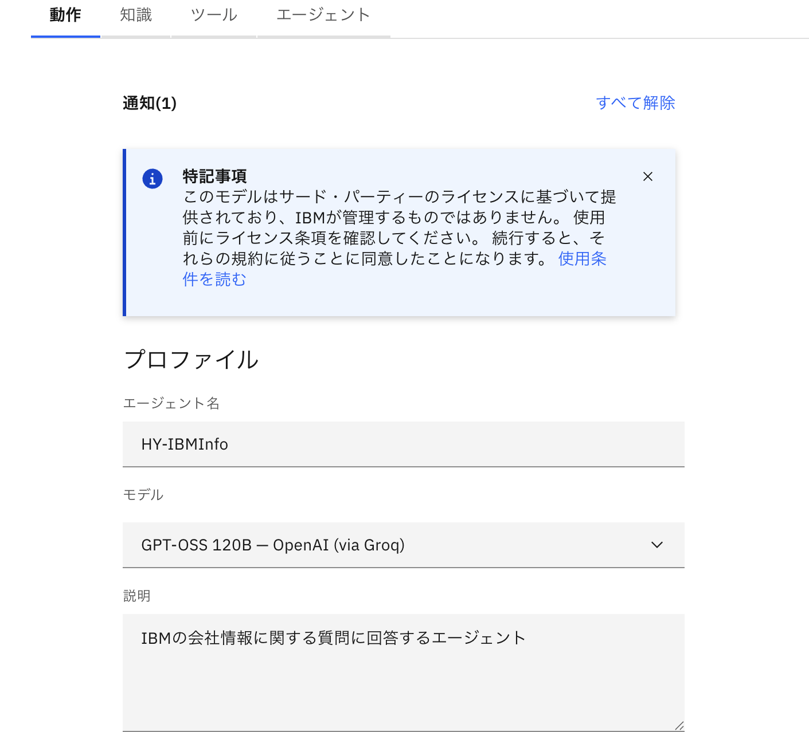


## 基本的な動きの確認
1. 右側にプレビューチャットが表示されています。ここで簡単に作成したエージェントを試すことができます。  
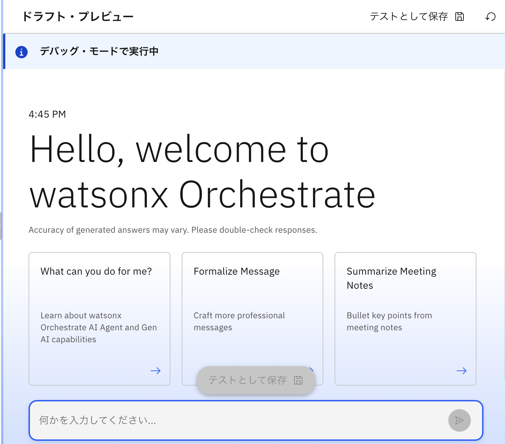  

2. まずは**watsonx Orchestrate とは何ですか？**と入力してください。  

3. watsonx Orchestrateに関する回答が返ってくることが確認できました。こちらは選択したLLMが回答を作成しています。  
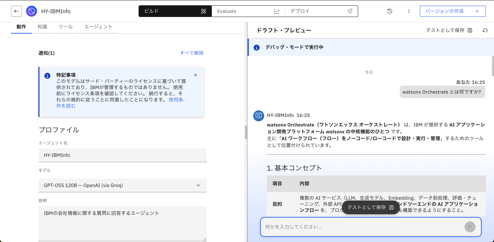

4. 続いて、**IBMの株価はいくらですか？**と入力します。日付などをきかれた場合には、必要に応じて回答してください。  

5. その結果、最新の株価情報は得ることができないことを確認できます。  
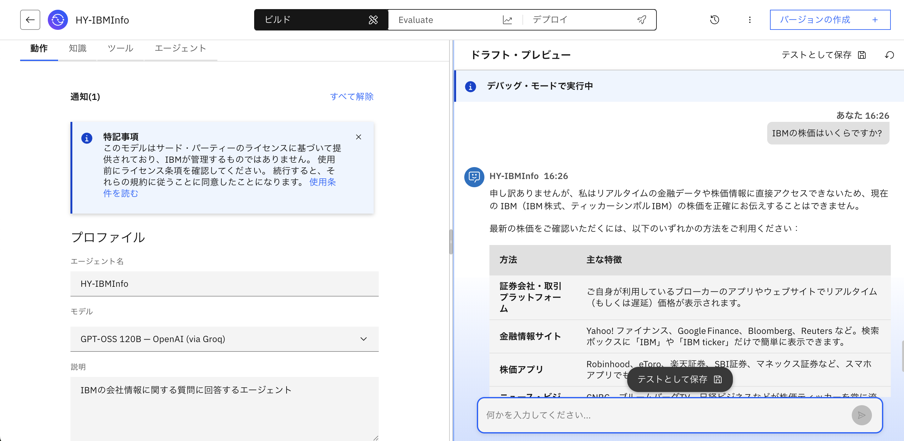
  
生成AIは一般的な質問への回答や案出し、要約などは得意ですが、最新の情報の取得は難しいことが確認できました。

## 動作の定義
1. プレビューチャットに**IBMについて教えてください**と入力します。

2. その結果、適切な回答が返ってきました。かなり詳細な回答となっています。
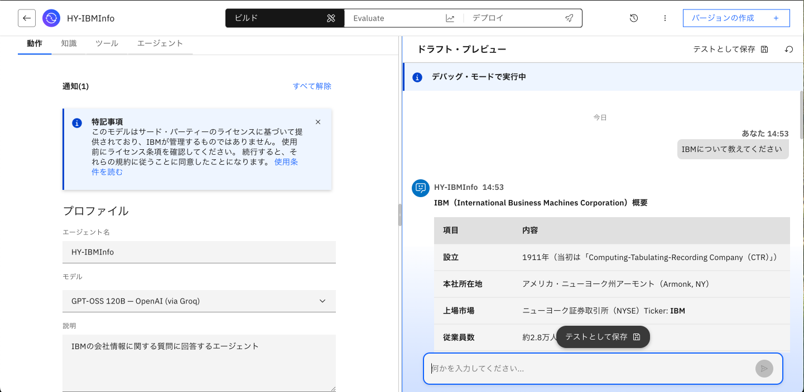

3. ユーザーが使いやすいよう利用ユーザーに合わせた動きを行うために、**指示**に応答の定義を行います。このハンズオンでは回答の簡潔化のために、以下のように入力します。  
```
回答は必ず3文以内に収めてください。
詳しい説明が必要な場合は、ユーザーに「詳しく説明しましょうか？」と一言添えて確認を取ってから続けてください。
```
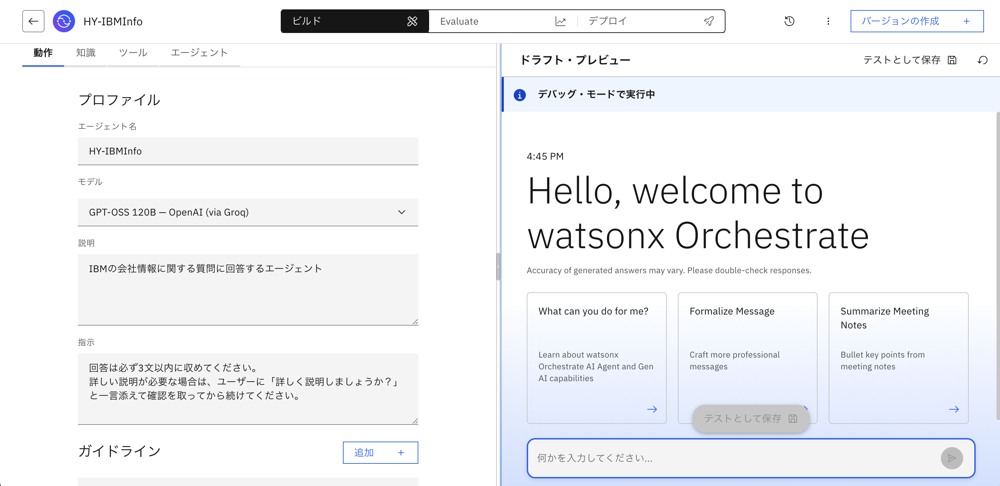

4. プレビューチャットをリセットしてください。  
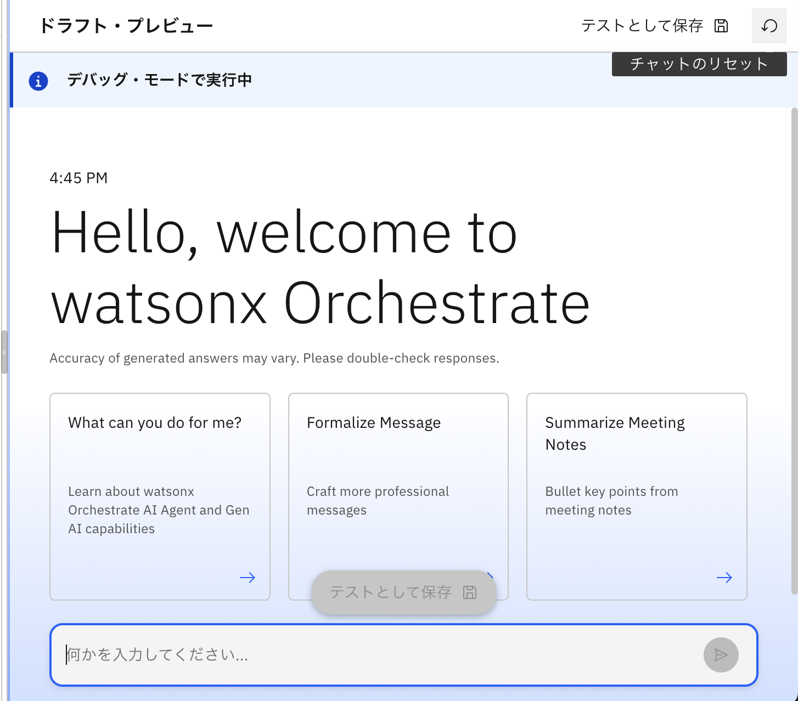

5. 再度、**IBMについて教えてください**と入力します。  

6. 次は簡潔に返ってきていることが確認できました。  
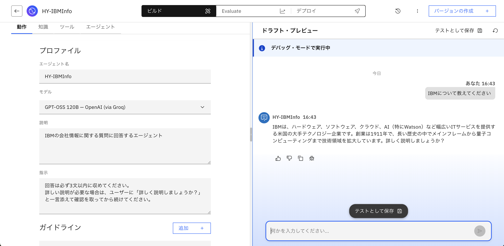
  
このように、ユーザビリティを上げるために、振る舞いを適切に定義することが必須です。

!!!note
    GPT-OSSモデルへの効果的な指示の与え方は、[**こちら**](https://www.ibm.com/docs/ja/watsonx/watson-orchestrate/base?topic=models-gpt-oss-model-behavior-instruction-guidelines){:target="_blank"}もご参照ください。


## 知識の使用
watsonx Orchestrateは組み込みのRAG (Retrieval Augmented Generation) 機能を提供し、エージェントごとにドキュメントをアップロードすることで、その内容をもとに回答を生成することが可能です。  

1. このハンズオンでは年次報告書を読み込ませて、それに基づいた質問に対応するエージェントを作成します。  
**知識**タブに移動し、**ソースの追加**のボタンをクリックします。  
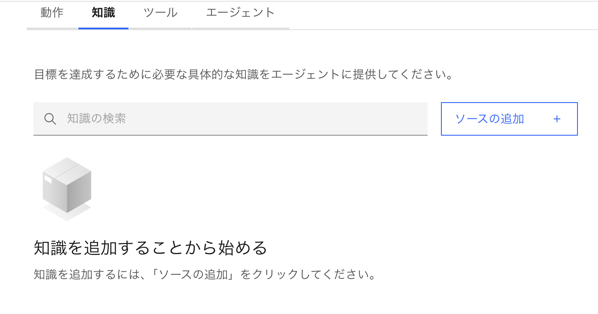  

2. 知識の追加画面が出るので、**新しい知識**をクリックします。  
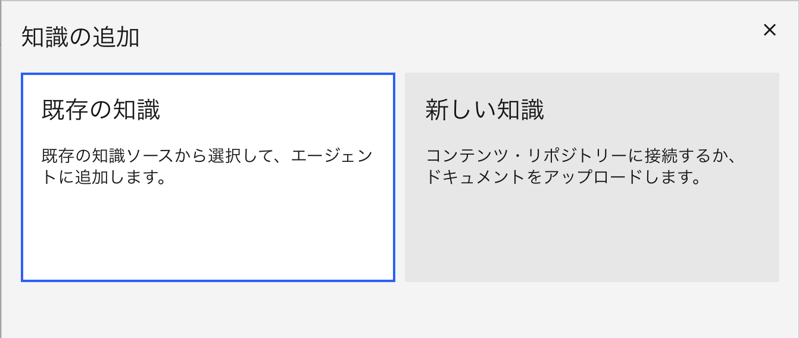  

3. 知識ソースの選択画面が出るので、**ファイルのアップロード**をクリックし、**次へ**ボタンをクリックします。  
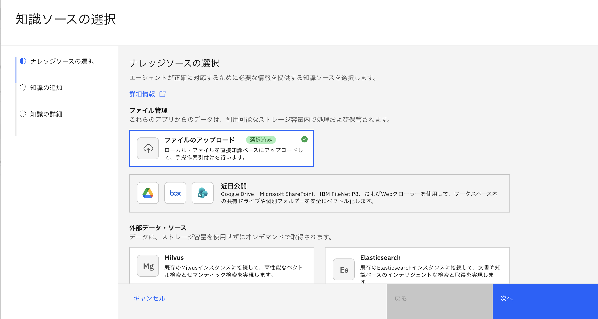  

4. 今回のハンズオンでは、[**こちらのファイル**](./files/2024-annual-report.pdf){:target="_blank"}を使用します。 ダウンロードして保存して使用してください。ボックスにドラッグするか、または青字のテキストをクリックしてファイル・アップロード・ウィンドウを開いて、ファイルをアップロードし、**次へ**をクリックします。   
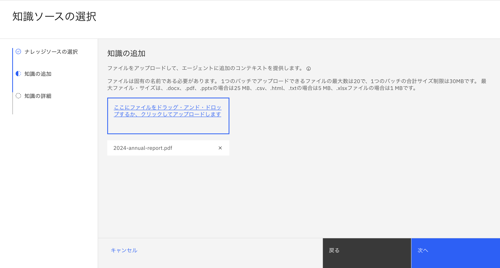

5.  エージェントが適切なタイミングで知識を使用するために、読み込むファイルがどのようなものであるかを定義する必要があります。 
今回は、名前に**IBM年次報告書(2024)**、説明に**これは2024年のIBMの年次報告書です。財務情報とIBMのコア事業戦略を含んでいます**と入力し、**保存**ボタンをクリックしてください。  
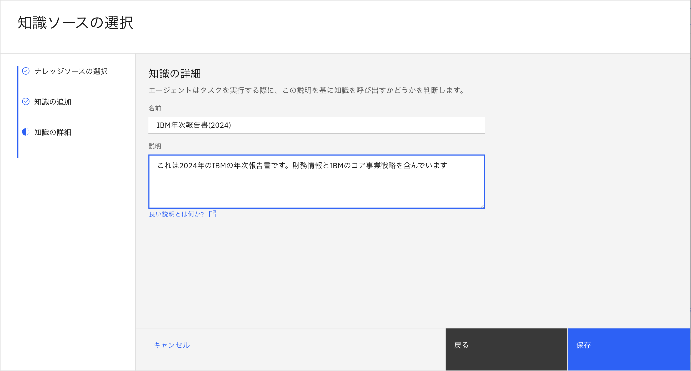  

6. レポートが取り込まれるまでには少し時間がかかります。完了すると、ファイルが知識ソースのリストに表示されます。  
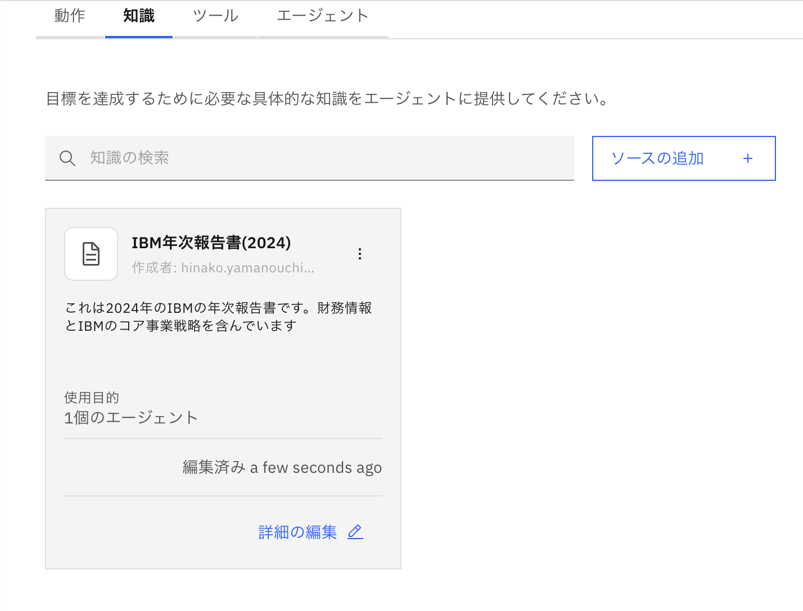  

7. 知識ソースのリストの右下にある**詳細の編集**を選択します。

8. 画面右上にある**歯車**をクリックします。
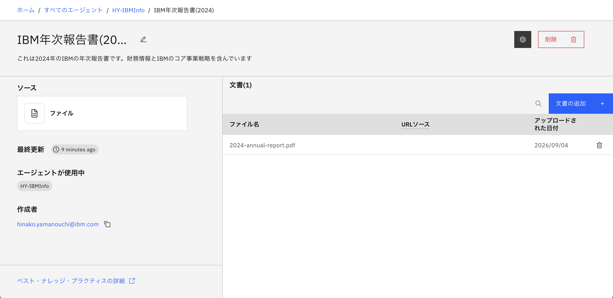 

9. 応答はデフォルトの**動的**のまま**保存**をクリックします。  
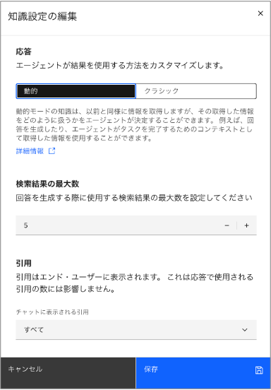  

10. 左上の**YourInitials-IBMInfo**のリンクをクリックし、エージェント作成画面に戻ります。

11. プレビューチャットで**IBMの2024 年のフリー・キャッシュ・フローはいくらですか**と入力します。  

12. watsonx Orchestrateが先ほど読み込んだファイルの内容をもとに、適切な回答を行っていることが確認できます。  
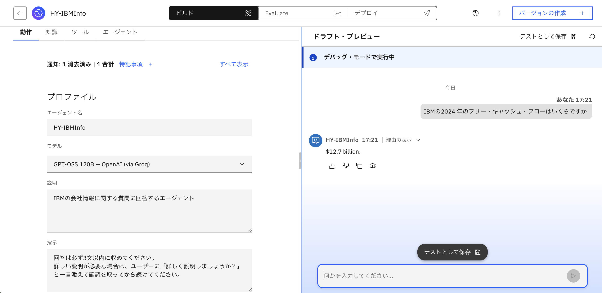
  
ドキュメントをアップロードすることで、エージェントに対して簡単にRAGを構成できることが確認できました。

## エージェントのデプロイ
誰でもこのエージェントを使うことができるように、エージェント作成後は**デプロイ**をする必要があります。  

1. 右上の**デプロイ**タブに切り替えます。  
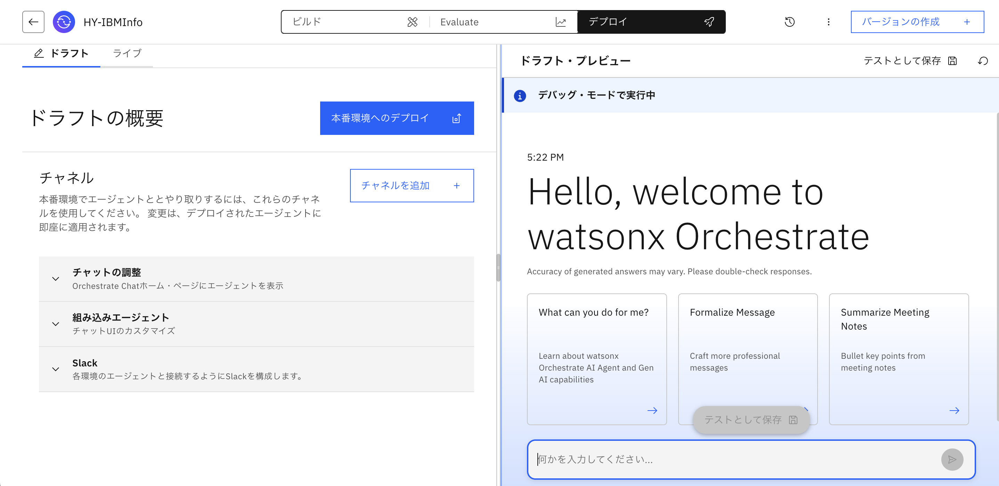

2. チャットの調整を開き、ウェルカム・メッセージとスターター・プロンプトの編集の**編集**をクリックします。

3. ユーザーがエージェントを開くと表示される**ウェルカムメッセージ**と**スタータープロンプト**を設定します。　<br>
ウェルカムメッセージに**こんにちは、IBMエージェントへようこそ**と入力します。<br>
スタータープロンプトにあるデフォルトの設定を全て削除し、**プロンプトの追加**ボタンをクリックし、**watsonx Orchestrate とは何ですか？**と設定します。　<br>
スタータープロンプトを設定することで、ユーザーはここをクリックすることで会話を始めることができるようになります。
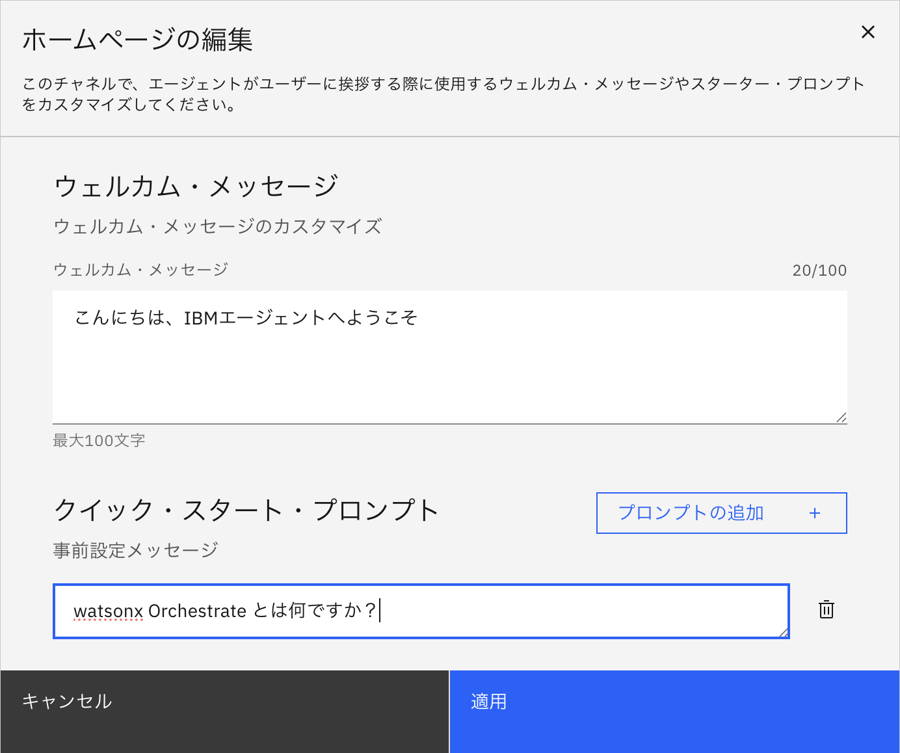

4. プレビューチャットをリフレッシュしてください。設定が反映されます。
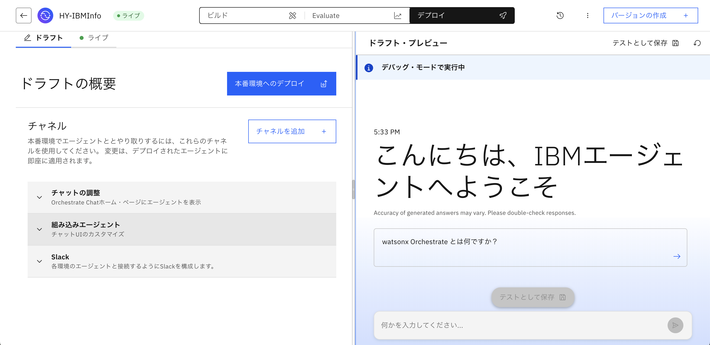

5. **本番環境へのデプロイ**をクリックし、**新規バージョンの作成**をクリックします。<br>
バージョン名を**初期エージェント**、バージョン番号を**1.0.0**と設定し、作成をクリックします。

6. 作成したバージョンを選択し、デプロイをクリックします。<br>
特に何も入力せず、右下の**デプロイ**をクリックします。 
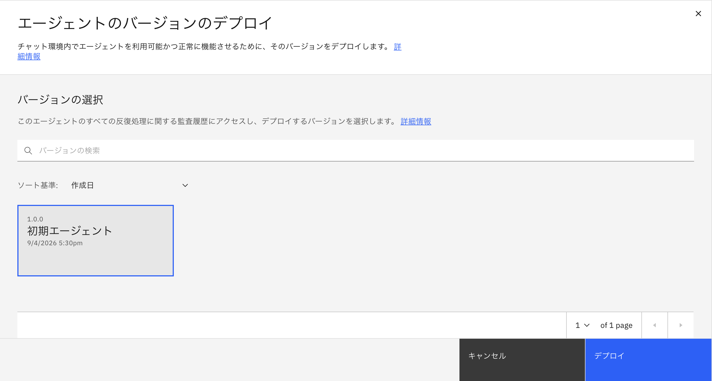

7. これでデプロイが完了しました。 <br>
ライブのタブに緑の丸がついたことが確認できます。

8. 左上のメニューから**チャット**を選択すると、チャット画面に移動します。左上のエージェント選択メニューから作成したエージェントの名前を選択します。デプロイされていることが確認できました。  
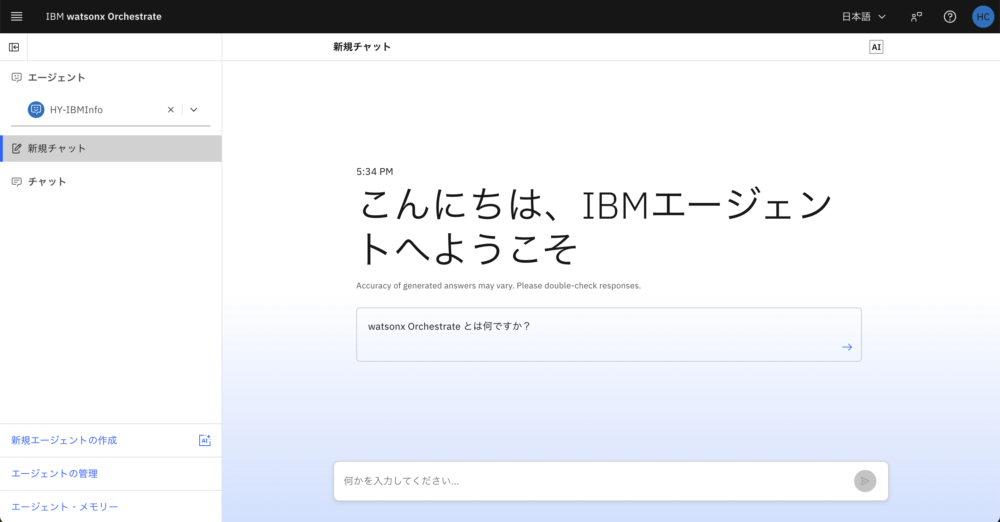


## フィードバックの実施
ユーザーからのフィードバックを元に、回答を改善することも重要です。watsonx Orchestrateではユーザーのフィードバックを受け付ける機能を提供します。どの様なフィードバックが可能かを見てみましょう。  

1. 再度**IBM の 2024 年のフリー・キャッシュ・フローはいくらですか**と入力し、回答に対して👍をクリックします。  
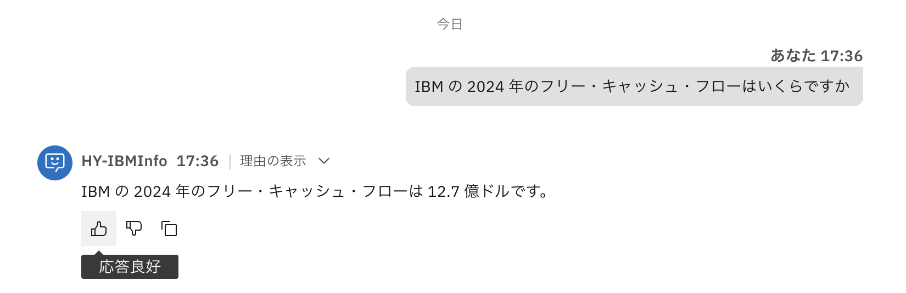

2. 回答が簡潔であったため、**正しい**を選択し、**送信**をクリックします。  
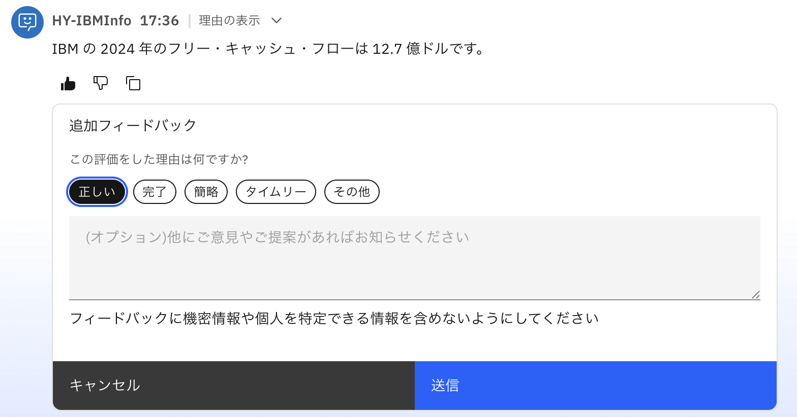  

3. 一方で、再度**IBMの今日の株価を教えてください**と入力すると、回答は正しいですが期待していた回答は返ってきませんでした。<br> 
そのため、👎をクリックし、**未完了**を選択し、**送信**をクリックします。   

5. 開発者はこのフィードバック結果を確認し、回答の改善に役立てることが可能です。詳細については今回のハンズオンでは省略します。  
  

## お疲れ様でした！
このLab1では、watsonx OrchestrateのGUIを使って、簡単にAgentを作成しました。利用ユーザーや業務内容に合わせてカスタマイズを行うことで、ユーザービリティを上げることが可能です。  

<!--
## オプション：エージェントに知識を加える（ppt）
知識は、PDF以外にもPowerPointなどのファイルも使用可能です。

1. [こちらのリンク](./files/wxO_Overview.pptx)を右クリックしてファイルに保存してください。このファイルはIBM製品の一つwatsonx Orchestrateの概要について説明した資料です。

2. チャット画面で、**watsonx Orchestrateのプランについて教えてください**のように入力してください。LLMが何らかの回答を生成してくれる場合もありますが、根拠に基づく正しい回答は得られないはずです。  
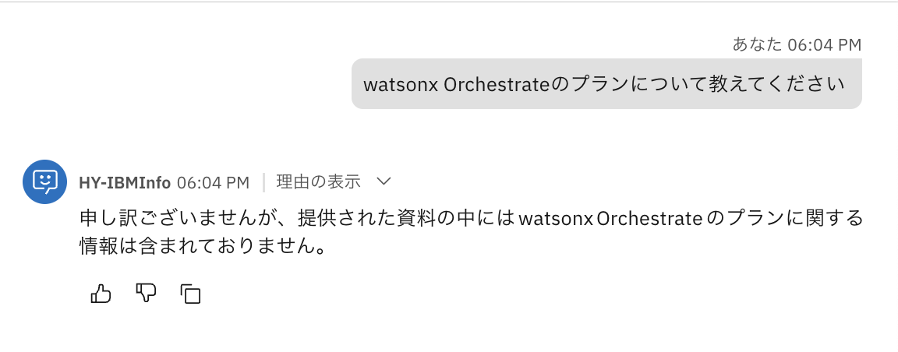

3. 知識ソースのIBM年次報告書(2024)のボックス内にある**オプション**をクリックし、**詳細の編集**を選択します。
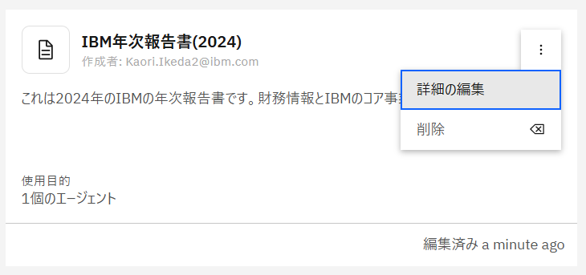

4. 右にある**文書の追加**を選択し、先ほど実施した手順と同じようにPPTファイルをアップロードします。

5. アップロード完了後、先程設定した名前を**IBM関連文書**に更新します。また説明についても**財務情報とIBMのコア事業戦略を含んだ、2024年のIBMの年次報告書です。watsonx Orchestrateの概要情報です。**と更新します。
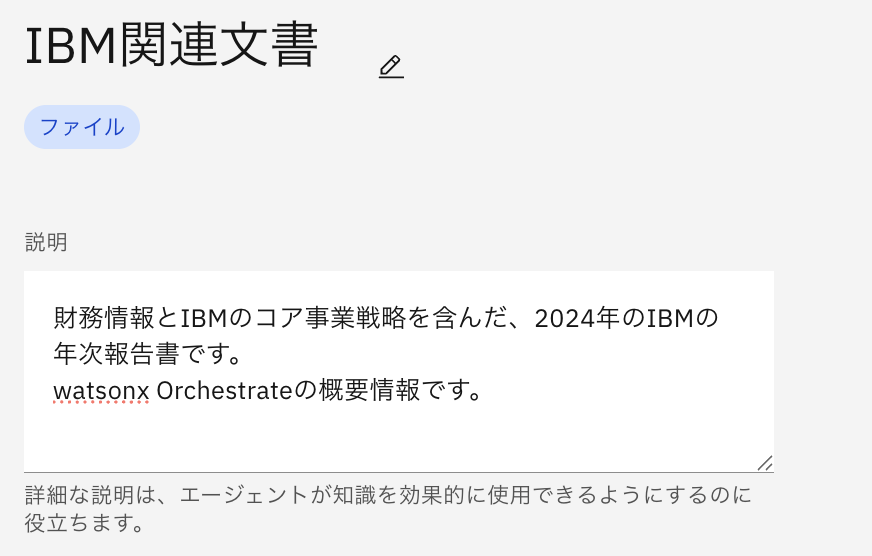

6. 再びチャット画面に戻り、**watsonx Orchestrateのプランについて教えてください**と入力します。ファイルをアップロードする前の結果とは異なり、プランの一覧の詳細が表示されることがわかります。  
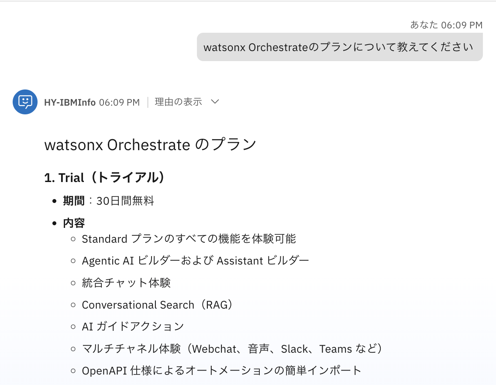
-->

## 参考：モデルの変更
1. デフォルトでLLMが選択されています。現在のバージョンでは、**GPT-OSS 120B- OpenAI(via Groq)**が選択されています。  
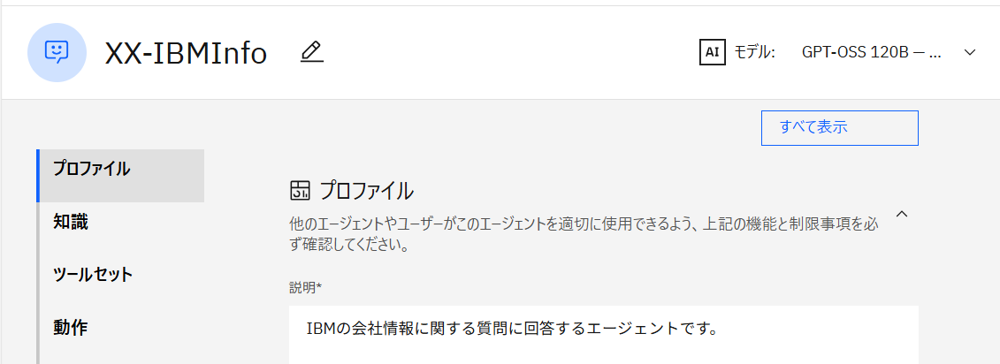

2. wxOがサポートしているモデルに切り替えることが可能になります。 
現在サポートしているLLMは[こちら](https://www.ibm.com/docs/ja/watsonx/watson-orchestrate/base?topic=agent-available-ai-models)です。  
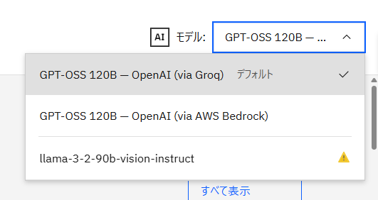  

ユースケースに合わせたLLMを選択することで、適切な回答、処理を行うエージェントを作成することができます。