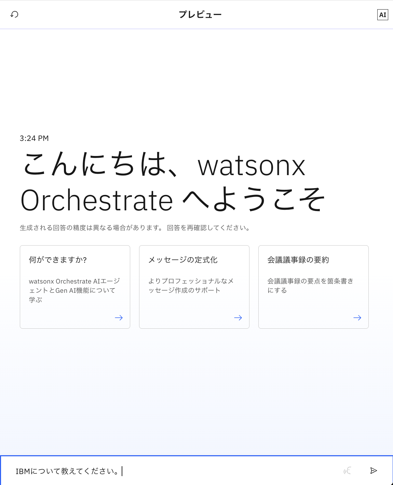
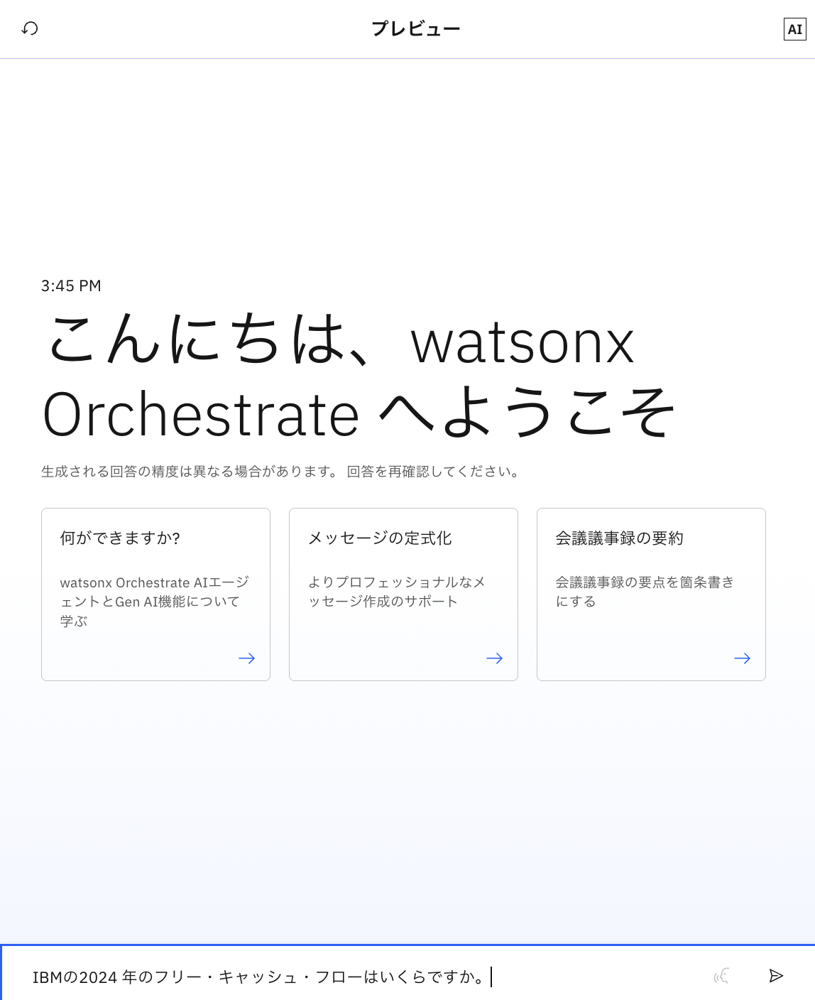

# AIAgentを作ってみよう！

このLabでは、基本的なAIAgentの作り方を学びます。

## Agentの作成
1. 左上のメニューから**ビルド**を選択します。  

2. 右にある**エージェントの作成**ボタンをクリックします。  

3. **最初から作成**を選択します。  

4. このハンズオンではIBMに関する質問に回答するエージェントを作成するため、名前を**YourInitials-IBMInfo**と設定します。  

5. このエージェントの役割を説明に記載します。watsonx Orchestrateは記載した内容をもとにどのエージェントを呼び出すかを判断するため、適切な記載が求められます。  
このハンズオンでは、説明に**IBMの会社情報に関する質問に回答するエージェントです**と設定し、**作成**をクリックします。  

6. Agentが作成されました。先ほど入力した名前と説明が自動的に入っています。  
※エラーが発生する場合は、エージェントの名前が重複している可能性があります。イニシャルを変更するなどして再度試してみてください。  

7. LLMを**GPT-OSS 120B- OpenAI(via Groq)**に変更します。モデルを変更すると、規約に関するメッセージが表示されます。

8. ユーザーがエージェントを開くと表示される**ウェルカムメッセージ**と**スタータープロンプト**を設定します。ウェルカムメッセージに**こんにちは、IBMエージェントへようこそ**と入力します。

9. 続いて、スタータープロンプトにあるデフォルトの設定を削除します。削除後、**プロンプトの追加**ボタンをクリックします。**What is watsonx Orchestrate?**と入力後、再度**プロンプトの追加**ボタンをクリックし、もう一つ追加します。**あなたのできることを教えてください**と入力してください。
スタータープロンプトを設定することで、ユーザーはここをクリックすることで会話を始めることができるようになります。

10. プレビューチャットをリフレッシュしてください。設定が反映されます。

## 基本的な動きの確認
1. 右側にプレビューチャットが表示されています。ここで簡単に作成したエージェントを試すことができます。  

2. まずは**What is watsonx Orchestrate?**と入力もしくはチャット上にある**What is watsonx Orchestrate?**を選択します。  

3. watsonx Orchestrateに関する回答が返ってくることが確認できました。こちらは選択されたLLMが回答を作成しています。  

4. 続いて、**What is the stock price of IBM?**と入力します。日付などをきかれた場合には、必要に応じて回答してください。  

5. その結果、最新の株価情報は得ることができないことを確認できます。  

  
生成AIは案出し、要約などは得意ですが、新しい情報の取得は難しいことが確認できました。

## 動作の定義
1. プレビューチャットに**IBMについて教えてください**と入力します。もしくはスタータープロンプトのIBMについて教えてくださいをクリックします。

2. その結果、適切な回答が返ってきました。場合によっては、英語での返答となるケースがあります。そのような場合に備えて、ステップ3を行います。  

3. ユーザーが使いやすいよう利用ユーザーに合わせた動きを行うために、**動作**に応答の定義を行います。このハンズオンでは、日本人を対象としたAgentの作成のために、念のために**回答は必ず日本語で行ってください**と入力します。  

<!--
4. プレビューチャットをリフレッシュしてください。  

5. 再度、**IBMについて教えてください**と入力します。  

6. 次は日本語で返ってくることが確認できました。  

-->

<!--修正予定
7. 続いて、**ガイドライン**の設定を行います。ガイドラインを設定することで、特定の状況でどのように行動するかを定義することができます。**ガイドラインの追加**をクリックし、名前に**挨拶**と設定します。
また、条件には**こんにちはなどと挨拶をされました**、アクションには**ユーザーに合わせて挨拶を返します**と入力し、**保存**をクリックします。
  

8. プレビューチャットをリフレッシュして、**こんばんは**とチャットに入力します。挨拶が返ってくることが確認できます。

-->
  
このように、ユーザビリティを上げるために、動作を適切に定義することが必須です。

## 知識の使用
watsonx Orchestrateは組み込みのRAG (Retrieval Augmented Generation) 機能を提供し、エージェントごとにドキュメントをアップロードすることで、その内容をもとに回答を生成することが可能です。  
1. このハンズオンでは年次報告書を読み込ませて、それに基づいた質問に対応するエージェントを作成します。  
**ソースを追加する**のボタンをクリックします。  
  

2. 知識の追加画面が出るので、**新しい知識**をクリックします。

2. 知識ソースの選択画面が出るので、**ファイルのアップロード**をクリックし、**次へ**ボタンをクリックします。  
  

3. 今回のハンズオンでは、[こちらのファイル](./files/2024-annual-report.pdf)を使用します。 ダウンロードして保存して使用してください。ボックスにドラッグするか、または青字のテキストをクリックしてファイル・アップロード・ウィンドウを開いて、ファイルをアップロードし、**次へ**をクリックします。   

4.  エージェントが適切なタイミングで知識を使用するために、読み込むファイルがどのようなものであるかを定義する必要があります。 
今回は、名前に**IBM年次報告書(2024)**、説明に**これは2024年のIBMの年次報告書です。財務情報とIBMのコア事業戦略を含んでいます**と入力し、**保存**ボタンをクリックしてください。  
  

5. レポートが取り込まれるまでには少し時間がかかります。完了すると、ファイルが知識ソースのリストに表示されます。  
  

6. プレビューチャットで**IBMの2024 年のフリー・キャッシュ・フローはいくらですか**と入力します。  

7. watsonx Orchestrateが先ほど読み込んだファイルの内容をもとに、適切な回答を行っていることが確認できます。  

  
ドキュメントをアップロードすることで、エージェントに対して簡単にRAGを構成できることが確認できました。

## エージェントのデプロイ
誰でもこのエージェントを使うことができるように、エージェント作成後は**デプロイ**をする必要があります。  
1. 右上の**デプロイ**ボタンをクリックします。  

2. 特に何も入力せず、右下の**デプロイ**をクリックします。  

3. これでデプロイが完了しました。  
左上のメニューから**チャット**を選択すると、チャット画面に移動します。左上のエージェント選択メニューから作成したエージェントの名前を選択します。デプロイされていることが確認できました。  

## フィードバックの実施
ユーザーからのフィードバックを元に、回答を改善することも重要です。watsonx Orchestrateではユーザーのフィードバックを受け付ける機能を提供します。どの様なフィードバックが可能かを見てみましょう。  

1. 再度**IBM の 2024 年のフリー・キャッシュ・フローはいくらですか**と入力し、回答に対して👍をクリックします。  

2. 回答が簡潔であったため、**簡略**を選択し、**送信**をクリックします。  
  

3. 一方で、再度**IBMの今日の株価を教えてください**と入力すると、求めていた回答が返ってきませんでした。  

4. そのため、👎をクリックし、**未完了**を選択し、**送信**をクリックします。  
  

5. ビルダーと管理者はこのフィードバック結果を、APIで確認し、回答の改善に役立てることが可能です。APIの使用方法などは、今回のハンズオンでは省略します。  
  

## お疲れ様でした！
このLab1では、watsonx OrchestrateのGUIを使って、簡単にAgentを作成しました。利用ユーザーや業務内容に合わせてカスタマイズを行うことで、ユーザービリティを上げることが可能です。  

## オプション：エージェントに知識を加える（ppt）
知識は、PDF以外にもPowerPointなどのファイルも使用可能です。

1. [こちらのリンク](./files/wxO_Overview.pptx)を右クリックしてファイルに保存してください。このファイルはIBM製品の一つwatsonx Orchestrateの概要について説明した資料です。

2. チャット画面で、**watsonx Orchestrateのプランについて教えてください**のように入力してください。正しい回答は得られないはずです。  

3. 知識ソースのIBM年次報告書(2024)のボックス内にある**オプション**をクリックし、**詳細の編集**を選択します。

4. 右にある**文書の追加**を選択し、先ほど実施した手順と同じようにPPTファイルをアップロードします。

5. アップロード完了後、先程設定した名前を**IBM関連文書**に更新します。また説明についても**財務情報とIBMのコア事業戦略を含んだ、2024年のIBMの年次報告書です。watsonx Orchestrateの概要情報です。**と更新します。

6. 再びチャット画面に戻り、**watsonx Orchestrateのプランについて教えてください**と入力します。ファイルをアップロードする前の結果とは異なり、プランの一覧の詳細が表示されることがわかります。  

## 参考：モデルの変更
1. デフォルトでLLMが選択されています。現在のバージョンでは、**llama-3-2-90b-vision-instruct**が選択されています。  

2. wxOがサポートしているモデルに切り替えることが可能になります。 
現在サポートしているLLMは[こちら](https://www.ibm.com/docs/ja/watsonx/watson-orchestrate/base?topic=model-available-ai-models)です。  
  

ユースケースに合わせたLLMを選択することで、適切な回答、処理を行うエージェントを作成することができます。