# フローを実装してみよう！

AIAgentはエージェンティックな振る舞いによって様々な処理を呼び出しますが、事前にフローを定義してその振る舞いを完全に制御したいケースもあります。
このLabでは、フロー・ビルダーを用いてフローを定義し、エージェントから呼び出す方法について確認します。

## シンプルなフローの作成と呼び出し
1. 左上のメニューから **ビルド** を選択します。  
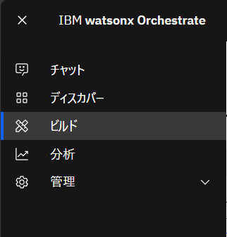  

2. 左側の **すべてのツール** を選択し、**ツールの作成** をクリックします。  
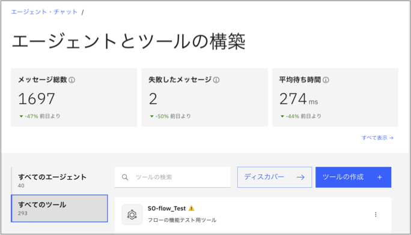

3. **エージェント型ワークフロー** をクリックします。  
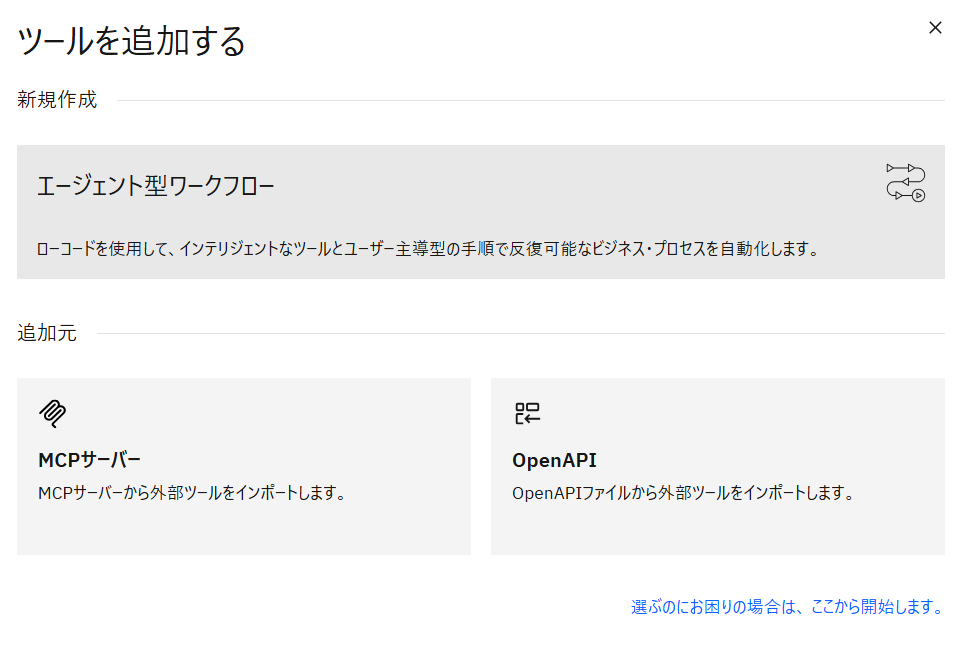  

4. 名前に**XX_weatherFlow** (XXにはイニシャルを設定してください。) を入力し、**構築の開始**ボタンをクリックします。  
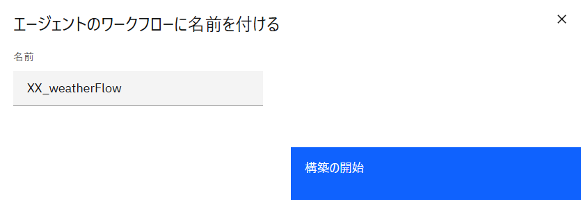  

5. 名前の右にある**詳細の編集**をクリックします。  
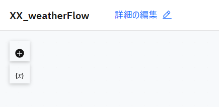  

    1. 次の値を設定します。
        - 説明: 特定の都市の天気情報を取得する

6. 左上の**パラメーター**タブをクリックします。
    1. **入力の追加** ボタンを押して**ストリング**を選択し、次の値を設定してください。
        - 名前: city_name	
        - 説明: 都市名
    2. 同様に以下二つの値も設定してください。
        - 名前: latitude	
        - 説明: 緯度
          
        - 名前: longitude	
        - 説明: 経度
    
    4. **出力の追加**ボタンを押して**ストリング**を選択し、次の値を設定してください。
        - 名前: temp
        - 説明: 都市の気温
    5. **完了** をクリックします。  
    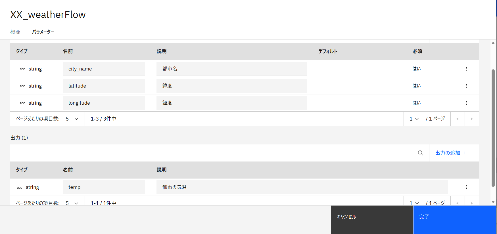  

5. 画面左上の **＋** アイコンをクリックし、**ツール**タブを選択します。検索ボックスに weather と入力し、表示された current weather for coordinates を **開始** と **終了** の間にドラッグ&ドロップします.  
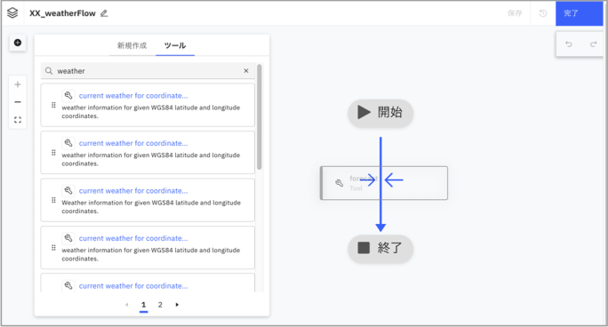  
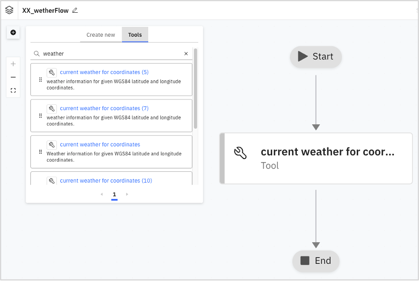  

## データマッピング
1. 配置したcurrent weather for coordinatesをクリックし、表示された **データマッピングの編集** をクリックします。  
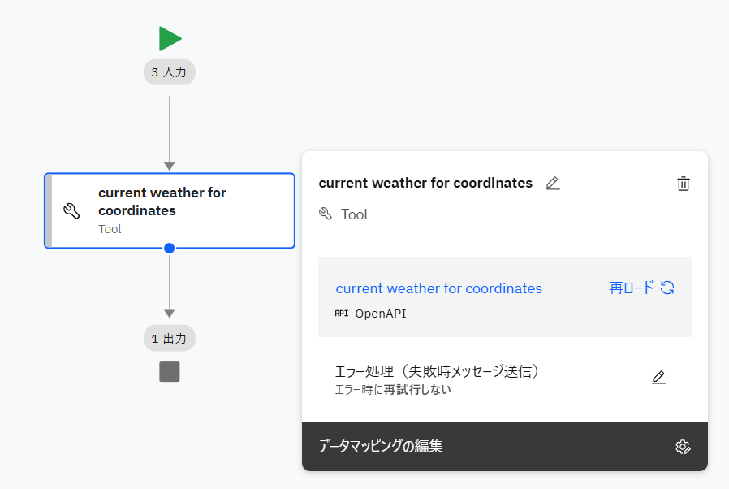  

2. current_weatherにはオート・マップではなくtrueを設定するため、オート・マップ の×をクリックして削除します。  
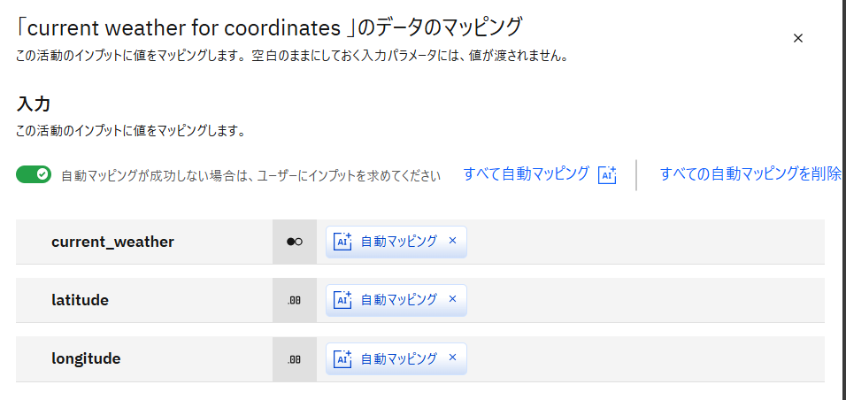  
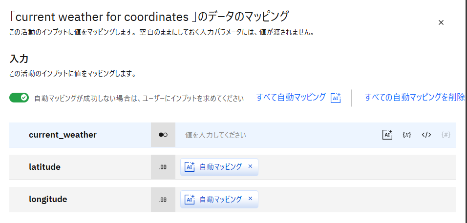  

3. さらに **値を入力してください** をクリックし、**はい**に切り替えます。  
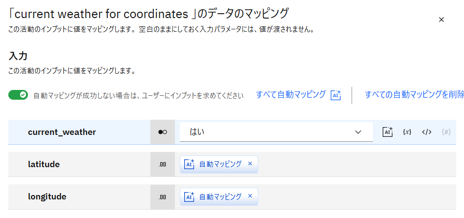  

4. **自動マッピングが成功しない場合は、ユーザーにインプットを求めてください**を**オフ**にします。
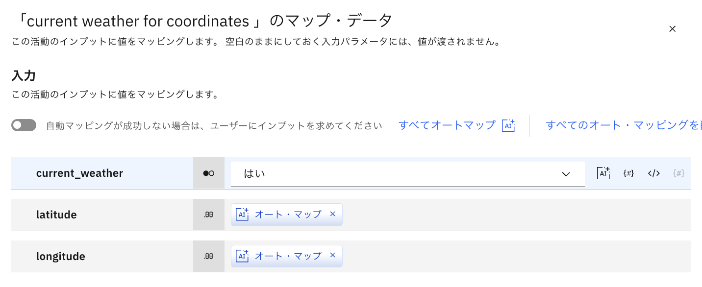

5. 右上の×をクリックしてマッピング画面を閉じます。

6. 右上の**完了**ボタンをクリックしてフロー・ビルダーを閉じます。  
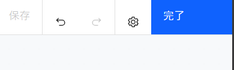  

## エージェントへのツール追加とテスト実行
1. エージェント・ビルダーから先ほど作成したXX-IBMInfoを開き、**ツールの追加** ボタンをクリックします。  
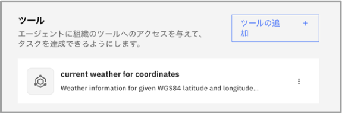

2. **ローカル・インスタンス** を選択します。  
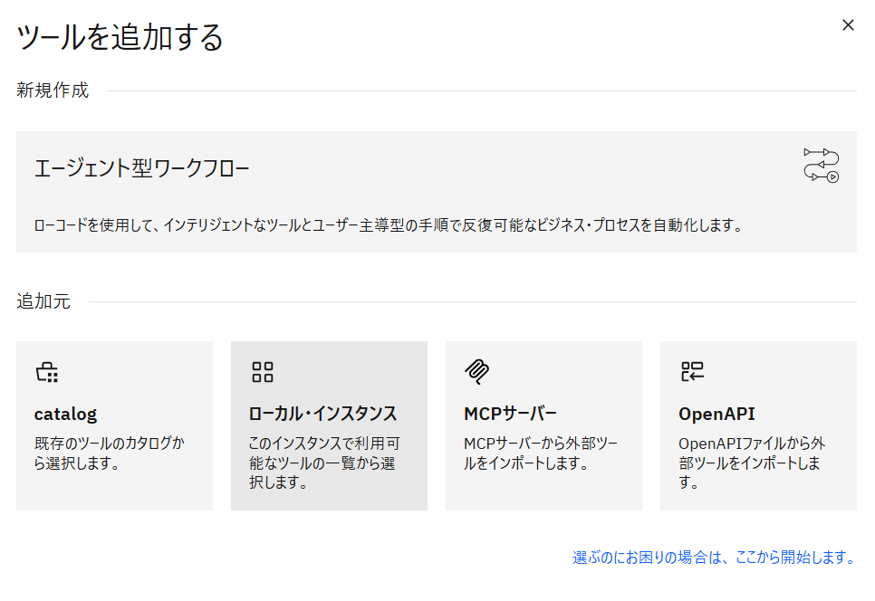  

3. 検索ボックスにXX_weatherと入力し、表示されたXX_weatherFlowのチェックボックスを有効にして エージェントに追加 ボタンをクリックします。  
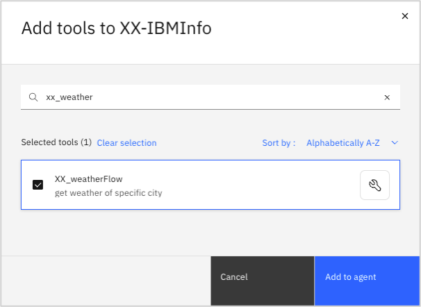  

4. 前の演習で作成したcurrent weather for coordinatesを削除します。  
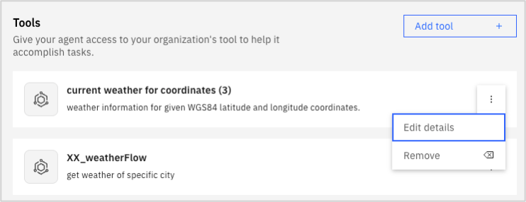  

5. 右側のプレビューで「東京の気温を教えて」と尋ねると、フローが呼び出されます。処理は非同期に実施され、応答を待っている間は追加の入力ができません。  
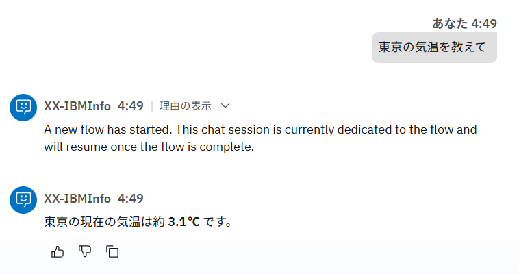  

## ブランチ(分岐)とユーザーアクティビティの定義
ユーザーが入力した都市の気温に応じて、今日のおすすめの過ごし方を表示するようにXX_weatherFlowを変更します。  

1. XX_weatherFlowの縦三点リーダーをクリックして表示されたメニューから **フロー・ビルダーで開く** をクリックします。  
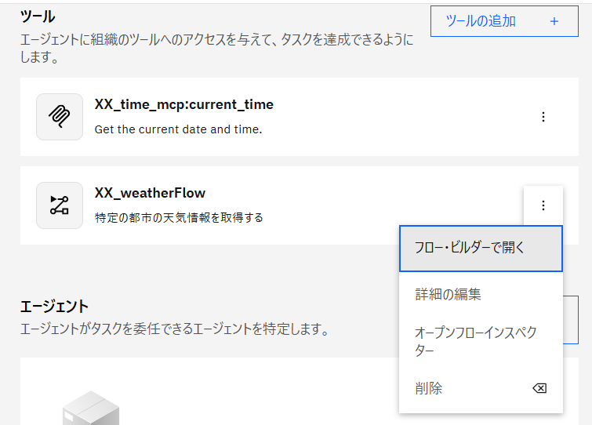  

2. current weather for coordinatesと出力の間の矢印にカーソルを合わせ、＋マークをクリックします。表示されたメニューから **フロー制御を追加する** → **ブランチ** を選択します。
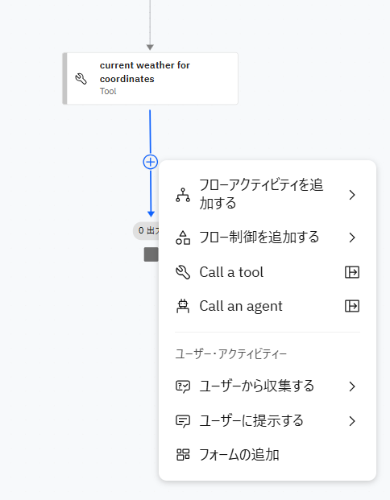  

3. 追加した**ブランチ1**と**出力**の間の矢印(**パス1**)にカーソルを合わせて＋マークをクリックし、表示されたメニューから **ユーザーに提示する** → **メッセージ** を選択します。  
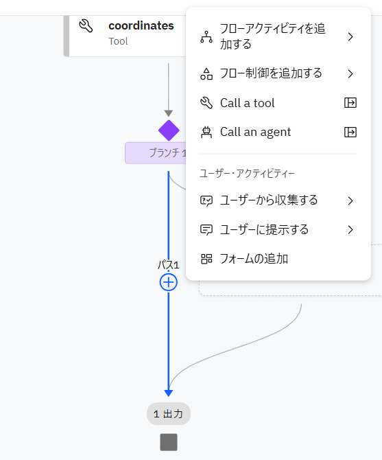  

4. パス2の **Add** をクリックし、表示されたメニューから同じく **ユーザーに提示する** → **メッセージ** を選択します。2つのメッセージは見やすいようにドラッグ&ドロップで位置を調整してください。  
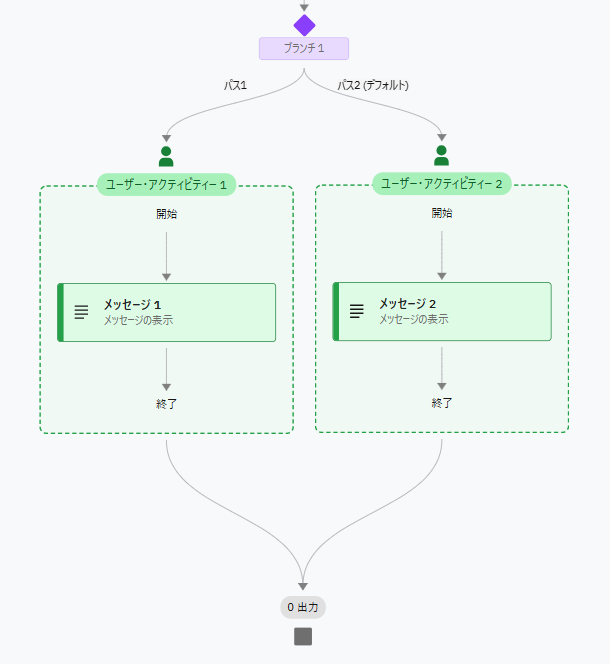  

5. ブランチを編集します。
     1. **ブランチ1** をクリックして **条件の編集** をクリックします。  
     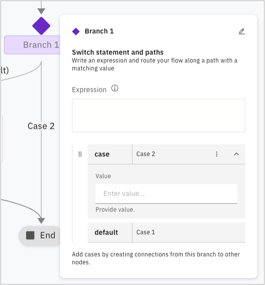  
     
     2. **if**の右にある **+** ボタンをクリックし、表示されたセレクト変数において **current weather for coordinates** > **current weather temperature** を選択します。  
     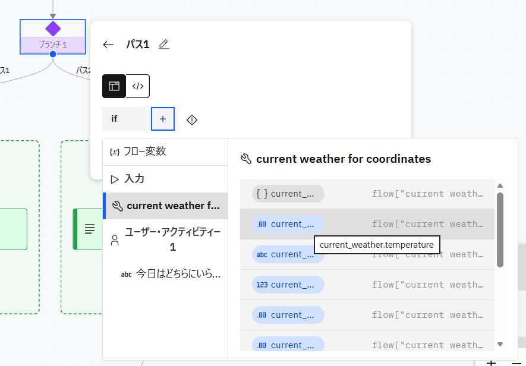  
    
     3. **オペレーター** として **<=** を選択します。  
     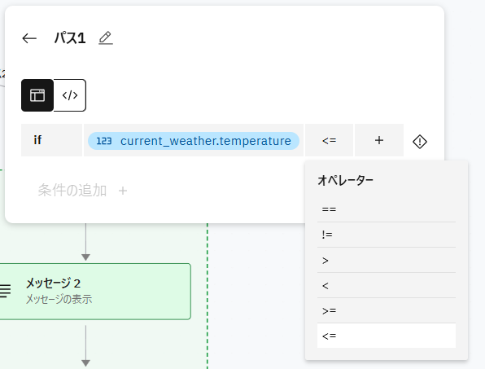  

     4. 値として **15** を設定します。  
     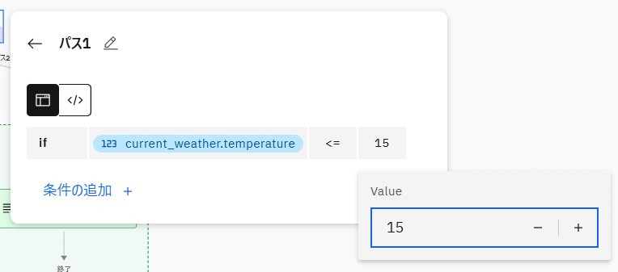  
     
     5. パス1の右にある鉛筆マークをクリックし、名前を **15度以下** に変更します。名前の左にある **← (Back)** をクリックしてブランチ1に戻ります。  
     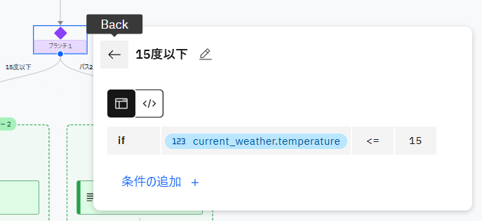  

     6. パス2をクリックし、**15度より高い** に変更します。
     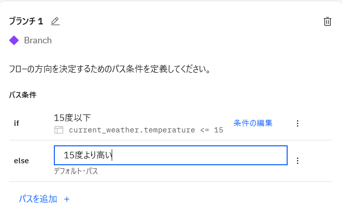  

6. 次に **メッセージ** を編集します。
     1. **メッセージ1** をクリックし、出力メッセージに **今日は肌寒いので、家で過ごすのがおすすめです。映画鑑賞などはいかがですか？** と入力します。 
     メッセージ1の欄には **寒い日の過ごし方** と入力します。
     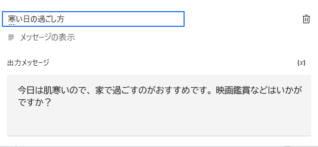  
     
     2. 次に **メッセージ2** をクリックし、出力メッセージに **今日は暖かいので外出がおすすめです。お散歩やショッピングはいかがですか？** と入力します。 
     メッセージ2の欄には **暖かい日の過ごし方** と入力します。
     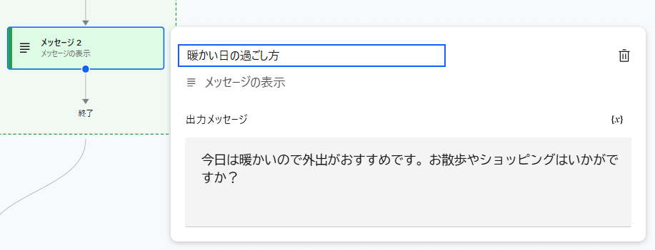  

7. 左上にある **詳細の編集** をクリックします。
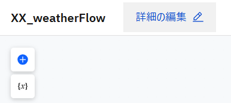  

8. AIエージェントが正しくフローを呼び出せるように、フローの説明を **都市の気温に応じて、今日のおすすめの過ごし方を表示する。** と書き換えて、**完了** をクリックします。
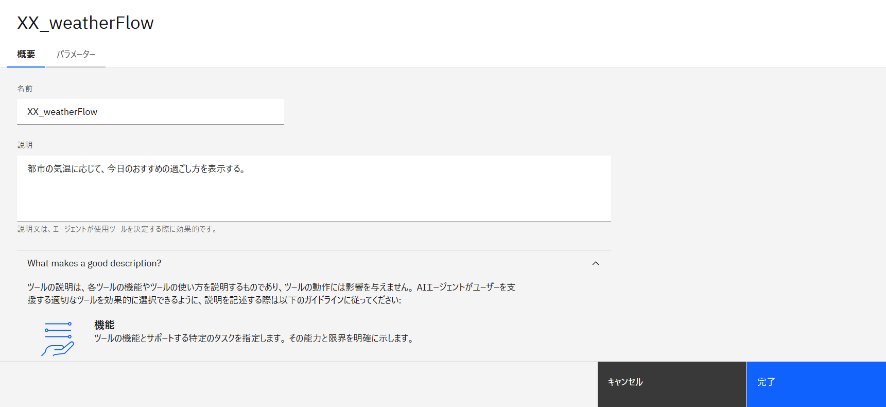  

9. 右上の **完了** ボタンをクリックして、フロー・ビルダーを閉じます。
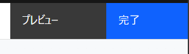

10. 右側のプレビューチャットで「今日のおすすめの過ごし方は？」と入力すると、今日いる都市名を質問されます。その都市の気温に応じて、先ほどフロー内で設定したおすすめの過ごし方が表示されます。
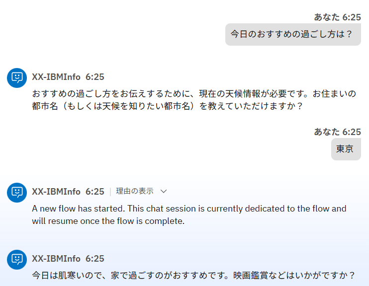  

11. ただ、上記の設定だけではフローの実行後にLLMが独自で考えた過ごし方の提案も行われることが多くあります。もしそちらをなくしたい場合は、動作に **XX_weatherFlowの実行完了後は、追加の出力を一切行わずに会話を終了してください。** と追加すると改善されることがあります。
GPT-OSSモデルへの効果的な指示の与え方は、[こちら](https://www.ibm.com/docs/ja/watsonx/watson-orchestrate/base?topic=models-gpt-oss-model-behavior-instruction-guidelines)もご参照ください。

## お疲れさまでした！
このハンズオンでは、フロー・ビルダーの使い方について説明しました。