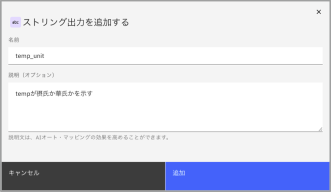

# フローを実装してみよう！

AIAgentはエージェンティックな振る舞いによって様々な処理を呼び出しますが、事前にフローを定義してその振る舞いを完全に制御したいケースもあります。
このLabでは、フロー・ビルダーを用いてフローを定義し、エージェントから呼び出す方法について確認します。

## シンプルなフローの作成と呼び出し
1. 左上のメニューから **ビルド** を選択し、**エージェント・ビルダー** を選択します。  


2. 左側の **すべてのツール** を選択し、**ツールの作成** をクリックします。  


3. **新しいフローを作成する** をクリックします。  


4. 左上のUntitled横の編集ボタンをクリックします。  


    1. 次の値を設定します。
        - 名前: XX_weatherFlow (XXにはイニシャルを設定してください。)
        - 説明: 特定の都市の天気情報を取得する
    2. **入力の追加** ボタンを押して**ストリング**を選択し、次の値を設定してください。
        - 名前: city_name	
        - 説明: 都市名
        - 必須: オン
    3. **出力の追加** ボタンを押して**ストリング**を選択し、次の値を設定してください。
        - 名前: temp
        - 説明: 都市の気温
    4. **保存** をクリックします。  
    


5. 画面左上の **ツール** タブを選択し、検索ボックスにweatherを入力します。表示されたcurrent weather for coordinatesを **開始** と **終了** の間にドラッグ&ドロップします.  
  


## データマッピング
1. 配置したcurrent weather for coordinatesをクリックし、表示された **データマッピングの編集** をクリックします。  


2. current_weatherはオート・マップではなくtrueを設定するために、オート・マップ の×をクリックして削除します。  
  
  

3. さらに **値を入力してください** をクリックし、On-Offのスライドボタンを表示させてON(true)に切り替えます。  
  

4. 右上の×をクリックしてマッピング画面を閉じます。

5. 右上の**完了**ボタンをクリックしてフロー・ビルダーを閉じます。  
  

## エージェントへのツール追加とテスト実行
1. エージェント・ビルダーから先ほど作成したXX-IBMInfoを開き、**ツールの追加** ボタンをクリックします。  


2. **ローカル・インスタンスから追加** を選択します。  
  

3. 検索ボックスにXX_weatherと入力し、表示されたXX_weatherFlowのチェックボックスを有効にして エージェントに追加 ボタンをクリックします。  
  

4. 前の演習で作成したcurrent weather for coordinatesを削除します。  
  

5. 右側のプレビューで「東京の気温は？」と尋ねると、フローが呼び出されます。処理は非同期に実施され、応答を待っている間は追加の入力ができません。  
  


## ブランチ(分岐)とPython コード・ブロックの定義
東京以外の都市が指定された場合には、気温を華氏表記にするようにXX_weatherFlowを変更します。  

1. Agent BuilderでXX-IBMInfoを開いた状態で、XX_weatherFlowの縦三点リーダーをクリックして表示されたメニューから **詳細の編集** をクリックします。  


2. **出力の追加** ボタンを押して**ストリング**を選択し、次の値を設定後、**保存** をクリックします。
    - 名前: temp_unit
    - 説明: tempが摂氏か華氏かを示す  
  

3. XX_weatherFlowの縦三点リーダーをクリックして表示されたメニューから **フロー・ビルダー** をクリックします。  


4. current weather for coordinatesと終了の間の矢印にカーソルを合わせると＋マークが表示されます。それをクリックし、表示されたメニューから **ブランチ** を選択します。  
  

5. 追加した**ブランチ1**と**終了**の間の矢印(**パス1**)にカーソルを合わせて＋マークをクリックし、表示されたメニューから **コード・ブロック** を選択します。  
  

6. **Add**をクリックし、表示されたメニューから **コード・ブロック** を選択します。2つのコード・ブロックがは見やすいようにドラッグ&ドロップで位置を調整してください。  
  

7. 最初に追加した **コード・ブロック1** を編集します。
     1. **コード・ブロック1** をクリックし、表示された **アウトプットの定義** をクリックします。  
       
     
     2. **出力の追加** ボタンをクリックして**ストリング**を選択します。  
       
     
     3. 次の値を設定後、**追加** ボタンをクリックします。  
         - 名前: temp_unit   
         - 説明: tempが摂氏か華氏かを示す  
       
       
     
     4. **コード・エディター** タブを選択し、次のコードを設定後に右上の×をクリックして閉じます。    
     ```
     self.output.temp_unit = "摂氏"
     ```  
        

8. ２番目に追加した **コード・ブロック2** を編集します。
     1. **コード・ブロック2** をクリックし、表示された **アウトプットの定義** をクリックします。
    
     2. **出力の追加** ボタンをクリックして**ストリング**を選択します。  

     3. 次の値を設定後、**追加** ボタンをクリックします。  
         - 名前: temp_unit   
         - 説明: tempが摂氏か華氏かを示す  
            

     4. **コード・エディター** タブを選択し、摂氏を華氏に変換する処理を含む次のコードを設定後に右上の×をクリックして閉じます。    
     ```     
     flow["current weather for coordinates"].output.current_weather.temperature = (flow["current weather for coordinates"].output.current_weather.temperature*9/5)+32
     self.output.temp_unit = "華氏"
     ```
       

9. ブランチを編集します。
     1. **ブランチ1** をクリックして **条件の編集** をクリックします。  
       
     
     2. **if**の右にある **+** ボタンをクリックし、表示されたセレクト変数において **フロー入力** > **city_name** を選択します。  
       
     
    
     3. **オペレーター** として **==** を選択します。  
       

     3. 値として **東京** を設定します。  
     
     
     4. 右上の **完了** ボタンをクリックしてフロー・ビルダーを閉じて、XX-IBMInfoに戻ります。  
     

12. XX-IBMInfoの **動作** に次の文を追加します。  
```
XX_weatherFlowのcity_nameに設定する値は、日本の都市名は日本語にしてください。
気温の単位については、XX_weatherFlowのtemp_unitに従って℃あるいは℉を使用してください。
```
  

13. 右側のプレビューで再度「東京の気温は？」と尋ねると摂氏で表示され、「ニューヨークの気温は？」と尋ねると華氏で表示されます。  


## お疲れさまでした！
このハンズオンでは、フロー・ビルダーの使い方について説明しました。