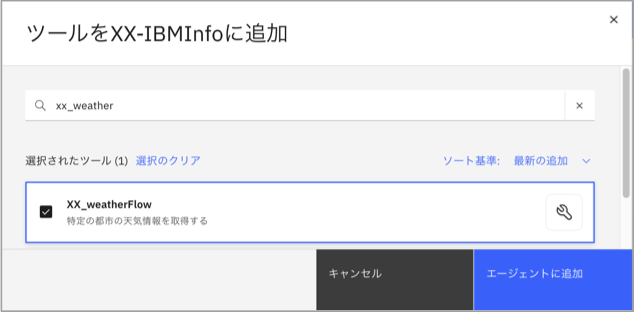
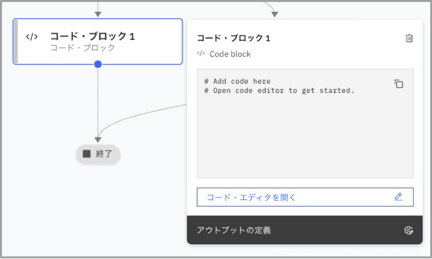
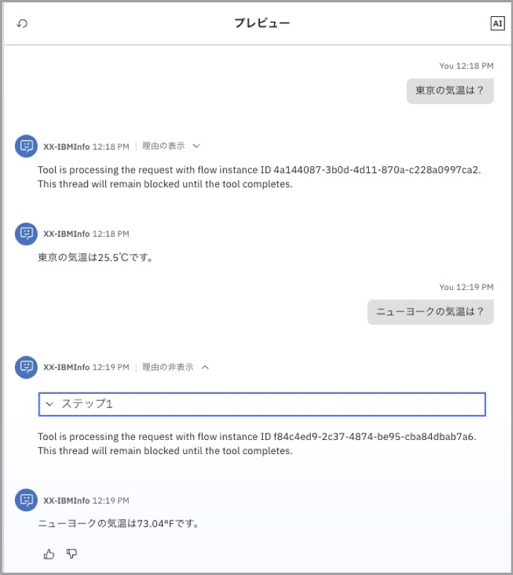

# flowを定義して呼び出してみよう！

AIAgentはエージェンティックな振る舞いによって様々な処理を呼び出しますが、事前にflowを定義してその振る舞いを完全に制御したいケースもあります。
このLabでは、Flow Builderを用いてflowを定義し、Agentから呼び出す方法について確認します。

## シンプルなflowの作成と呼び出し
1. 左上のメニューからBuildを選択し、Agent Builderを選択します。  


2. 左側のAll toolsを選択し、Create toolをクリックします。  


3. Create a new flowをクリックします。  


4. 左上のUntitled横の編集ボタンをクリックします。  


    1. 次の値を設定します。
        - Name: XX_weatherFlow (XXにはイニシャルを設定してください。)
        - Description: get weather of specific city
    2. Add Inputボタンを押して次の値を設定してください。
        - Name: city_name
        - Type: string	
        - Description: name of the city
        - Required: on
    3. Add Outputボタンを押して次の値を設定してください。
        - Name: temp
        - Type: string	
        - Description: city temperature
    4. Save changesをクリックします。  
    


5. 画面左上のToolsタブを選択し、検索ボックスにweatherを入力します。表示されたcurrent weather for coordinatesをStartとEndの間にドラッグ&ドロップします。  
※複数のユーザーがToolをImportしている場合、current weather for coordinates (4) など、後ろに数字がついたものが表示されますが、数字がついていないものを選択してください。
  


## データマッピング
1. 配置したcurrent weather for coordinatesをクリックし、表示されたEdit data mappinngをクリックします。  


2. current_weatherはAuto-mapではなくtrueを設定するために、Auto-mapの×をクリックして削除します。  
  
  

3. さらにEnter a valueをクリックし、On-Offのスライドボタンを表示させてON(true)に切り替えます。  
  

4. 右上の×をクリックしてマッピング画面を閉じます。

5. 右上のDoneボタンをクリックしてflow builderを閉じます。  
  

## AgentへのTool追加とテスト実行
1. Agent Builderから先ほど作成したXX-IBMInfoを開き、Add toolボタンをクリックします。  


2. Add form local instanceを選択します。  
  

3. 検索ボックスにXX_weatherと入力し、表示されたXX_weatherFlowのチェックボックスを有効にしてAdd to agentボタンをクリックします。  
  

4. 前の演習で作成したcurrent weather for coordinatesをRemoveします。  
  

5. 右側のPreviewで「大阪の気温は？」と尋ねると、フローが呼び出されます。処理は非同期に実施され、応答を待っている間は追加の入力ができません。  
  


## 分岐とPython Codeblockの定義
東京以外の都市が指定された場合には、気温を華氏表記にするようにXX_weatherFlowを変更します。  

1. Agent BuilderでXX-IBMInfoを開いた状態で、XX_weatherFlowの縦三点リーダーをクリックして表示されたメニューからEdit detailsをクリックします。  


2. Add Outputボタンを押して次の値を設定し、Save changesをクリックします。
    - Name: temp_unit
    - Type: string	
    - Description: indicates whether temp is in degrees Celsius or Fahrenheit


3. XX_weatherFlowの縦三点リーダーをクリックして表示されたメニューからOpen in flow builderをクリックします。  


4. current weather for coordinatesとEndの間の矢印にカーソルを合わせると＋マークが表示されます。それをクリックし、表示されたメニューからBranchを選択します。  
  

5. 追加したBranchとEndの間の矢印にカーソルを合わせて＋マークをクリックし、表示されたメニューからCode Blockを選択します。追加したCode block1をドラッグ&ドロップで左へ移動します。  
  

6. Branchにカーソルを合わせると⚫️が表示されます。  
  

7. それをEndの⚫️にドラッグ&ドロップして矢印を追加します。  
  
  

8. BranchとEndの間の矢印(Case2)にカーソルを合わせて＋マークをクリックし、表示されたメニューからCode Blockを再度選択します。2つのCode Blockが重なる場合は見やすいように位置を調整してください。  
  

9. 最初に追加したCode block1を編集します。
     1. Code block1をクリックし、表示されたOpen code editorをクリックします。  
       
     
     2. Outputsタブを選択し、Add outputボタンをクリックします。  
       
     
     3. 次の値を設定後、Saveボタンをクリックします。  
         - Name: temp_unit  
         - Type: String  
         - Description: Celsius or Fahrenheit  
       
       
     
     4. Code editorタブを選択し、摂氏を華氏に変換する処理を含む次のコードを設定後に右上の×をクリックして閉じます。    
     ```
     flow["current weather for coordinates"].output.current_weather.temperature = (flow["current weather for coordinates"].output.current_weather.temperature*9/5)+32
     self.output.temp_unit = "Fahrenheit"
     ```  
        

10. ２番目に追加したCode block2を編集します。
     1. Code block2をクリックし、表示されたOpen code editorをクリックします。
    
     2. 同様にOutputsタブに次の値を設定します。  
         - Name: temp_unit  
         - Type: String  
         - Description: Celsius or Fahrenheit  
       
    
     3. Code editorタブを選択し、次のコードを設定後に右上の×をクリックして閉じます。    
     ```
     self.output.temp_unit = "Celsius"
     ```
       

11. Branchを編集します。
     1. Branchをクリックして編集画面を表示させます。  
       
     
     2. Expressionの入力欄をクリックし、キーボードからctrl+spaceを入力するとコードアシストが表示されます。flow.input.city_nameを選択します。  
     
    
     3. Case 2のValueとして東京を設定します。  
     
     
     4. 右上のDoneボタンをクリックしてflow builderを閉じて、XX-IBMInfoに戻ります。

12. XX-IBMInfoのBehaviorに次の文を追加します。  
```
XX_weatherFlowのcity_nameには、日本の都市名は日本語で設定してください。
気温の単位については、XX_weatherFlowのtemp_unitに従って℃あるいは℉を使用してください。
```
  

13. 右側のPreviewで再度「大阪の気温は？」と尋ねると華氏で表示され、「東京の気温は？」と尋ねると摂氏で表示されます。  


## お疲れさまでした！
このハンズオンでは、flow builderの使い方について説明しました。