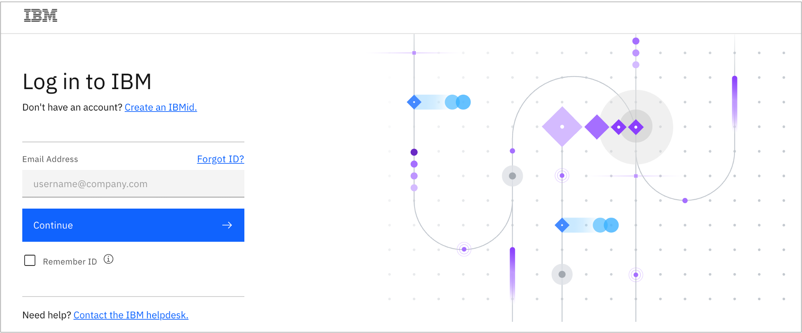
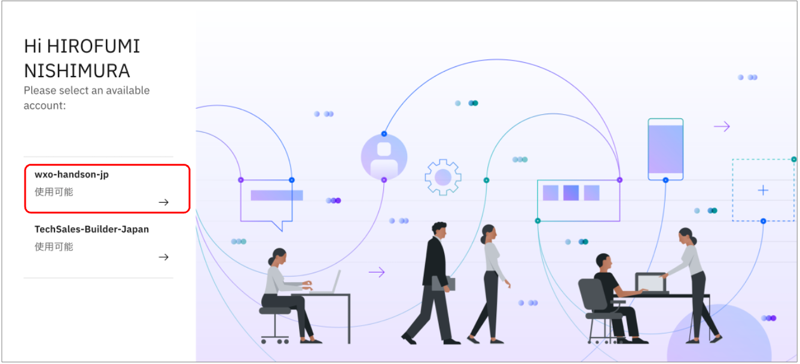
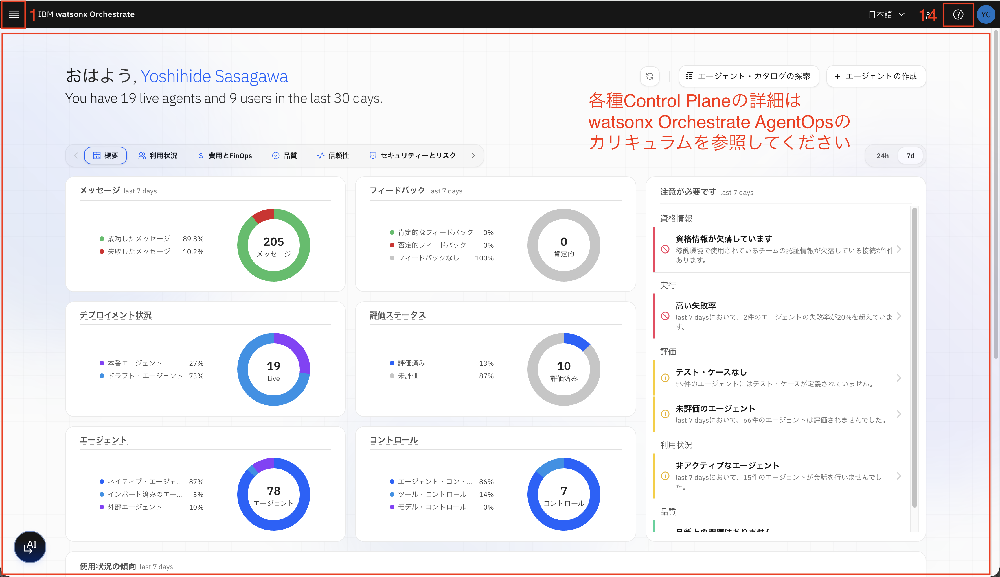
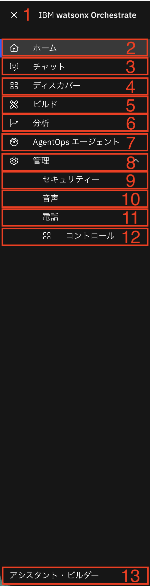

# watsonx Orchestrateへのアクセス方法を確認してみよう！

このLabでは、watsonx Orchestrateにアクセスし、各画面の役割について理解します。

## watsonx Orchestrateの画面を確認してみよう
このセクションでは、watsonx Orchestrateの主な画面構成について学びます。

 1. watsonx Orchestrateにログインします。  
  

 2. IBM-idを入力して、**Continue** ボタンをクリックします。

 3. 複数テナントに所属する場合には、テナント選択画面が表示されるので、適切なテナント名を選択してください。  
  

 4. 以下のような画面が表示されます。（ツアーのダイアログが表示された場合にはスキップしてください。）  
    
    
 5. 詳細は以下の通りです。  
    1.メニュー  
    各画面へ遷移するためのメニューが表示されます。    

    2.ホーム  
    ホーム画面に戻ります。    

    3.チャット  
    watsonx Orchestrateへ様々な処理を依頼するためのチャット画面です。    

    4.ディスカバー  
    プリビルドされているエージェントやツールを探すことができます。  

    5.ビルド  
    エージェントを作成するメニューに移ります。プリビルドツールの組み合わせやプリビルドエージェントを選択することができます。  

    6.分析  
    エージェント使用状況のダッシュボードが表示されます。  

    7.AgentOpsエージェント  
    AIエージェントの評価・最適化・運用を支援するための運用管理エージェントを使用できます。  

    8.管理  
    管理をクリックするとセキュリティー、音声、電話、コントロールが表示されます。  

    9.セキュリティー  
    アプリケーションを使用するためのコネクタと認証情報を設定します。

    10.音声  
    音声入力・出力の設定が可能です。
     
    11.電話  
    SIPを使った電話通信の設定が可能です。
     
    12.コントロール  
    チャットの入出力に対してガードレールの設定が可能です。
     
    13.アシスタント・ビルダー  
    外部のWebサイトなどに組みこんだり、Slackなどのチャネルと統合可能なAIアシスタントの構成が可能です。  
     
    14.ヘルプ  
    ドキュメントとサポートの検索や、チュートリアルが受けられます。  

7. テナントIDを取得するには、右上のイニシャルが表示されているアイコンをクリックし、製品情報を選択します。  

8. ダイアログが表示されます。crnからはじまる文字列がIDです。サポートに問い合わせる際にはこのIDを伝える必要があるため、覚えておきましょう。  

## お疲れさまでした！
このハンズオンでは、watsonx Orchestrateにログインし、各画面のメニューについて役割を確認しました。　
