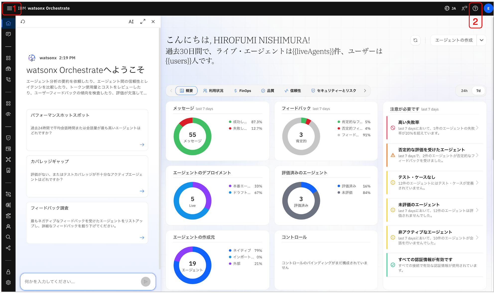
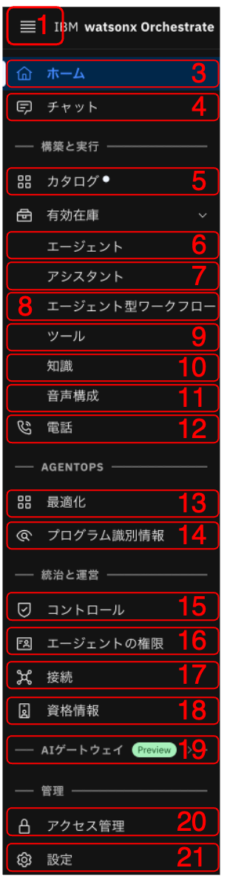

# watsonx Orchestrateへのアクセス方法を確認してみよう！

このLabでは、watsonx Orchestrateにアクセスし、各画面の役割について理解します。

## watsonx Orchestrateの画面を確認してみよう
このセクションでは、watsonx Orchestrateの主な画面構成について学びます。

 1. watsonx Orchestrateにアクセスし、ログインするためにIBM-idを入力して **Continue** ボタンをクリックします。  
    

 2. 複数テナントに所属する場合には、テナント選択画面が表示されるので、適切なテナント名を選択してください。  
  

 3. 以下のような画面が表示されます。（ツアーのダイアログが表示された場合にはスキップしてください。）
   

    **1.メニュー**
    各画面へ遷移するためのメニューを表示。

    **2.ヘルプ**
    ドキュメントとサポートの検索や、チュートリアルが受けられます。
    
    

    

    { width=600 }
    

    

    **3.ホーム**
    ホーム画面（Agentic Control Plane のダッシュボード）に戻る。AgentOpsのハンズオン参照。

    **4.チャット**
    エンドユーザーがデプロイ済みのエージェントと会話するチャットインターフェースを表示。

    **5.カタログ**
    IBM・パートナーが提供するプリビルトのエージェント・MCP サーバー・ツール・アプリを検索・評価・追加できるディスカバリーページ。

    **6.エージェント**
    テナント内のネイティブエージェントを作成・管理する。

    **7.アシスタント**
    watsonx Assistant ベースの会話型アシスタントを作成・管理する。

    **8.エージェント型ワークフロー**
    複数エージェント・ツール・人間の承認ステップなどを組み合わせた自動化ワークフローをローコードで作成・管理する。

    **9.ツール**
    エージェントが外部システムを操作するための Python ツール・OpenAPI ツール・Langflow ツールを作成・インポート・管理する。

    **10.知識**
    エージェントが回答の根拠として参照するドキュメント（ナレッジベース）を登録・管理する。

    **11.音声構成**
    エージェントを音声チャネルに対応させるための音声設定（言語・アクセント・発話速度・推論エンジンなど）を作成・管理する。

    **12.電話**
    エージェントを電話チャネルに接続するための設定ページ。

    **13.最適化**
    AgentOps エージェントとの会話 UI から 評価、最適化、デプロイの一連ループを行う。

    **14.プログラム識別情報**
    エージェントの会話数・ユニークユーザー数・フィードバック評価などのパフォーマンスデータを可視化する分析ページ。

    **15.コントロール**
    エージェント・モデル・ツールに適用するポリシー（コンテンツガードレール・PII フィルター・出力長制限・レート制限など）と、テナント全体に適用する企業制御（データ保持期間・ネットワーク制御・アナリティクスプライバシー）を一元管理する。

    **16.エージェントの権限**
    テナント内の全エージェントがアクセス可能な接続・ツール・権限スコープを管理者が一元的に確認・管理する。エージェントと外部システム間のアクセス制御の透明性を確保する。

    **17.接続**
    外部ビジネスシステム（HR・CRM・ITSM など）との認証設定（OAuth・API キー・Basic 認証等）を作成・管理する。

    **18.資格情報**
    外部アプリケーションへの接続認証に使用するチーム資格情報（共有サービスアカウント）とメンバー資格情報（個人 ID）を管理する。

    **19.AIゲートウェイ**
    外部 LLM・MCP サーバー・外部プラットフォームのエージェントを一元的に登録・ガバナンスするハブ。（Preview: 一般提供前の試験的機能）

    **20.アクセス管理**
    テナントのメンバーを招待・管理し、ロールを割り当てる。

    **21.設定**
    チャット履歴の保持期間・API キー生成・プラットフォーム表示言語・AI モデル選択可否・プレミアモデルの有効化・セキュリティ設定などのインスタンス全体の設定を管理する。

    

    

4. テナントIDを取得するには、右上のイニシャルが表示されているアイコンをクリックし、製品情報を選択します。  

5. ダイアログが表示されます。crnからはじまる文字列がIDです。サポートに問い合わせる際にはこのIDを伝える必要があるため、覚えておきましょう。  

## お疲れさまでした！
このハンズオンでは、watsonx Orchestrateにログインし、各画面のメニューについて役割を確認しました。　
