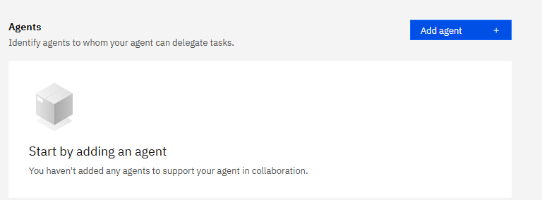

# 複数エージェントを組み合わせてみよう！
watsonx Orchestrateでは複数エージェント間の連携も簡単に行うことができます。エージェントが連携すべきエージェントを判断し適切にメッセージを転送して処理を行うことが可能です。このLabでは、これまで作成してきたエージェントに、株価情報などを取得可能なエージェントとの連携を設定し、機能を拡張する手順を学びます。

## Collaborator Agentの設定
1. 左上のメニューを開き、**Build > Agent Builder** を選択し、これまで作成してきたXX-IBMInfoエージェントを探して開きます。  

2. Agentsの欄の**Add Agents**ボタンをクリックしてください。  

3. ダイアログが表示されるので、**Add from local instance**を選択してください。  

4. 追加可能なAgentのリストが表示されるので、**yfinance_agent**を選択し、右下の**Add to agent**ボタンをクリックしてください。  

5. yfinance_agentが追加されました。このエージェントは、2つのToolを用いて、株価や会社情報を取得可能なエージェントです。XX-IBMInfoエージェントは、このエージェントの説明を元に、必要に応じて処理をルーティングします。  

## Agentの実行
1. チャット欄に**IBMの会社情報を教えて**と入力してください。次の様に結果が返ってくるはずです  

2. **Show Reasoning**をクリックし、Stepを展開して確認してください。おそらく、Step1でyfinance_agentに処理が転送され、Step2でToolが呼び出されて会社情報を取得しているはずです。  

3. <オプション>**IBMとOracleの会社情報と株価を表形式で比較して**と入力してどの様な振る舞いになるか確認してみましょう。  

## お疲れさまでした！
このハンズオンでは、複数エージェントを連携させるための設定を学び、これまで作成したエージェントに株価や会社情報を取得する機能を追加しました。
