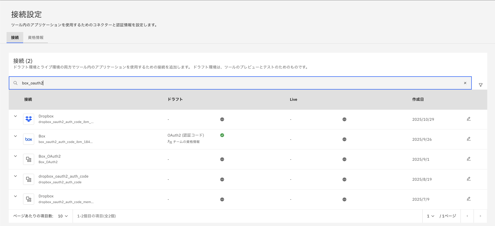
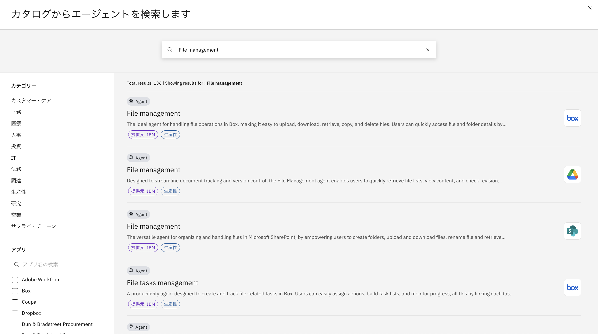

# プリビルド・エージェント/ツールを使ってみよう！

watsonx Orchestrateには、事前定義されたエージェントやツールがカタログに多数含まれ、テンプレートとして利用することが可能です。
また、接続(Connections)という仕組みを使うことで、接続情報を柔軟に管理、設定することが可能です。
このLabでは、Boxへ接続可能なエージェントをテンプレートから構成し、利用する手順について説明します。

## 接続の設定
定義済みの接続を確認し、Boxに接続するために必要な構成を行います。  
1. 左側のメニューより、管理 > 接続を選択してください。  
  
2. 接続の管理画面が表示されます。    
3. 検索ボックスに、**box_oauth2**と入力してください。Boxに関する接続が表示されるはずです。  
 
4. boxの設定（テナント管理者のみ実行してください。共有のテナントを使用する場合は、管理者に設定を依頼してください。既に接続済みの場合はスキップして、次のステップの**エージェントの作成**に進んでください。）  
Boxの右側の編集ボタンをクリックしてください。設定画面が開くので、**チームの資格情報**が選択されていることを確認してから、以下の値を設定し、**接続**ボタンをクリックしてください。
なお、設定値はDraft/Liveの2つの値を設定することで、開発画面とデプロイされたToolで異なる接続情報を使い分けることが可能です。今回はDraftのみを設定してください。
 

## エージェントの作成
カタログにあるBoxを用いるエージェントをテンプレートにしてエージェントを作成します。  
1. 左側のメニューからビルド > エージェント・ビルダーと進み、**エージェントの作成**ボタンをクリックしてください。  

  
2. エージェント作成のウィザードが開くので、右側の**テンプレートから作成**を選択してください。  

3. 検索Boxに**File management**と入力し、エンターキーを入力してください。Boxを使用するエージェントが表示されるので、**File management**を選択してください。

4. エージェントの詳細が表示されるので、内容を確認し、右下の**テンプレートとして使用**をクリックしてください。

5. エージェント作成されます。共用の環境を使用している場合は、エージェントの名前の右側の編集ボタンをクリックし、あなたの名前を付けるなど、区別がつくようにしてください。  
6. エージェントの設定を確認し、利用可能なツールや、動作の記述内容を確認してください。特に動作についてはかなり細かく設定がされていることが分かります。

## エージェントの実行
1. 右側のチャット欄に**handson.docxの詳細を表形式で表示して**と入力してください。  

2. メンバー資格情報が設定されており、まだ接続が行われていない場合には、以下の様にパラメータを設定するフォームが表示されます。  

3. Username,Passwordに講師から共有された値を入力して、**接続**ボタンをクリックしてください。UsernameやPasswordをコピー＆ペーストする際には、スペースなどが付加されていないことを確認してください。
4. 正しく接続された場合には、プロジェクトの一覧が表示されます。ツールの初回利用時には、バックグラウンドで導入を実施するので、時間をおいてから再度実行してくださいというメッセージが表示される場合があります。その場合は指示に従ってください。
  
6. File managementエージェントはファイルのアップロードや削除など他にも機能があります。その他のツールも実行して動作を確認してください。例えば以下のような処理が可能です。   
 
    - ファイルのコピー
    - ファイルのアップロード
    - ファイルの削除

## お疲れさまでした！
このハンズオンでは、接続を構成する方法を学び、プリビルドのエージェントをテンプレートにエージェントを作成する手順を実行しました。