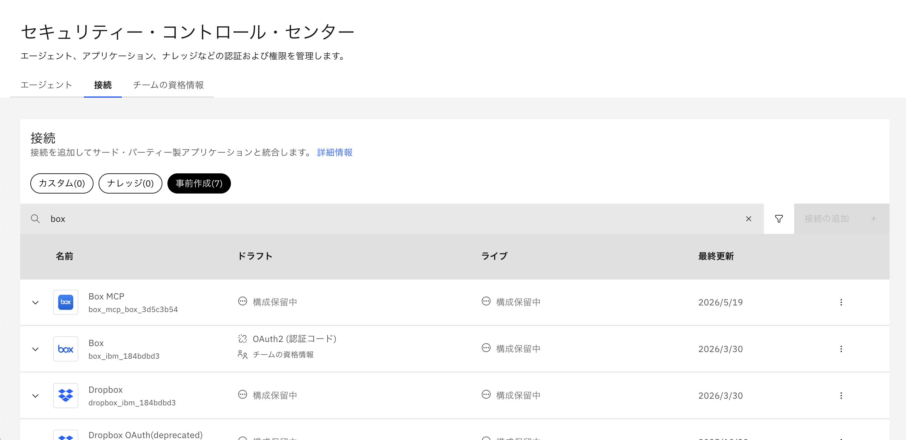
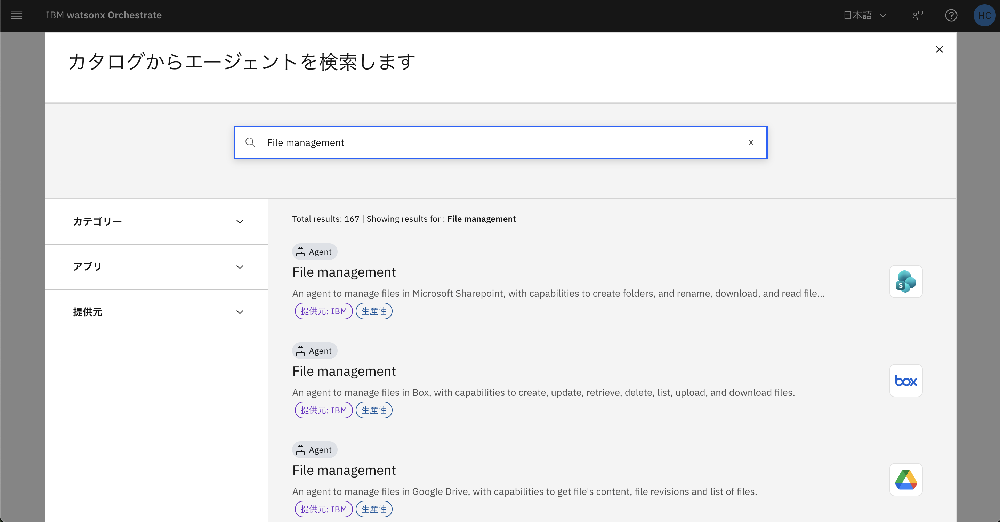
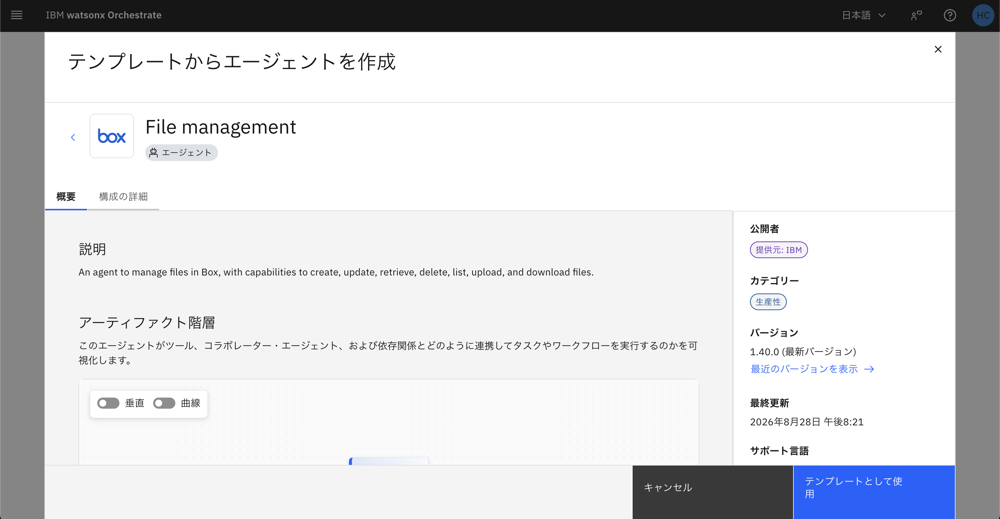
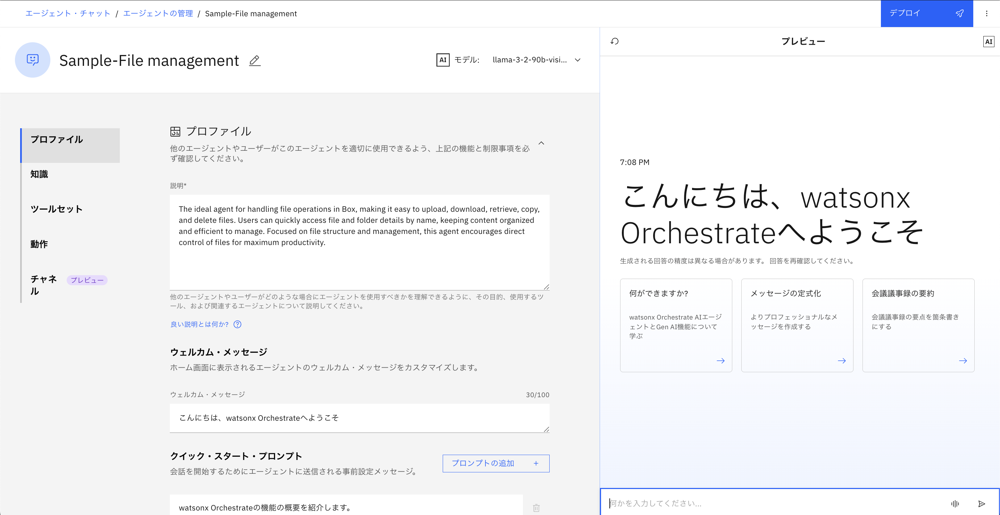
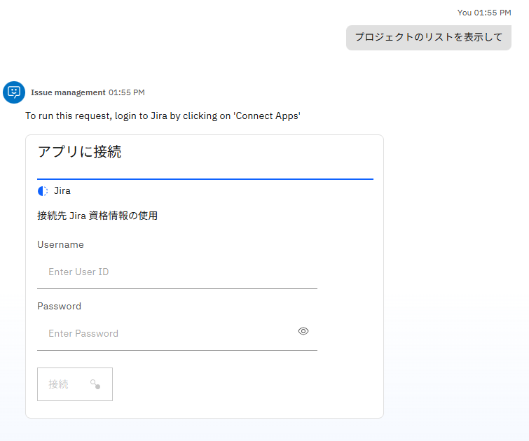
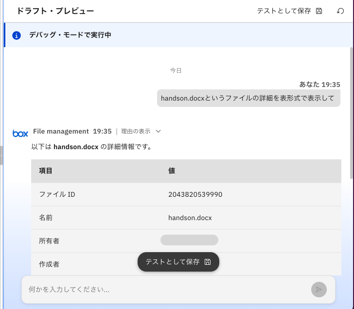

# プリビルド・エージェント/ツールを使ってみよう！

watsonx Orchestrateには、事前定義されたエージェントやツールがカタログに多数含まれ、テンプレートとして利用することが可能です。
また、接続(Connections)という仕組みを使うことで、接続情報を柔軟に管理、設定することが可能です。
このLabでは、Boxへ接続可能なエージェントをテンプレートから構成し、利用する手順について説明します。

## 接続の設定
定義済みの接続を確認し、Boxに接続するために必要な構成を行います。(※ハンズオンではあらかじめ講師が設定した接続を利用するため、各自で接続の設定を行う必要は在りません。手順を確認し、**エージェントの作成**のステップに進んでください)

1. 左側のメニューより、管理 > セキュリティを選択してください。  

2. セキュリティ・コントロール・センターの画面が表示されるので、**接続**タブを選択してください。接続の一覧が表示されます。
  
3. **事前作成**のフィルタ・ボタンをクリックしてから右側の虫メガネアイコンをクリックし、検索ボックスに、**box**と入力してください。Boxに関する接続がいくつか表示されるはずです。  **box**という名前の接続の右側の3点リーダーをクリックし、**接続の編集**を選択します。
 

4. boxへの接続を構成します。  
Boxの右側の編集ボタンをクリックしてください。以下のように設定します。 
・認証タイプ：OAuth2許可コード　 
・Server URL:https://box.com 
・トークンURL:https://api.box.com/oauth2/token　 
・許可URL：https://account.box.com/api/oauth2/authorize　 
・クライアントID：box側で構成したアプリケーションのクライアントID　 
・クライアント・シークレット：box側で構成したアプリケーションのクライアント・シークレット　 
・資格情報タイプ：チームの資格情報　 
<!--
- 範囲：許可するスコープ 例）manage:jira-project read:jira-work offline_access
-->
なお、設定値はDraft/Liveの2つの値を設定することで、開発画面とデプロイされたToolで異なる接続情報を使い分けることが可能です。今回はDraftのみを設定してください。  

## エージェントの作成
カタログにあるBoxを用いるエージェントをテンプレートにしてエージェントを作成します。  
1. 左側のメニューからビルドを開き、**エージェントの作成**ボタンをクリックしてください。  　 
　　 
2. エージェント作成のウィザードが開くので、**テンプレートから作成**を選択してください。  　 
　　 
3. 検索ボックスに**File management**と入力してください。右にboxのアイコンがある、**File management**を選択してください。　 
　　 
4. エージェントの詳細が表示されるので、内容を確認し、右下の**テンプレートとして使用**をクリックしてください。　 
　　 
5. エージェントが作成されます。共用の環境を使用している場合は、エージェントの名前を編集し、あなたのイニシャルを追加するなど、区別がつくようにしてください。　　 
6. エージェントの設定を確認し、利用可能なツールや、動作の記述内容を確認してください。特に動作についてはかなり細かく設定がされていることが分かります。

## エージェントの実行
1. 右側のチャット欄に**handson.docxというファイルの詳細を表形式で表示して**と入力してください。  

2. もしメンバー資格情報が設定されており、まだ接続が行われていない場合には、以下の様にパラメータを設定するフォームが表示されます。
  
    

    
イメージ

    

    

    Username,Passwordに講師から共有された値を入力して、**接続**ボタンをクリックしてください。UsernameやPasswordをコピー＆ペーストする際には、スペースなどが付加されていないことを確認してください。

3. 正しく接続された場合は、ファイルの詳細が表示されます。ツールの初回利用時には、バックグラウンドで導入を実施するので、時間をおいてから再度実行してくださいというメッセージが表示される場合があります。その場合は指示に従ってください。  
   

4. File managementエージェントはファイルのアップロードや削除など他にも機能があります。その他のツールも実行して動作を確認してみてください。例えば以下のような処理が可能です。   
 
    - ファイルのコピー
    - ファイルのアップロード
    - ファイルの削除

## お疲れさまでした！
このハンズオンでは、接続を構成する方法を学び、プリビルドのエージェントをテンプレートにエージェントを作成する手順を実行しました。