# プリビルド・エージェント/ツールを使ってみよう！

watsonx Orchestrateには、事前定義されたエージェントやツールがカタログに多数含まれ、テンプレートとして利用することが可能です。
また、接続(Connections)という仕組みを使うことで、接続情報を柔軟に管理、設定することが可能です。
このLabでは、Jiraへ接続可能なエージェントをテンプレートから構成し、利用する手順について説明します。

## 接続の設定
定義済みの接続を確認し、Jiraに接続するために必要な構成を行います。(※ハンズオンではあらかじめ講師が設定した接続を利用するため、各自で接続の設定を行う必要は在りません。手順を確認し、**エージェントの作成**のステップに進んでください)

1. 左側のメニューより、管理 > セキュリティを選択してください。  
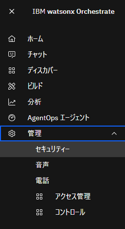
2. セキュリティ・コントロール・センターの画面が表示されるので、**接続**タブを選択してください。接続の一覧が表示されます。
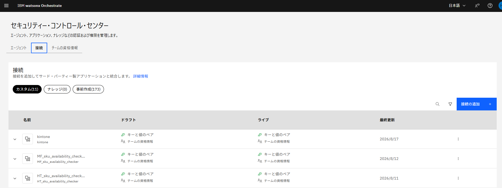    
3. **事前作成**のフィルタ・ボタンをクリックしてから右側の虫メガネアイコンをクリックし、検索ボックスに、**jira**と入力してください。Jiraに関する接続がいくつか表示されるはずです。Jiraという名前の接続の右側の3点リーダーをクリックし、**接続の編集**を選択します。
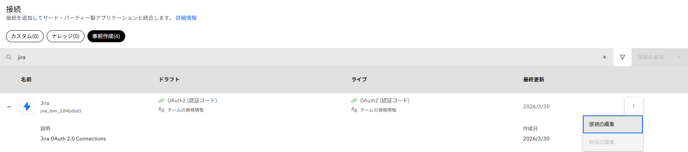

4. Jiraへの接続を構成します。JiraはOAuth2許可コードに必要な情報を設定する接続です。ユーザー毎に異なる値を設定する場合にはユーザー、メンバー資格情報を使用します。必要なパラメータとサンプルの値は以下の通りです。特に範囲にoffline_accessを含める点に注意してください。これは、リフレッシュ・トークンを用いてトークンを更新する際に必要なスコープです。また、Jira側のアプリケーションに表示されているコールバックURLを登録する必要もあります。

- 認証タイプ：OAuth2許可コード
- Server URL:https://api.atlassian.com
- トークンURL:https://auth.atlassian.com/oauth/token
- 許可URL：https://auth.atlassian.com/authorize
- クライアントID：Jira側で構成したアプリケーションのクライアントID
- クライアント・シークレット：Jira側で構成したアプリケーションのクライアント・シークレット
- 範囲：許可するスコープ 例）manage:jira-project read:jira-work offline_access

    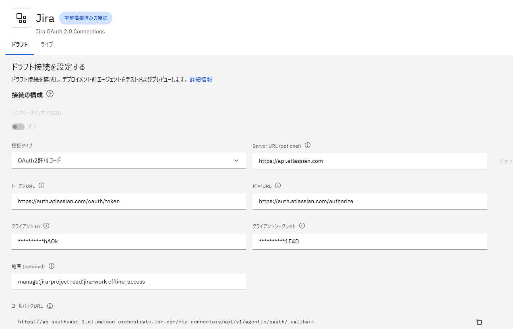  

なお、設定値はDraft/Liveの2つの値を設定することで、開発画面とデプロイされたToolで異なる接続情報を使い分けることが可能です。今回はDraftのみを設定してください。  

5. 設定を保存すると、以下の様なダイアログが表示されるので、**続行**をクリックします。  
    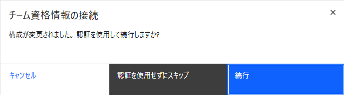   
Jiraへのアクセスの許可を求められるので、 Acceptすることで構成は完了です！  
    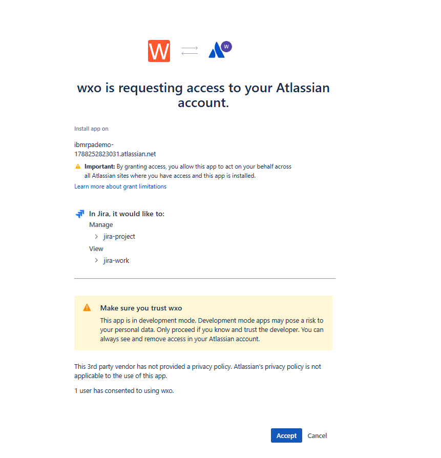  

## エージェントの作成
カタログにあるJiraを用いるAgentをテンプレートにしてAgentを作成します。  
1. 左側のメニューからビルド > エージェント・ビルダーと進み、**エージェントの作成**ボタンをクリックしてください。  

2. Agent作成のウィザードが開くので、**テンプレートから作成する**を選択してください。  
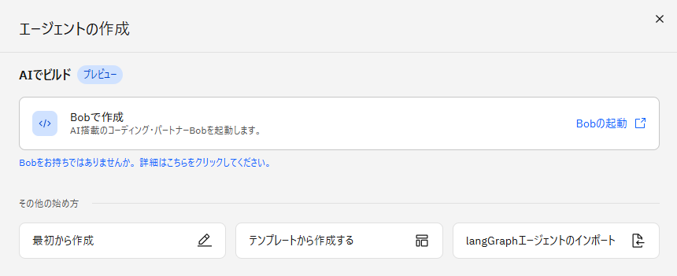
3. 検索Boxに**issue manager**と入力し、エンターキーを入力してください。Jiraを使用するエージェントが表示されるので、**Issue manager**を選択してください。
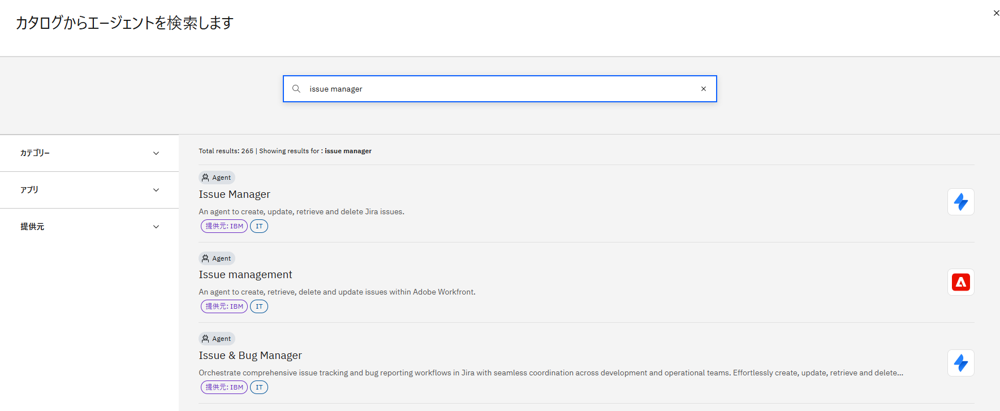
4. エージェントの詳細が表示されるので、内容を確認し、右下の**テンプレートとして使用**をクリックしてください。
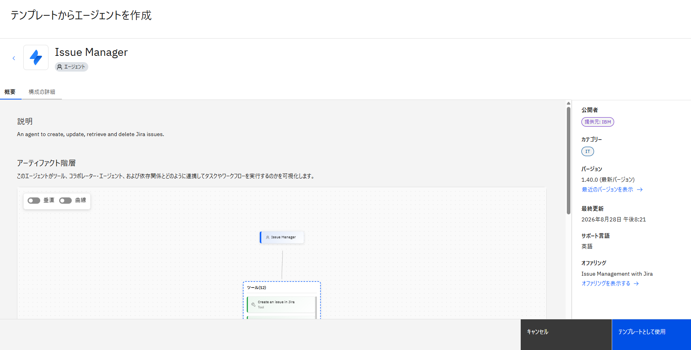
5. Issue Managerという名前でエージェントが作成されます。共用の環境を使用している場合は、エージェントの名前を編集し、あなたのイニシャルを追加するなど、区別がつくようにしてください。  
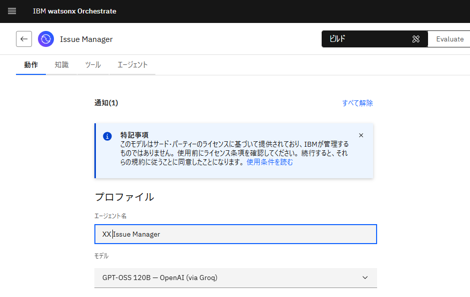
6. エージェントの設定を確認し、利用可能なツールや、動作の記述内容を確認してください。特に動作についてはかなり細かく設定がされていることが分かります。

## エージェントの実行
1. 右側のチャット欄に**プロジェクトのリストを表示して**と入力してください。  
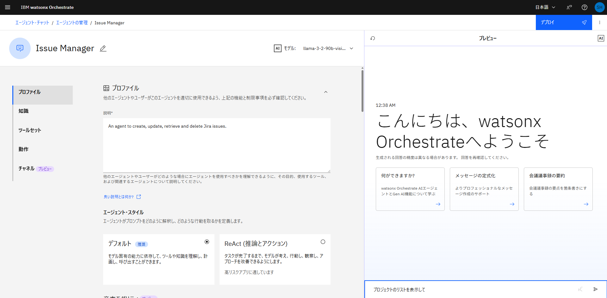
2. メンバー資格情報が設定されており、まだ接続が行われていない場合には、以下の様にパラメータを設定するフォームが表示されます。Username,Passwordに講師から共有された値を入力して、**接続**ボタンをクリックしてください。UsernameやPasswordをコピー＆ペーストする際には、スペースなどが付加されていないことを確認してください。  

3. チーム資格情報を用いている場合はそのまま接続されます。
4. 正しく接続された場合には、プロジェクトの一覧が表示されます。ツールの初回利用時には、バックグラウンドで導入を実施するので、時間をおいてから再度実行してくださいというメッセージが表示される場合があります。その場合は指示に従ってください。
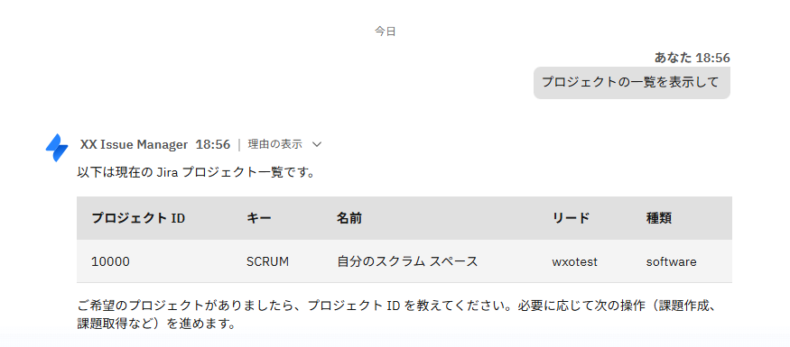
6. Issue Manager Agentはissueの取得や作成など他にも機能があります。その他のツールも実行して動作を確認してください。例えば以下のような処理が可能です。  
 
    - issueの表示
    - issueの作成
    - issueの削除

## お疲れさまでした！
このハンズオンでは、接続を構成する方法を学び、プリビルドのエージェントをテンプレートにエージェントを作成する手順を実行しました。