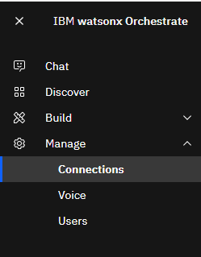
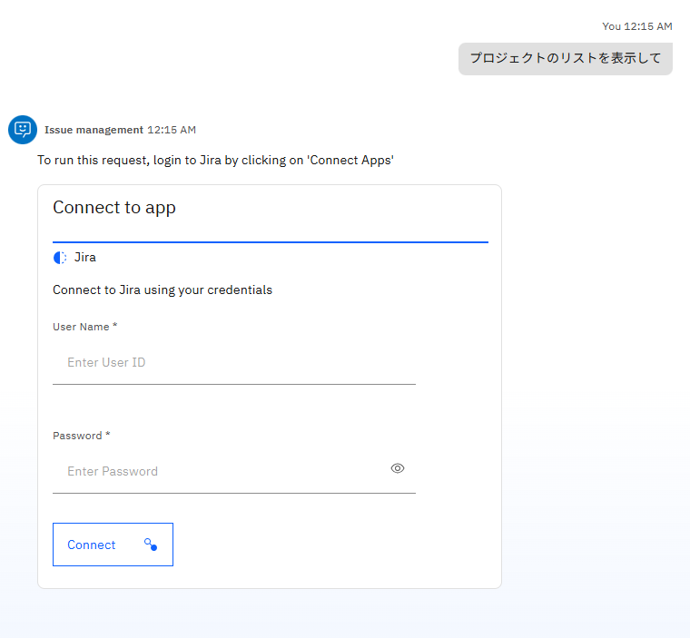

# プリビルドAgent/Toolを使ってみよう！

watsonx Orchestrateには、事前定義されたAgentやToolがカタログに多数含まれ、テンプレートとして利用することが可能です。
また、Connectionsという仕組みを使うことで、接続情報を柔軟に管理、設定することが可能です。
このLabでは、Jiraへ接続可能なAgentを構成し、利用する手順について説明します。

## Connectionsの設定
定義済みのConnectionsを確認し、Jiraに接続するために必要な構成を行います。  
1. 左側のメニューより、Manage > Connectionsを選択してください。  
      
2. Connectionsの管理画面が表示されます。    
3. 検索ボックスに、**jira**と入力してください。Jiraに関する2つのConnectionsが表示されるはずです。

 - Jiraは基本認証に必要な情報を設定するConnectionで、ユーザー毎に異なるユーザーIDとパスワードを設定します。このように、ユーザー毎に異なる値を設定する場合には、Member Creadentialsを使用します。
 - Jira URLは、接続先のドメインを設定するためのkey_value型のConnectionsで、全体で共通の値を設定します。これをTeam Credentialsと呼びます。Team Credentialsは管理者のみ設定可能です。  
    
  
4. Jira URLの設定（管理者のみ。共有のテナントを使用する場合は、管理者に設定を依頼してください。既に接続済みの場合はスキップして、Step5のJiraの設定に進んでください。）  
Jira URLの右側の編集ボタンをクリックしてください。設定画面が開くので、**Team credentials**が選択されていることを確認してから、以下の値を設定し、**Connect**ボタンをクリックしてください。   
なお、設定値はDraft/Liveの2つの値を設定することで、開発画面とデプロイされたToolで異なる接続情報を使い分けることが可能です。今回はDraftのみを設定してください。  

 - **Authentication Type:** Key Value Pair
 - **Server URL:**空欄のままでOK
 - **key:** base_url
 - **Value:**講師から共有されたドメイン名

 
接続が成功したら、**Save**ボタンをクリックしてください。  
5. Jiraの設定  
次にJiraの右側の編集ボタンをクリックします。**Member credentials**が選択されていることを確認し、Authentication Typeとしては、**Basic Auth**を選択してSaveボタンをクリックしてください。

## Agentの作成
カタログにあるJiraを用いるAgentをテンプレートにしてAgentを作成します。  
1. 左側のメニューからBuild > Agent Builderと進み、**Create Agent**ボタンをクリックしてください。  
  
2. Agent作成のウィザードが開くので、右側の**Create from template**を選択してください。
  
3. 検索Boxに**jira**と入力してください。Jiraを使用する2つのAgentが表示されるので、**Issue management**を選択してください。

4. Agentの詳細が表示されるので、内容を確認し、右下の**Use as template**をクリックしてください。

5. Agentが作成されます。共用の環境を使用している場合は、Agentの名前の右側の編集ボタンをクリックし、あなたの名前を付けるなど、区別がつくようにしてください。  
6. Agentの設定を確認し、利用可能なToolや、Behaviorの記述内容を確認してください。特にBehaviorについてはかなり細かく設定がされていることが分かります。

## Agentの実行
1. 右側のチャット欄に**プロジェクトのリストを表示して**と入力してください。  

2. Member Credentialsが設定されており、まだ接続が行われていない場合には、以下の様にパラメータを設定するフォームが表示されます。  

3. User Name,Passwordに講師から共有された値を入力して、**Connect**ボタンをクリックしてください。Passwordをコピー＆ペーストする際にスペースなどが付加されていないことを確認してください。
4. 接続が成功するはずです。  
 
5. プロジェクトの一覧が表示されます。Toolの初回利用時には、バックグラウンドで導入を実施するので、時間をおいてから再度実行してくださいというメッセージ(We are configuring your tool in the background. This may take a few minutes, please try after some time.)が表示される場合があります。その場合は指示に従ってしばらくしてからもう一度実行してみてください。

6. Issue Manaement Agentはissueの取得や作成など他にも機能があります。その他のToolも実行して動作を確認してください。例えば以下のような処理が可能です。   
 
    - issueの表示
    - issueの作成
    - issueの削除

## お疲れさまでした！
このハンズオンでは、Connectionsを構成する方法を学び、プリビルドのAgentをテンプレートにAgentを作成する手順を実行しました。