# ツールを定義して呼び出してみよう！

ツールは、ユーザーに代わってデータを照会したり、ドキュメントを作成したり、トランザクションを実行したりするコンポーネントです。
この Lab では、外部の API をインポートしてツールを定義し、AI エージェントから利用する方法について学びます。

※AI エージェントのモデルは **llama-3-2-90b-vision-instruct** を使用しています。他のモデルで実行すると結果が異なる場合があります。

## ツールのインポート
天気の情報を取得する OpenAPI 形式のファイルを
インポートします。インポートする前に、Lab1 で作成した AI エージェントで天気の質問に回答できるか確認してみましょう。

1. 左上のメニューを開き、**チャット** を選択してください。  
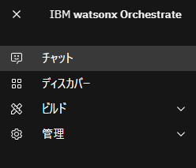

2. 左上のエージェントが **(YourInitials)-IBMInfo** になっていることを確認してください。  
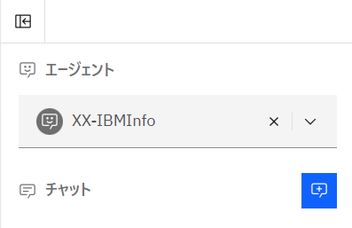

3. **東京の天気は？** のようにお好きな地域の天気を聞いてみてください。ツールをインポートする前の状態では、正しく回答できないことを確認します。  
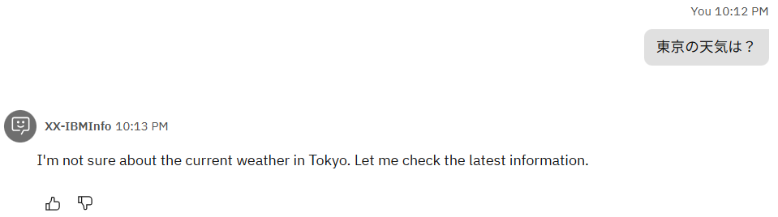

4. インポートするツールを用意します。[こちらのリンク](./files/weather.yaml)を右クリックし、名前を付けて保存してください。  
今回使用する weather.yaml は、ある地域の緯度 (**latitude**) ・ 経度 (**longitude**)、そして current_weather を **true** と入力すると、その地域の現在の気温や天気、風速などを回答してくれるツールです。  

    * ツールは、OpenAPI 形式 もしくは MCP に対応したものをインポート可能です。
    * Python でツールを実装し、SaaS 環境に導入することも可能です。  

5. 左上のメニューを開き、**ビルド > エージェント・ビルダー** を選択してください。  
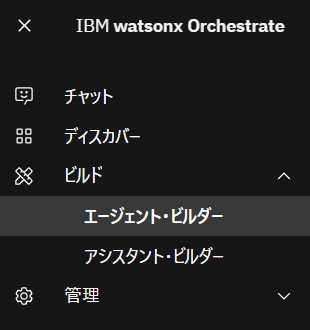

6. **(YourInitials)-IBMInfo** のエージェントをクリックします。  
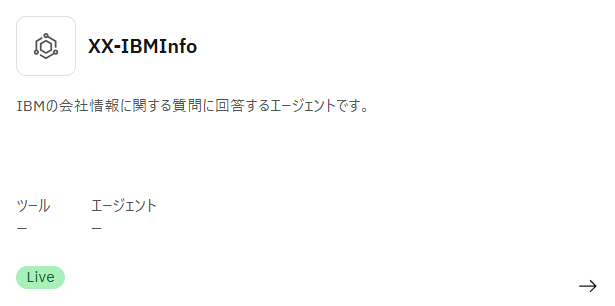

7. ツールセットのメニューで **ツールの追加** をクリックします。  
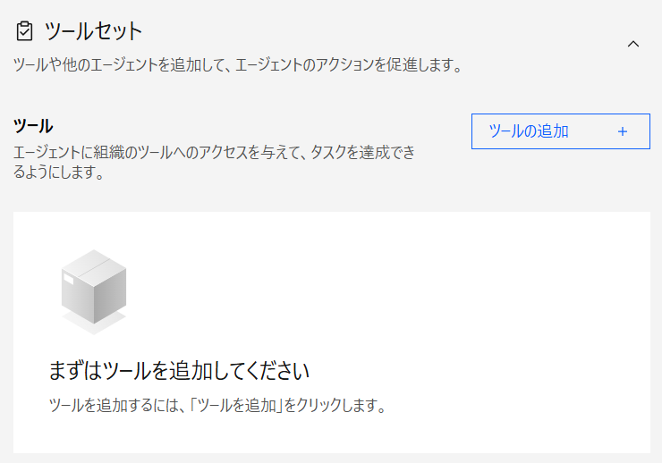

8. ツールセット では、以下の4つの方法でエージェントにツールを追加できます。

    * カタログから追加 (プリビルドツール)
    * ローカル・インスタンスから追加 (カスタムツール)
    * インポート (OpenAPIのカスタムツール)
    * 新しいフローを作成する　※ Lab3 で実施します。

    今回は **インポート** をクリックします。  
    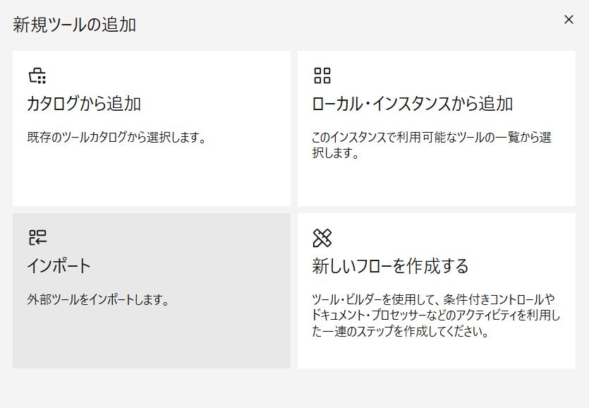

9. **ファイルからインポート** をクリックします。  
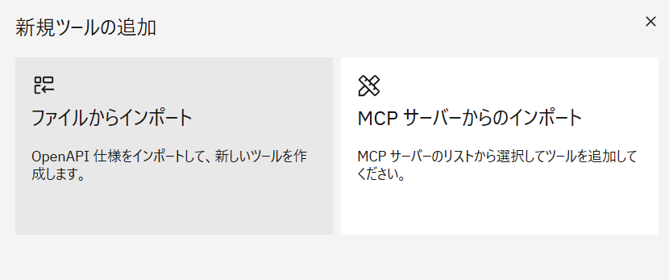

10. 先ほど保存した weather.yaml をアップロードし、**次へ** をクリックします。
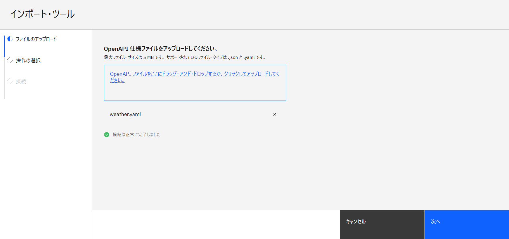

11. 操作のチェックボックスにチェックを入れ、**完了** をクリックします。  
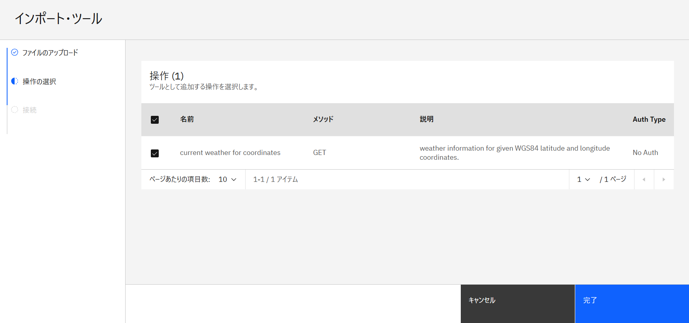

12. 以下のメッセージが表示されたら、ツールの追加は完了です。  
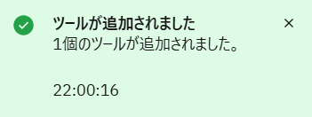

## エージェントが出来ることの確認
1. 右側のプレビューチャットに、**あなたのできることを教えてください。** と聞いてみましょう。

2. 1回目の質問では定型のあいさつが返ってきましたが、2回目に同じ質問をすると 1. 天気情報の提供、2. 2024年のIBMの年次報告書の提供ができると回答されます。  
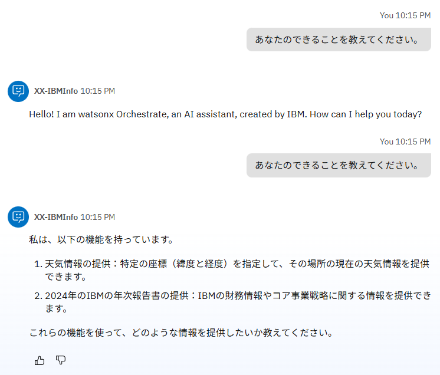

3. (オプション) 動作の指示に **定型の挨拶は省略し、最初の質問から回答してください。** のように指示を追加すると、1回目から回答してくれるようになります。  
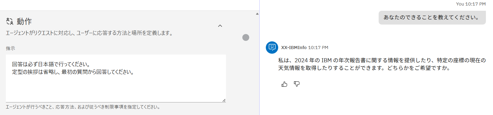

## ツールの利用
1. チャットをリロードし、先ほどと同じくお好きな地域の天気を聞いてみましょう。正しく回答が返ってくることを確認できます。  
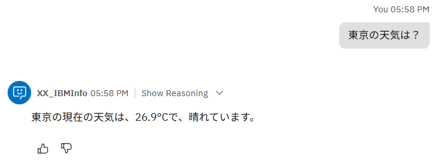  
以下の様にうまく回答されない場合は、もう一度同じリクエストを入力すると正しく呼び出されるはずです。 
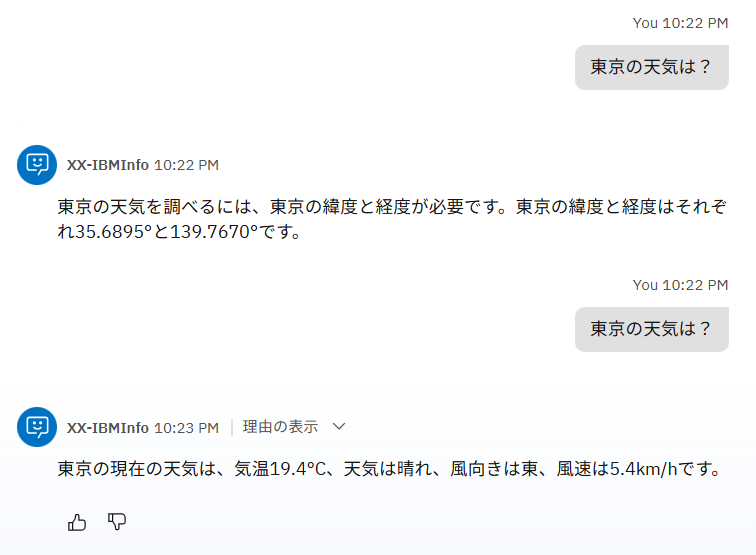  

!!!note
    この挙動は、製品が使用しているシステム・プロンプトが、変数の値を勝手に想定、生成するなという指示を与えていることによるものです。
    エージェントの指示や、ツールの説明を調整することにより、適切な動作を行うように調整することが可能ですが、今回のハンズオンではスコープ外とします。

2. **理由の表示** をクリックして **ステップ1** を開いてみると、入力した地名から緯度と経度を認識し、パラメータを適切に変換してくれていることが確認できます。  
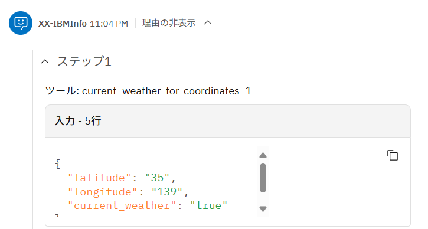


## 複数地名の確認（エージェンティックな振る舞い）
次に、複数の地域の天気を比較する質問をし、エージェンティックな振る舞いを体験してみましょう。

1. 先ほどと同じチャットに、**横浜と宇都宮ではどちらの方が涼しい？** と入力してみてください。  
横浜と宇都宮の気温を表示し、どちらの方が涼しいか回答してくれるはずです。  
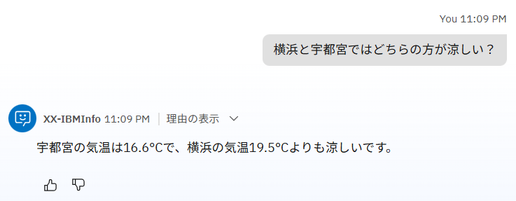

2. **理由の表示** をクリックすると、ステップ1 と ステップ2 で横浜と宇都宮の天気が取得されていることが確認できます。  
ただ、2つを比較するという処理はツールに定義されていないため、AI エージェントのベースとなる LLM がエージェンティック (自律的) に実行したと読み取ることができます。

## 表形式の表示
今度は、複数の地域の天気を表形式で表示してみましょう。

北海道の市町村を3つ選択し、それらの市町村の気温を表形式で出力してみましょう。  
3市町村の緯度・経度ができるだけ異なるように選び、先ほどのチャットの続きで質問してみてください。  
**例: 函館市、稚内市、羅臼町の気温を表形式で比較してください。**  
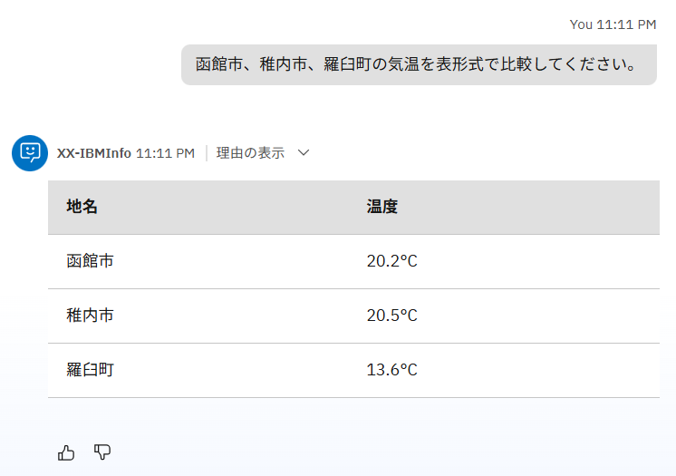

こちらも、各市町村の気温はツールによって取得されていますが、表形式での出力は LLM のエージェンティックな判断によって行われていることがわかります。

もしうまく表示されない場合は、**Githubマークダウン形式の表で表示して** とチャットに入力してみましょう。

## エージェントスタイルの違いの確認

エージェントスタイルの違いにより、エージェントの振る舞いがどのように変わるか確認してみましょう。  
エージェントスタイルは デフォルト と ReAct の2種類があり、最初はデフォルトで設定されています。

1. エージェントスタイルがデフォルトの状態で、**明日の千葉の気温は、今日より10度高くなるらしいのですが、何度になりますか？** と質問してみましょう。おそらく、正しい回答は返ってこないと思います。  
(正しく回答が返ってくる場合は、モデルを **llama-3-2-90b-vision-instruct** に設定してください)  
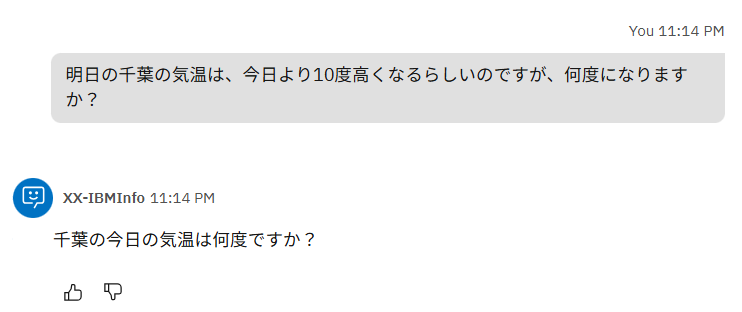

2. エージェントスタイルを ReAct に変更してみましょう。左側のプロファイルの中にあるエージェント・スタイルを **ReAct** に変更してください。  


3. チャットをリロードし、もう一度 1 と同じ質問をしてみましょう。今度は正しく回答できているかと思います。  
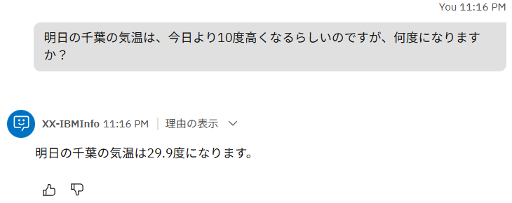

このように、ReAct の方が複雑な質問や指示も正しく考えて実行することができます。ただ、その分デフォルトよりも回答が遅くなるため、用途に応じた使い分けが重要です。

各エージェントスタイルの概要は、[製品ドキュメント](https://www.ibm.com/docs/ja/watsonx/watson-orchestrate/base?topic=agents-choosing-style-your-agent)に以下のように記載されています。

|エージェントスタイル|特徴|使用する場面|利点|  
|------------|-----------|-------------|----------|  
|デフォルト|LLMのプロンプト主導の意思決定に依存するシンプルで柔軟なワークフローには、デフォルトスタイルを使用します。<br>このスタイルはツール中心であり、エージェントがどのツールを使うか、いつ使うか、どのように対応するかを、事前に定義された計画を必要とせずに決めることができます。|・ 単一のステップ、または軽く順序のあるタスク<br>・ 適応力が求められるシナリオ<br>・ 厳密な順序に従わず、複数のツールを使用するタスク|最小限のセットアップで迅速な実行が可能。<br>柔軟性と迅速な対応を必要とするエージェントに最適。|  
|ReAct|段階的な推論や検証が必要なタスクには、ReAct スタイルを使用する。<br>このスタイルは "Think → Act → Observe"（考える→行動する→観察する）のループに従うもので、エージェントは各行動を振り返りながら進める。<br>ReAct の方法論に基づいており、透明性のある推論をサポートする。|・ 探索的またはリサーチ重視のタスク<br>・ 要件が変化したり曖昧だったりするシナリオ<br>・ 推論の過程が見えることや、ユーザーの確認が有益なタスク|反復的な推論を通じて精度を向上させる。<br>検証、透明性、またはユーザーからのフィードバックが求められるタスクに最適。|  


## Option：MCPの利用
MCP を利用して、Time MCP Server という MCP サーバーをインポートしてみましょう。  

MCP (Model Context Protocol) は、生成AIが外部のツールやデータソースと連携するための標準規格です。MCP により、AI エージェントは MCP サーバーが提供する外部ツールを検出し、使用することができます。  
今回は、Time MCP Server という MCP サーバーをインポートし、時刻を取得する外部のツールを呼び出してみましょう。

(ハンズオン環境に既に MCP サーバーが追加されている場合は、4-6 をスキップし 7 から始めてください)

1. 左側のツールセットで **ツールの追加** をクリックします。  
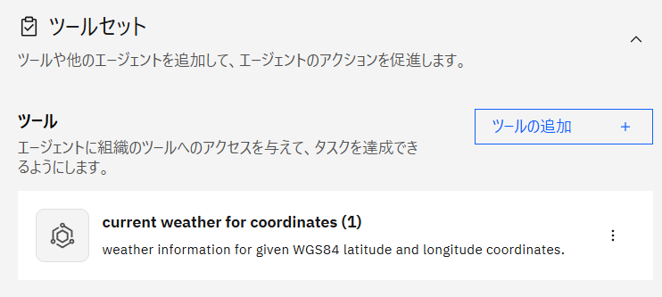

2. **インポート** をクリックします。  
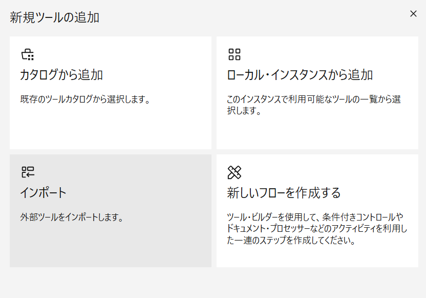

3. **MCP サーバーからのインポート** をクリックします。  
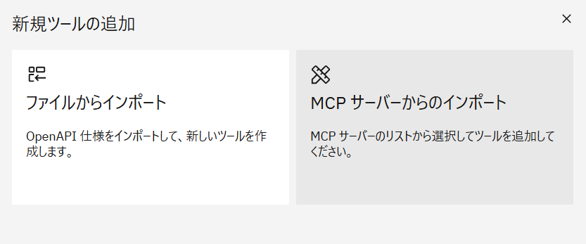

4. **MCP サーバーの追加** をクリックします。  
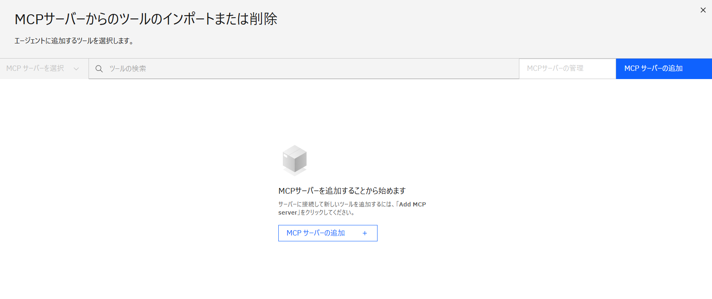

5. 以下のように入力し、**接続** をクリックします。 (XX は自身のイニシャル)  
**サーバー名:** XX_time_mcp  
**インストール・コマンド:** npx -y time-mcp  
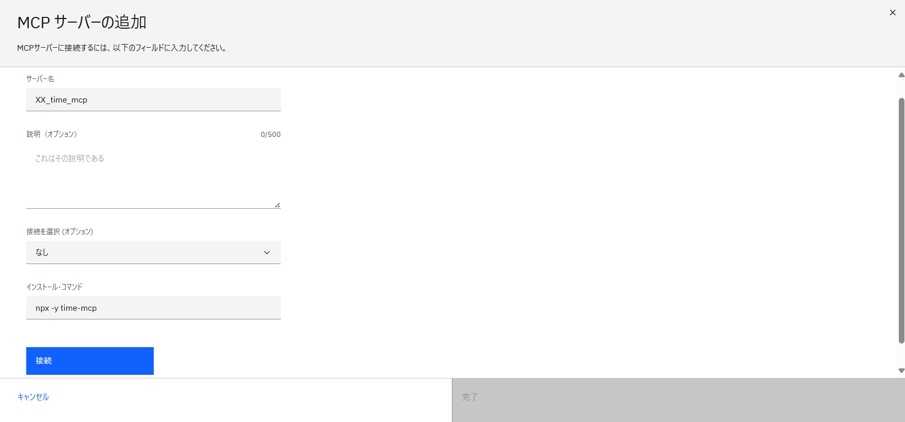

6. 接続が成功したら、**完了** をクリックします。  
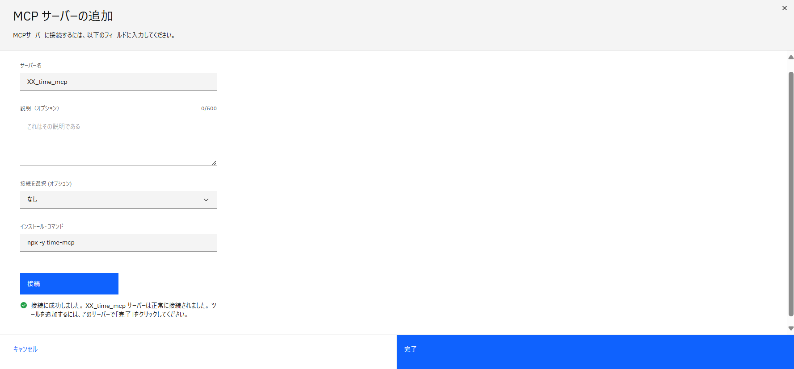

7. MCPサーバーの管理のメニューが表示された場合は、右上の × で閉じます。
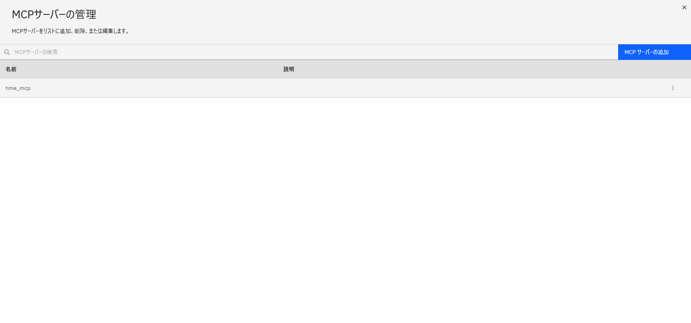

8. (MCP追加済みの方のみ) 左上の **MCP サーバーを選択** より、**time_mcp** を選択してください。  
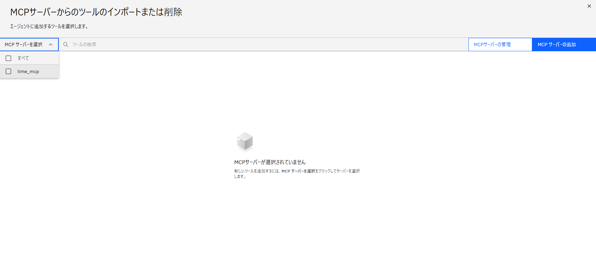

9. 接続した Time MCP Server で利用できる外部ツールの一覧が表示されます。  
アクティブ化トグルをオンにすると、エージェントにツールとして追加されます。今回は **current_time** をオンにしてみましょう。  
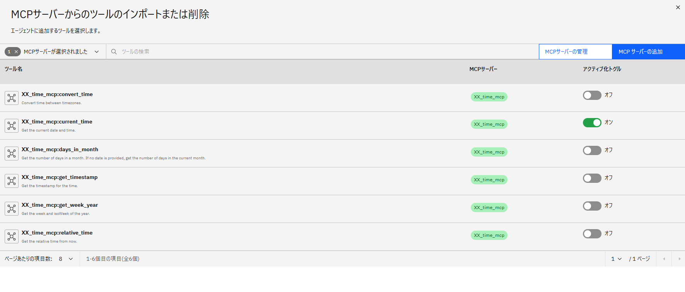  

10. 右上の × でメニューを閉じます。ツールセットを見てみると、先ほどオンにした current_time がツールとして追加されていることが分かります。  
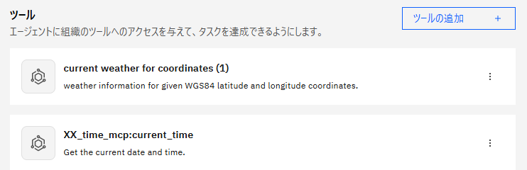  

11. 右側のチャットから、追加したツールを呼んでみましょう。  
current_time は現在の日付と時間を教えてくれるため、**ロンドンの現在の日時は何ですか？** のように、お好きな地域の日時を聞いてみてください。日時を正しく回答してくれると思います。  
正しい時刻が返ってこなかったり、フォーマットを問われたりする場合は、以下の指示を動作に追加してみてください。
    ```
    current_time toolを使用する際は、formatとして　"YYYY/MM/DD HH:mm"　を指定してください。
    ```    
    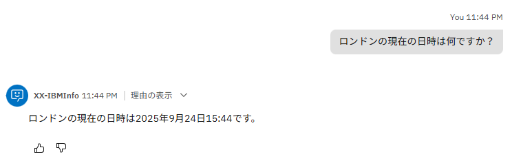  

このように、MCPサーバーを追加すると、既存の外部ツールをすぐにエージェントに連携して活用することができます。


## お疲れさまでした！
このハンズオンでは、ツールのインポートや、エージェントからのツールの利用について学びました。
