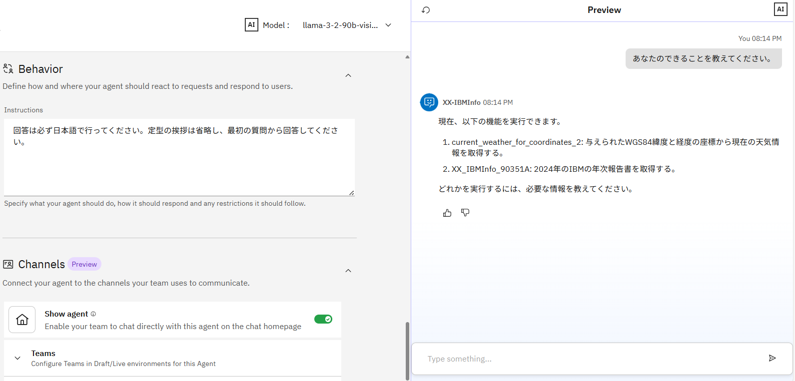

# Tool を定義して呼び出してみよう！

Tool は、ユーザーに代わってデータを照会したり、ドキュメントを作成したり、トランザクションを実行したりするコンポーネントです。
この Lab では、外部の API をインポートして Tool を定義し、AI Agent から利用する方法について学びます。

※AI Agent のモデルは **llama-3-2-90b-vision-instruct** を使用しています。他のモデルで実行すると結果が異なる場合があります。

## Tool のインポート
天気の情報を取得する OpenAPI 形式のファイルをインポートします。インポートする前に、Lab1 で作成した AI Agent で天気の質問に回答できるか確認してみましょう。

1. 左上のメニューを開き、**Chat** を選択してください。  


2. 左上の Agents が **(YourInitials)-IBMInfo** になっていることを確認してください。  


3. お好きな地域の天気を聞いてみてください。Tool をインポートする前の状態では、正しく回答できないことを確認します。  


4. インポートする Tool を用意します。[こちらのリンク](./files/weather.yaml)を右クリックし、名前を付けて保存してください。  
今回使用する weather.yaml は、ある地域の緯度 (**latitude**) ・ 経度 (**longitude**)、そして current_weather を **true** と入力すると、その地域の現在の気温や天気、風速などを回答してくれる Tool です。  

    * Tool は、OpenAPI 形式 もしくは MCP に対応したものをインポート可能です。
    * Python で Tool を実装し、SaaS 環境に導入することも可能です。  

5. 左上のメニューを開き、**Build > Agent Builder** を選択してください。  


6. **(YourInitials)-IBMInfo** のエージェントをクリックします。  


7. Toolset のメニューで **Add tool** をクリックします。  


8. Toolset では、以下の4つの方法でエージェントに Tool を追加できます。

    * カタログからのプリビルドツールの追加 (Add from catalog)
    * ローカルインスタンスからのカスタムツールの追加 (Add from local instance)
    * カスタムツールのインポート (Import)
    * ツール・フローの作成 (Create a new flow)　※ Lab3 で実施します。

    今回は **Import** をクリックします。
    

9. **Import from file** をクリックします。


10. 先ほど保存した weather.yaml をアップロードし、**Next** をクリックします。


11. Operations のチェックボックスにチェックを入れ、**Done** をクリックします。  


12. 以下のメッセージが表示されたら、Tool の追加は完了です。  


## 出来ることの確認
1. 右側の Preview のチャットに、**あなたのできることを教えてください。** と聞いてみましょう。

2. 1回目の質問では定型のあいさつが返ってきましたが、2回目に同じ質問をすると 1. 天気情報の取得、2. IBMの年次報告書の提供が実行できると回答されます。


3. (オプション) Behavior の Instructions に **定型の挨拶は省略し、最初の質問から回答してください。** のように指示を追加すると、1回目から正しく回答してくれるようになります。


## Toolの利用
1. チャットをリロードし、先ほどと同じくお好きな地域の天気を聞いてみましょう。正しく回答が返ってくることを確認できます。


    Show Reasoning をクリックして Step1 を開いてみると、入力した地名から緯度と経度を認識し、パラメータを適切に変換してくれていることが確認できます。
    

2. 画像のようにうまく回答されない場合は、以下の文章を Instructions に追加し、チャットをリロードして再度質問してみてください。  

    ```
    ユーザーから特定の都市の気象情報を求められた場合は、適切なパラメータでToolを呼び出してください。
    ```
    

## 複数地名の確認（エージェンティックな振る舞い）
次に、複数の地域の天気を比較する質問をし、エージェンティックな振る舞いを体験してみましょう。

1. チャットに、**横浜と宇都宮はどっちが涼しい？** と入力してみてください。  
横浜と宇都宮の気温を表示し、どちらの方が涼しいか回答してくれるはずです。


2. Show Reasoning をクリックすると、Step1 と Step2 で横浜と宇都宮の天気が取得されていることが確認できます。  
ただ、2つを比較するという処理は Tool に定義されていないため、AI Agent のベースとなる LLM がエージェンティック (自律的) に実行したと読み取ることができます。

## 表形式の表示
今度は、複数の地域の天気を表形式で表示してみましょう。

1. 北海道の市町村を3つ選択し、それらの市町村の気温を表形式で出力してみましょう。  
3市町村の緯度・経度ができるだけ異なるように選んでみてください。  
**例: 函館市、稚内市、羅臼町の気温を表形式で比較してください。**  


こちらも、各市町村の気温は Tool によって取得されていますが、表形式での出力は LLM のエージェンティックな判断によって行われていることがわかります。

もしうまく表示されない場合は、**Githubマークダウン形式の表で表示して** とチャットに入力してみましょう。

## エージェントスタイルの違いの確認

エージェントスタイルの違いにより、Agent の振る舞いがどのように変わるか確認してみましょう。  
エージェントスタイルは デフォルト と ReAct の2種類があり、最初はデフォルトで設定されています。

1. エージェントスタイルがデフォルトの状態で、**明日の千葉の気温は今日より10度高くなるらしいのですが、何度になりますか？** と質問してみましょう。おそらく、正しい回答は返ってこないと思います。


2. エージェントスタイルを ReAct に変更してみましょう。左側の Profile の中にある Agent Style を **ReAct** に変更してください。


3. チャットをリロードし、もう一度 1 と同じ質問をしてみましょう。今度は正しく回答できているかと思います。


このように、ReAct の方が複雑な質問や指示も正しく考えて実行することができます。ただ、その分デフォルトよりも回答が遅くなるため、用途に応じた使い分けが重要です。

各エージェントスタイルの概要は、[製品ドキュメント](https://www.ibm.com/docs/ja/watsonx/watson-orchestrate/base?topic=agents-choosing-agent-style)に以下のように記載されています。

|エージェントスタイル|特徴|適した作業|  
|------------|-----------|-------------|  
|デフォルト|プロンプトを理解し、最適なアクションを決定し、利用可能なツールを使用するために、その基礎となる言語モデルの組み込み推論機能を使用する。|・ 迅速で、単純な作業に適している。<br>・ ロジックが直線的で、文脈に応じた絞り込みが必要ないシナリオに最適。|  
|ReAct|エージェントがステップを計画し、タスクを熟考し、実行前に確認を求めたり、修正を提案したりすることを可能にする。 要求をより小さな構成要素に分解し、中間結果を評価し、必要に応じてアプローチを修正する。|・ より複雑な作業や発展的な作業に適している。<br>・ 意思決定が条件ロジック、文脈の理解、複数のツール間のコラボレーションを伴うようなユースケースに最適。|  


## Option：MCPの利用
MCP を利用して、Time MCP Server という MCP サーバーをインポートしてみましょう。  

MCP (Model Context Protocol) は、生成AIが外部のツールやデータソースと連携するための標準規格です。MCP により、AI Agent は MCP サーバーが提供する外部ツールを検出し、使用することができます。  
今回は、Time MCP Server という MCP サーバーをインポートし、時刻を取得する外部のツールを呼び出してみましょう。

(ハンズオン環境に既に MCP サーバーが追加されている場合は、4-7 をスキップし 8 から始めてください)

1. 左側の Toolset で **Add tool** をクリックします。


2. **Import** をクリックします。


3. **Import from MCP server** をクリックします。


4. **Add MCP server** をクリックします。


5. 以下のように入力し、**Connect** をクリックします。  
**Server name:** time_mcp  
**Install command:** npx -y time-mcp  


6. Connect が成功したら、**Done** をクリックします。  


7. Manage MCP servers のメニューが出たら、右上の × で閉じます。  


8. (MCP追加済みの方のみ) 左上の Select MCP server より、**time_mcp** を選択してください。


9. 接続した Time MCP Server で利用できる外部ツールの一覧が表示されます。  
Activation toggle を On にすると、Agent に Tool として追加されます。今回は **current_time** を On にしてみましょう。  
  

10. 右上の × でメニューを閉じます。Toolset を見てみると、先ほど On にした current_time が Tool として追加されていることが分かります。  
  

11. 右側のチャットから、追加した Tool を呼んでみましょう。current_time は現在の日付と時間を教えてくれるので、お好きな地域の現在の日時を聞いてみてください。日時を正しく回答してくれると思います。  
もし英語で回答されたり、format を問われたりする場合は、質問の仕方を変えて再度試してみてください。  


このように、MCPサーバーを追加すると、既存の外部ツールをすぐに Agent に連携して活用することができます。


## お疲れさまでした！
このハンズオンでは、Tool のインポートや、Agent からの Tool の利用について学びました。