# AIAgentを作ってみよう！

このLabでは、基本的なAIAgentの作り方を学びます。

## Agentの作成
1. 左上のメニューから**Build**を選択し、**Agent Builder**を選択します。  
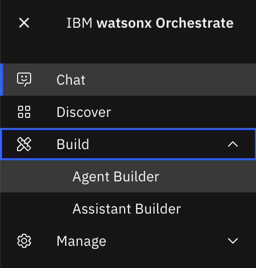

2. 右にある**Create agent**ボタンをクリックします。  


3. **Create from Scratch**を選択します。  


4. このハンズオンではIBMに関する質問に回答するエージェントを作成するため、Nameを**YourInitials-IBMInfo**と設定します。  


5. このエージェントの役割をDescriptionに記載します。watsonx Orchestrateは記載した内容をもとにどのエージェントを呼び出すかを判断するため、適切な記載が求められます。  
このハンズオンでは、Descriptionに**IBMの会社情報に関する質問に回答するエージェントです。**と設定し、**Create**をクリックします。  


6. Agentが作成されました。先ほど入力したNameとDescriptionが自動的に入っています。  


## 基本的な動きの確認
1. 右側にPreviewチャットが表示されています。ここで簡単に作成したエージェントを試すことができます。  
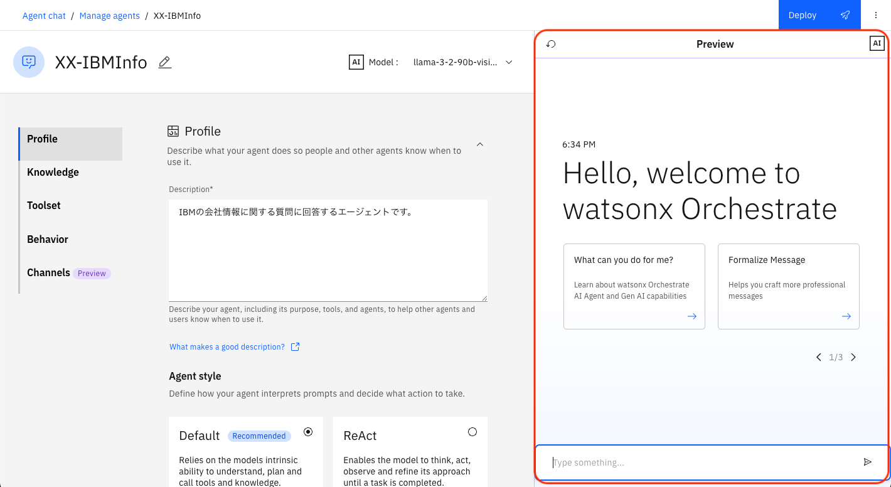

2. まずは**What is IBM?**と入力します。  


3. IBMに関する回答が返ってくることが確認できました。こちらは選択されたLLMが回答を作成しています。  


4. 続いて、**What is the stock price of IBM?**と入力します。日付などをきかれた場合には、必要に応じて回答してください。  
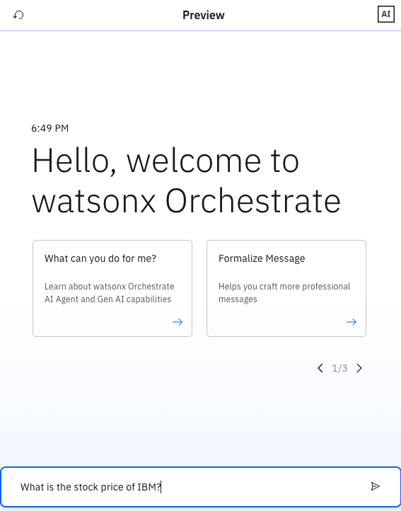

5. その結果、最新の株価情報を得ることができないことが確認できます。  

  
生成AIは案出し、要約などは得意ですが、新しい情報の取得は難しいことが確認できました。

## Behaviorの定義
1. Previewチャットに**IBMについて教えてください。**と入力します。  


2. その結果、ユーザーの質問は理解しているようですが、英語で回答が返ってきました。  


3. ユーザーが使いやすいよう利用ユーザーに合わせた動きを行うために、**Behavior**に応答の定義を行います。このハンズオンでは、日本人を対象としたAgentの作成のために、**回答は必ず日本語で行ってください。**と入力します。  


4. Previewチャットをリフレッシュしてください。  


5. 再度、**IBMについて教えてください。**と入力します。  


6. 次は日本語で返ってくることが確認できました。  

  
このように、ユーザビリティを上げるために、behaviorを適切に定義することが必須です。

## Knowledgeの使用
watsonx Orchestrateは組み込みのRAG (Retrieval Augmented Generation) 機能を提供し、エージェントごとにドキュメントをアップロードすることで、その内容をもとに回答を生成することが可能です。  
1. このハンズオンでは年次報告書を読み込ませて、それに基づいた質問に対応するエージェントを作成します。  
エージェントが適切なタイミングでKnowledgeを使用するために、読み込むファイルがどのようなものであるかを定義する必要があります。  
今回は、Descriptionに**これは2024年のIBMの年次報告書です。財務情報とIBMのコア事業戦略を含んでいます。**と入力します。  
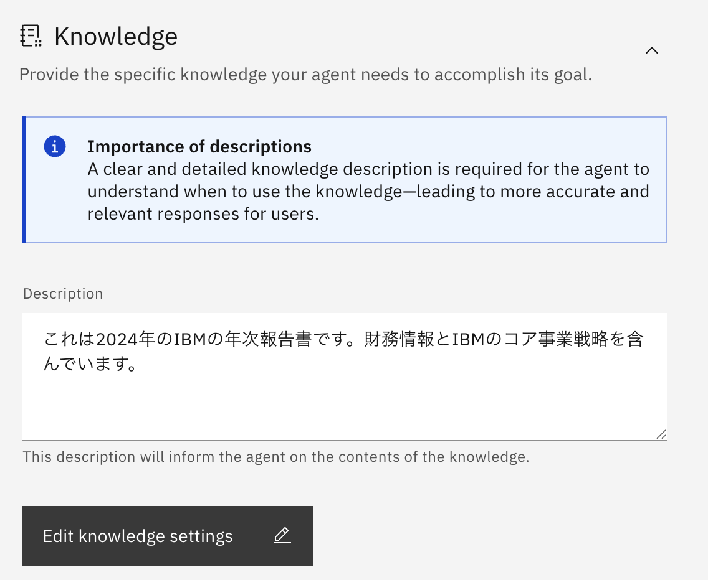

2. **Upload files**のボタンをクリックします。ボックスにドラッグするか、または青字のテキストをクリックしてファイル・アップロード・ウィンドウを開いて、ファイルをアップロードします。  
今回のハンズオンでは、[こちらのファイル](./files/2024-annual-report.pdf)を使用します。  
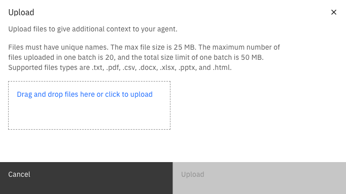

3. レポートが取り込まれるまでには少し時間がかかります。完了すると、すべてのファイルがFilesのリストに表示されます。  


4. Previewチャットで**IBMの2024 年のフリー・キャッシュ・フローはいくらですか。**と入力します。  
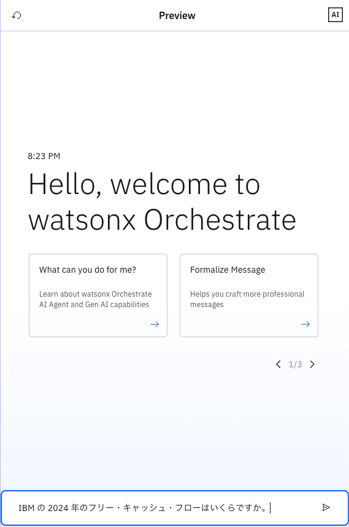

5. watsonx Orchestrateが先ほど読み込んだファイルの内容をもとに、適切な回答を行っていることが確認できます。  

  
ドキュメントをアップロードすることで、エージェントに対して簡単にRAGを構成できることが確認できました。

## エージェントのデプロイ
誰でもこのエージェントを使うことができるように、エージェント作成後は**Deploy**をする必要があります。  
1. 右上の**Deploy**ボタンをクリックします。  

2. 特に何も入力せず、右下の**Deploy**をクリックします。  
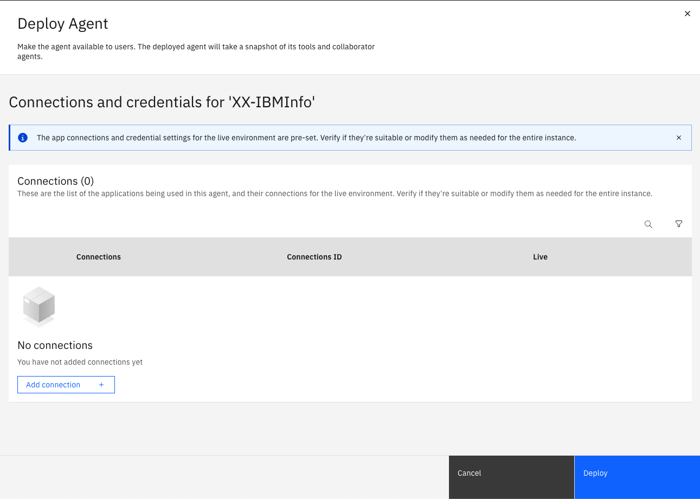
3. これでDeployが完了しました。  
左上のメニューから**Chat**を選択すると、チャット画面に移動します。Deployされていることが確認できました。  


## フィードバックの実施
ユーザーからのフィードバックを元に、回答を改善することも重要です。watsonx Orchestrateではユーザーのフィードバックを受け付ける機能を提供します。どの様なフィードバックが可能かを見てみましょう。  

1. 再度**IBM の 2024 年のフリー・キャッシュ・フローはいくらですか。**と入力し、回答に対して👍をクリックします。  


2. 回答が簡潔であったため、**Concise**を選択し、**Submit**をクリックします。  
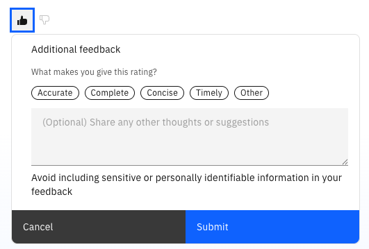

3. 一方で、再度**IBMの今日の株価を教えてください。**と入力すると、求めていた回答が返ってきませんでした。  
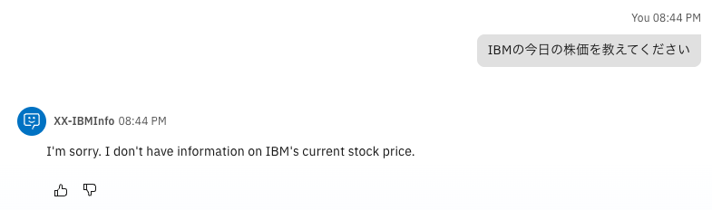

4. そのため、👎をクリックし、**Incomplete**を選択し、**Submit**をクリックします。  


5. ビルダーと管理者はこのフィードバック結果を、APIで確認し、回答の改善に役立てることが可能です。APIの使用方法などは、今回のハンズオンでは省略します。  
  

## お疲れ様でした！
このLab1では、watsonx OrchestrateのGUIを使って、簡単にAgentを作成しました。利用ユーザーや業務内容に合わせてカスタマイズを行うことで、ユーザービリティを上げることが可能です。  

## オプション：モデルの変更
1. デフォルトでLLMが選択されています。現在のバージョンでは、**llama-3-2-90b-vision-instruct**が選択されています。  


2. wxOがサポートしているモデルに切り替えることが可能になります。このハンズオンでは、**llama-3-405b-instruct**に切り替えます。  
現在サポートしているLLMは[こちら](https://www.ibm.com/docs/ja/watsonx/watson-orchestrate/base?topic=agents-choosing-foundation-model)です。  


ユースケースに合わせたLLMを選択することで、適切な回答、処理を行うエージェントを作成することができます。

## オプション：エージェントに知識を加える（ppt）
watsonx Orchestrateには、エージェントチャットと呼ばれるユーザーインターフェースから生成AIを活用したチャットを使用することが可能ですが、以下の方法でLLMに知識を加えることができます。：

- エージェントに直接ファイルをアップロード
- エージェントへ知識に関するコンテキストの提供
- 外部コンテンツ・リポジトリへの接続

このLabでは、エージェントに直接ファイルをアップロードしてエージェントに知識を加える方法について学びます。では、始めましょう！

1. [こちらのリンク](./files/BWL_Pricing_Overview.PPTX)を右クリックしてファイルに保存してください。このファイルはBWLの価格について説明した資料です。

2. P4,5にそれぞれ汎用版とUS版のBWLの価格が記載されていることを確認します。

  

3. メニューからAgent Builderを選択します。  
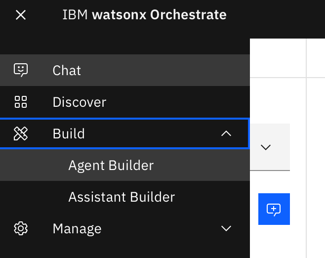

4. Create agentを選択します。


5. Create from scratchが選択されていることを確認します。Nameに’XX-BWL-Price’(XXは自身のイニシャル)、Descriptionに’Agents who can answer BWL prices.’と入力し、Createをクリックします。
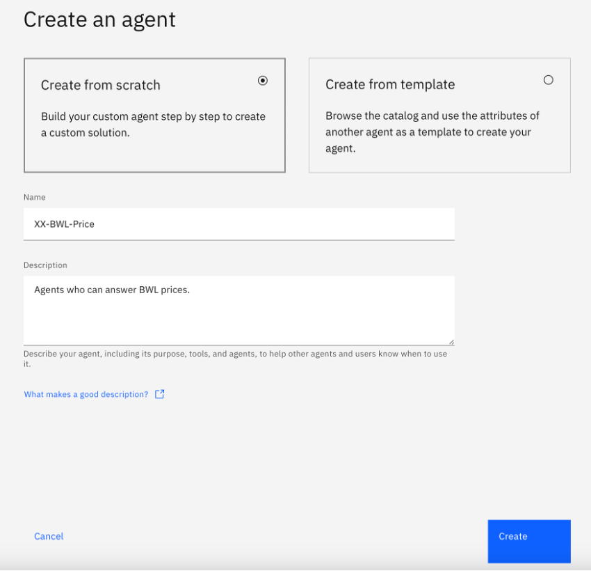

6. LLMとしてllama-3-2-90b-vision-instructが選択されていることを確認します。
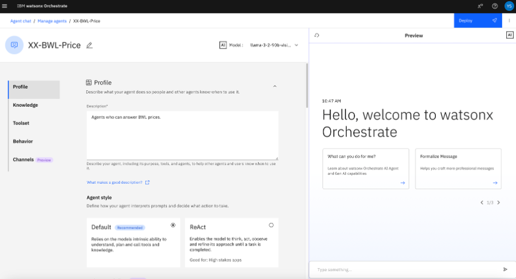

7. チャットに画面の記載のように入力してください。AIから何度か回答までに質問が繰り返される様子がわかります。


8. Knowledgeを選択し、Documentsの下にあるUpload filesをクリックします。


9. 先ほどダウンロードしたファイルをアップロードします。
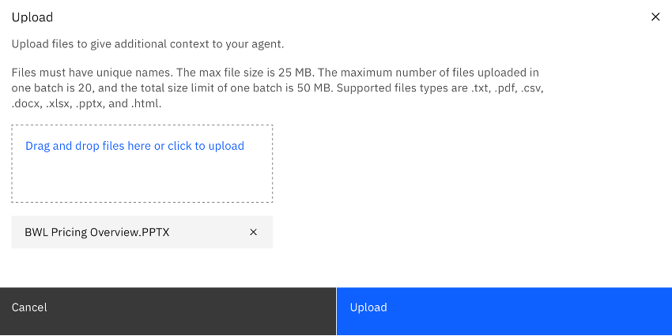

10. アップロードが成功したら更新ボタンをクリックします。
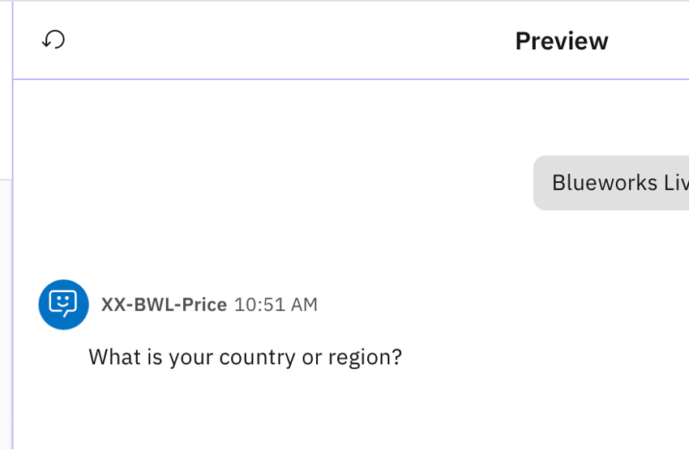

11. デフォルトのチャットに戻るので、再び「Blueworks Liveの価格について教えてください。」と入力します。ファイルをアップロードする前の結果とは異なり、プランごとの価格が一覧として表示されることがわかります。
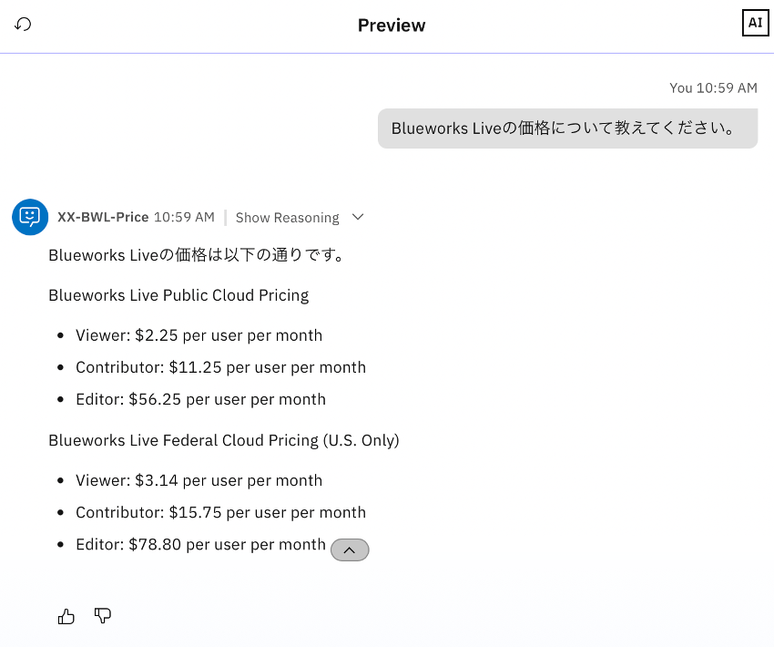

<!-- 
ブラウザで定義→こんにちは→英語で返答→日本語で会話可能であることを指示。→大阪弁で会話可能なことを指示
大阪弁を削除。ペルソナを設定することが大事であることを学ぶ。


生成AIが得意なのは、案だし、要約など、検索は新しい情報が無いことを確認する（大谷翔平は昨日ホームランを打ちましたか？）

生成AIに関するセミナーのタイトルを10個挙げてください


## Knowledgeの使用
RAGの設定（IBMのAnnualReportを読み込む）

IBMの2021年の売り上げは？

## フィードバックの実施


フィードバックの実施


## オプション：モデルを変更して試してもらう。俳句で回答するなど、自由に試してもらう。ペルソナを変更してみる。

## watsonx Orchestrateの画面を確認してみよう
このセクションでは、watsonx Orchestrateの主な画面構成について学びます。

 1. watsonx Orchestrateにログインします。
 2. IBM-idを入力して、**Continue** ボタンをクリックします。
 3. 複数テナントに所属する場合には、テナント選択画面が表示されるので、適切なテナント名を選択してください。  
　
　

 4. 以下のような画面が表示されます。（ツアーのダイアログが表示された場合にはスキップしてください。）  
　

 5. 詳細は以下の通りです。

    1.メニュー  
    各画面へ遷移するためのメニューが表示されます。    

    2.チャット画面  
    watsonx Orchestrateへ様々な処理を依頼するためのチャット画面    

    3.AI assistant builder 
    外部のWebサイトなどに組みこんだり、Slackなどのチャネルと統合可能なAIアシスタントの構成が可能です。  

    4.Skill studio 
    スキルの追加やスキルフローの作成、意思決定、ワークフロー、生成AIに関する処理をローコードで実装し、スキル(Automations)として公開が可能です。  

    5.ヘルプ  
    各種ヘルプへのリンクが表示されます。複数アカウントに所属する場合には、Swtich Accountからアカウントの切り替えが可能です。  

    6.タスク・リスト  
    ワークフローを使用している場合に、自分に割り当てられたタスクが表示されます。  
    
    7.プロファイル/設定  
    ユーザーのプロファイル設定が可能です。

6. テナントIDを取得するには、右上のイニシャルが表示されているアイコンをクリックし、製品情報を選択します。  


7. 以下のようなダイアログが表示されます。crnからはじまる文字列がIDです。サポートに問い合わせる際にはこのIDを伝える必要があるため、覚えておきましょう。  


## スキルの追加
watsonx Orchestrateには、プリビルド・スキルと呼ばれる1000以上の様々なスキルが付属し、すぐに使用することが可能ですが、以下の方法でスキルを追加することも可能です。：

- Open APIの定義ファイル(json/yaml)をインポートする。
- 既存スキル(ワークフローやRPA)のディスカバリー
- スキルフローの作成
- Automation Builderによるスキルの実装

このLabでは、OpenAPI定義をインポートしてスキルをカタログに追加する方法について学びます。では、始めましょう！

1. まず[こちらのリンク](https://n28bf9mpmg.execute-api.us-west-2.amazonaws.com/default/hellowatonx)をクリックして、Hello world OpenAPIが利用可能であることを確認してください。 {"message":"Missing Authentication Token"}と表示されればOKです。このAPIはAWS上で動作するシンプルなAPIです。

2. [こちらのリンク](./files/helloworld-watsonx.yaml)を右クリックしてファイルに保存してください。このファイルは先ほどのAPIの定義情報です。

3. notepad, VSCode, vi/vimといったお好みのエディタでファイルを開き編集します。
```
openapi: 3.0.3
info:
  title: YourInitials-helloworld-watsonx
  description: Hello world WatsonX
  version: 1.0.0
  x-ibm-annotations: true
  x-ibm-application-name: IBM Watsonx - Training
  x-ibm-application-id: watsonxai-YourInitials-training
  x-ibm-skill-type: imported
  x-ibm-application-icon: <svg version="1.1" id="Layer_1" xmlns="http://www.w3.org/2000/svg" xmlns:xlink="http://www.w3.org/1999/xlink" x="0px" y="0px" 
servers:
  - url: https://n28bf9mpmg.execute-api.us-west-2.amazonaws.com/default
security:
  - passwordGrant: [ ]
paths:
  /hellowatsonx:
    post:
      summary: YourInitials Hello World WatsonX
      operationId: Hello-YourInitials-watsonx
```
4. インポート時に他のハンズオン実施者とスキルが重複しないように、ファイルの中の、x-ibm-application-id, title,summaryとoperationIdをユニークにする必要があります。これらの値のYourInitialsの部分をあなたのイニシャルに置き換えてファイルを保存してください。更新後のファイルは以下のようになるはずです。(イニシャルの置き換え箇所は、4か所あります。)
```
openapi: 3.0.3
info:
  title: XX-helloworld-watsonx
  description: Hello world WatsonX
  version: 1.0.0
  x-ibm-annotations: true
  x-ibm-application-name: IBM Watsonx - Training
  x-ibm-application-id: watsonxai-XX-training
  x-ibm-skill-type: imported
  x-ibm-application-icon: <svg version="1.1" id="Layer_1" xmlns="http://www.w3.org/2000/svg" xmlns:xlink="http://www.w3.org/1999/xlink" x="0px" y="0px" 
servers:
  - url: https://n28bf9mpmg.execute-api.us-west-2.amazonaws.com/default
security:
  - passwordGrant: [ ]
paths:
  /hellowatsonx:
    post:
      summary: XX Hello World WatsonX
      operationId: Hello-XX-watsonx
```

5. メニューから**スキル・スタジオ**を選択します。  


6. 右上にある**作成**ボタンをクリックし、**APIのインポート**をクリックします。  


7. **ファイルから**を選択してください。  


8. 先ほど保存したファイルをドラッグ＆ドロップするか、クリックして選択してください。
9. ファイルの検証が実施され、問題無ければ以下の様に表示されます。  


10. 右下の**次へ**をクリックしてください。追加するAPIの内容が表示されます。
11. Hello World WatsonXのチェックボックスをチェックし、右下の**追加**ボタンをクリックしてください。  


12. スキル一覧にインポートしたスキルが表示されるので、右側のメニューを展開し、**このスキルの強化**を選択してください。  


13. スキルの詳細が表示されます。スキルの強化画面から、スキルの入出力の表示、スキルを呼び出すためのフレーズ、watsonx Orchestrateが次に実行するスキルの提案を行う次善のスキルの設定などを行うことが可能です。  


14. **入力**タブをクリックしてください。入力タブでは、スキルの入力について確認することができます。スキルの入力パラメータに**name**があり、必須のパラメータで無いことが分かります。  


15. **出力**タブをクリックしてください。Outputタブでは、スキルの出力について確認することが可能です。スキルの出力パラメータとして**greeting**が定義されていることが分かります。  


16. **セキュリティー**タブをクリックしてください。セキュリティータブでは、認証情報や、URLを確認することができます。また、接続のテストを行うことができます。  


17. 接続のテストを実行してみましょう。**ユーザー名**に test@acme.com、**パスワード**にtestを入力します。今回使用するAPIについては認証不要のため、どんな値を入力しても問題ありません。

18. **送信**ボタンをクリックし、**認証に成功しました**と表示されることを確認します。  


19. **句**タブをクリックしてください。句タブでは、スキルを呼び出す際に使用するフレーズを登録します。ユーザーがここに登録した例文にマッチした文章をチャットから入力することでこのスキルが呼び出されます。複数のスキルがマッチした場合にはwatsonx Orchestrateは実行するスキルを確認してきます。既にフレーズが登録済みのはずですが、いくつかのフレーズを追加してみてください。また、入力フィールドにカーソルを移動させると表示される、**Auto-generate phrases**ボタンをクリックすることで生成AIを用いてフレーズのサンプルを自動生成することも可能です。  


20. **次善のスキル**タブをクリックしてください。このタブでは、スキルを実行した後に次に実行すべきスキルの選択肢として表示される複数のスキルを定義することが可能です。

    * 次善のスキルは10個まで登録することが可能です。
    * 次善のスキルに追加した各スキルに対して明示的に変数のマッピングを行うことが可能です。  

21. **発行**ボタンをクリックして、スキルを発行してください。  


## Personal Skillへのスキルの追加
ここまでの作業で、カタログにスキルを追加することができました。次のステップとしてPersonal Skillにカタログからスキルを追加します。

1. 左上のメニューから**チャット**を選択してチャット画面を表示します。  


2. 以下のような画面が表示されるはずです。左下の**スキルをカタログから追加**をクリックします。  


3. 検索フォームに先ほど作成したスキルの名前(hello world)を入力して検索を実行してください。表示されたアプリをクリックします。


4. スキルを選択して、**スキルの追加**をクリックしてスキルを追加します。  


5. 右上の**アプリの接続**をクリックしてアプリケーションと接続します。


6. username,passwordに任意の値を入力し、**アプリの接続**ボタンをクリックします。  
今回は、username は**test@acme.com**、passwordは**test**となります。


7. アプリケーションとの接続が完了しました！なお、接続はカタログからではなく、チャットからスキルを呼び出した際に実行することも可能です。  


8. メニューからチャット画面に戻ります。スキルが追加されていることが分かります。  


## スキルの動作確認
カタログから追加したスキルは以下の2つの方法で実行可能です:  
- チャット画面下部に表示されているスキルをクリックする  
- スキルをEnhanceした際に指定したフレーズ(watsonx Orchestrateが指定されたフレーズを元に学習するため、完全一致する必要はありません)を入力する

1. チャットの入力欄に、**Hello World WatsonX**と入力してみてください。  


2. 先ほど追加したスキルが呼び出され、入力フォームが表示されます。  


3. 自分の名前を入力し、**適用**ボタンをクリックしてください。  


4. 結果が表示されるはずです。  


4. チャットの内容は右上のホウキアイコンをクリックすることで削除することが可能です。  


## お疲れさまでした！
このハンズオンでは、watsonx Orchestrateにログインし、カスタムスキルを追加、強化してから発行し、カタログに追加しました。そしてカタログからスキルを追加し、チャット画面から呼び出しました。　
-->
