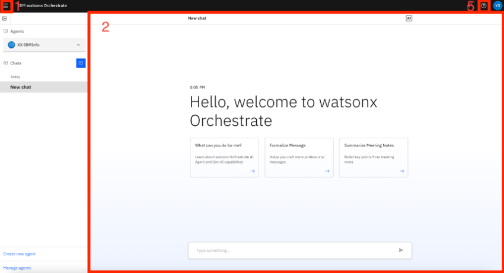
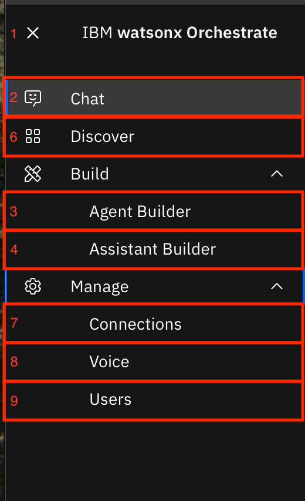

# watsonx Orchestrateへのアクセス方法を確認してみよう！

このLabでは、watsonx Orchestrateにアクセスし、各画面の役割について理解します。

## watsonx Orchestrateの画面を確認してみよう
このセクションでは、watsonx Orchestrateの主な画面構成について学びます。

 1. watsonx Orchestrateにログインします。
  

 2. IBM-idを入力して、**Continue** ボタンをクリックします。

 3. 複数テナントに所属する場合には、テナント選択画面が表示されるので、適切なテナント名を選択してください。  
  

 4. 以下のような画面が表示されます。（ツアーのダイアログが表示された場合にはスキップしてください。）  
    
    
 5. 詳細は以下の通りです。  
    1.メニュー  
    各画面へ遷移するためのメニューが表示されます。    

    2.チャット画面  
    watsonx Orchestrateへ様々な処理を依頼するためのチャット画面    

    3.Agent builder 
    ツールと組み合わせたエージェントの作成や、作成したエージェントをチャット形式で動作させることが可能です。  

    4.Assistant builder 
    外部のWebサイトなどに組みこんだり、Slackなどのチャネルと統合可能なAIアシスタントの構成が可能です。  

    5.ヘルプ  
    各種ヘルプへのリンクが表示されます。複数アカウントに所属する場合には、Swtich Accountからアカウントの切り替えが可能です。  

    6.Discover  
    プリビルドされているエージェントやツールを探すことができます。  

    7.Connections  
    アプリケーションを使用するためのコネクタと認証情報を設定します。

    8.Voice  
    音声入力・出力の設定が可能です。
     
    9.Users  
    ユーザーの追加、権限の設定、削除が可能です。

6. テナントIDを取得するには、右上のイニシャルが表示されているアイコンをクリックし、製品情報を選択します。  

7. ダイアログが表示されます。crnからはじまる文字列がIDです。サポートに問い合わせる際にはこのIDを伝える必要があるため、覚えておきましょう。  

## お疲れさまでした！
このハンズオンでは、watsonx Orchestrateにログインし、各画面のメニューについて役割を確認しました。　
